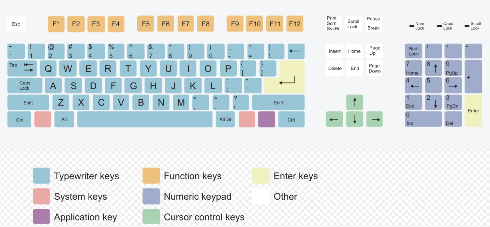

# win10快捷键

## 1. 认识按键⌨

### 1.1 主键盘区：

*   `Esc` 键：escape，退出键。

*   `Tab` 键：tabulator key，跳格键，在文本编辑软件中增加四个空格，Windows中可用于切换屏幕上的焦点。

*   `Ctrl` 键：control，控制键。

*   `Shift` 键：上档转换键，配合其他键使用。例如按住shift再按数字键，即可打出各种符号。或者启动数字小键盘功能。

*   `Alt` 键：换档键。

*   `Caps Lock` 键：大写锁定键，用于切换系统大写锁定。

*   `Windows` 键：键盘上画着一个Windows视窗图标的键。按这个键可以打开开始菜单。

*   `BackSpace` 键：退格键，用于删除当前光标前的字符；退格键 在Win资源管理器后退；打开、另存为界面表示返回上级。

*   `Enter` 键：回车键，换行，在Windows资源管理器表示打开文件（夹）或选中菜单选项；在Cmd\[DOS Mode]表执行命令。

*   `Space` 空格键： 如果活动选项是单选或复选框，则选中或清除框中的√

*   `fn` ：function，功能键。配合 f1 - f12 使用。

*   鼠标右键菜单键：右CTRL左边的键。

### 1.2 功能键区：

配合Fn键使用

*   F1 帮助

*   F2 重命名、部分主板开机时的BIOS快捷键

*   F3 查找

*   F4 地址栏

*   F5 刷新

*   F6 切换（到地址栏）

*   F9 部分主板开机引导

*   F7、8 自定义

*   F10 + Shift或Alt 右键菜单

*   F11全屏

*   F12 部分主板开机引导

### 1.3 系统键区：

*   `PrintScreen` 键：打印屏幕。按下该键后系统会自动全屏截图并保存至剪切板中（无任何提示可Ctrl+V贴至画图、QQ、Word等，BIOS中截的图可以在Windows等OS中查看），配合Alt键使用可以截取当前焦点所在的活动窗口。
*   `ScrollLock` 键：滚动条锁定键，配合ScrollLock指示灯来控制和显示当前滚动条锁定状态。常见的软件中只有Excel支持此功能，使用频率极低。
*   `Pause|Break` 键：暂停/中断键。当需要查看主板自检信息时，可以在自检时按下该键，自检结束后将不会自动进入下一步启动过程，而是等待用户操作。VBS（按键精灵等）、VBA编程中为暂停脚本。

### 1.4 编辑键区：

*   `Insert` 键：插入/改写键。使用该键可以切换当前文本输入状态是插入状态还是改写状态。Word、写字板、记事本等文字处理和某些程序编译器支持该功能。
*   `Delete` 键：删除键，文本编辑可以删除光标后而不是前的字符，文件浏览可以删除选中的文件。部分主板通过该键进入BIOS。
*   `Delete` + `Shift` 删除被选中的项目，如果是文件，将被直接删除而不是放入回收站
*   `Home` 键：起始键，用于将光标移至行开头。浏览网页时，可以返回网页最上端。
*   `End` 键：结尾键，用于将光标移至结尾。浏览网页时，可以将页面滚至最下方。
*   `PageUp` 键：向上翻页键。
*   `PageDown` 键：向下翻页键。
*   `NumLock` 键：数字锁定键，与NumLock指示灯对应，按下该键可以控制NumLock指示灯的状态。当NumLock指示灯点亮时，小键盘区用于输入数字；当NumLock指示灯熄灭时，小键盘区可代替编辑键区使用。

### 1.5 ↑上、下↓、←左、右→ 方向键

*   方向键 + Win：使窗口全屏、最小化、靠左半边、靠右半边（部分版本不支持）；
*   方向键 + Shift：将连续的文字或文件选中
*   方向键（左右）+Ctrl： 在英文单词或中文词语间跳跃
*   方向键（上下）+Ctrl： 在段落开头间跳跃

## 2. 根据按键分类

### 2.1 Ctrl键

*   `Ctrl + Alt + Delete`： 打开安全选项（XP以下为任务管理器，DOS系统中为重启）

*   `Ctrl + Shift + Esc`： 打开任务管理器 （Win9x中打开开始菜单）

*   `Ctrl + Shift + N`： 新建一个新的文件夹（Win XP不适用）

*   `Ctrl + Space（空格）`： 切换输入法

*   `Ctrl + Tab`： 切换标签页，焦点向下一项移动

*   `Ctrl + Shift + Tab`： 切换标签页，焦点向上一项移动

*   `Ctrl + F4`： Win资源管理器中切至地址栏；媒体播放中停止。

*   `Ctrl + Esc`： 打开开始菜单

*   `Ctrl + Alt + 方向键`： 旋转桌面

*   `ctrl + L` 或 `Alt + D`： 定位到搜索栏

### 2.2 Windows键

*   Win + 向上： 最大化窗口

*   Win + 向左： 将窗口左移

*   Win + 向右： 将窗口右移

*   Win + 向下： 最小化窗口

*   Win  + Shift + 方向键： 移动窗口到指定方向的显示器上（如果有多个显示器）

*   Win + F1： 显示“帮助”

*   Win  + PrintScreen： 截取当前屏幕到剪贴板，并保存截屏图片文件到“图片”文件夹中。（WIN8/10）

*   Win  或 `Ctrl + Esc`： 打开开始菜单

*   Win + Break： 打开“系统属性”对话框

*   Win + Pause： 显示“系统属性”对话框

*   Win + Tab： 循环切换任务栏上的程序（win7、win8）（windowsXP不适用）

*   Win  + Tab： 显示应用缩略图（win10，win11）

*   Win键 + Space： 如果开启了Aero效果，预览桌面（win7）（在win10此项是小界面切换输入法）

*   Win键+ Home： 最小化除活动窗口之外的所有窗口（win7）（windowsXP不适用）

#### 主键盘区上的数字

*   `Win键 + 数字`： 启动锁定到任务栏中的由该数字所表示位置处的程序。如果该程序已在运行，则切换到该程序。

*   `Win键 + Shift + 数字`： 启动锁定到任务栏中的由该数字所表示位置处的程序的新实例

*   `Win键 + Alt + 数字`： 打开锁定到任务栏中的第该数字个程序的跳转列表(Jump List)

#### 快速打开

*   `Win + B`： 选中桌面右下方托盘栏或任务栏Progress Bar

*   `Win + D`： 显示桌面Desktop

*   `Win + E`： 打开Windows资源管理器Explorer【即我的电脑、计算机】

*   `Win + F`： 打开“查找：所有文件”对话框（win10中为打开反馈中心）（Win资源管理器中为切至查找栏）

*   `Win + F + Ctrl`： 搜索计算机（如果已连接到网络）

*   `Win + G`： 循环切换小工具（win7）（win10打开xbox菜单）（windowsXP不适用）

*   `Win + I`： 打开“设置”（win10）

*   `Win + L`： 锁定计算机或切换用户

*   `Win + M`： 最小化所有窗口

*   `Win + Shift + M`： 将最小化的窗口还原到桌面

*   `WIN + P`： 多荧幕\投影仪选项选择演示显示模式。（WIN7）出现菜单后再摁Win+P选择选项，放开Win即可确定。也可摁一次然后方向键选择回车确定。

*   `win + Q`： 打开搜索

*   `Win + R`：打开“运行”对话框

*   `WIN + T`：显示任务栏当前所用程序的任务栏缩略图，再按一次切换到其他缩略图。（QWIN7）

*   `Win + U`： 打开辅助工具管理器、轻松访问中心

*   `win + v`： 打开剪切板

*   `Win + X`： 打开开始按钮右键菜单

*   `Win + Shift + S`： 截图

### 2.3 Alt键

*   `Alt + F4`： 结束当前进程

*   `Alt + Space`： 打开活动窗口最左上角的菜单

*   `Alt + Space+N`： 最小化活动窗口

*   `Alt + Tab`： 切换当前程序 （加Shift反向）

*   `Alt + Esc`： 切换当前程序 （加Shift反向）

*   `Alt + Enter`： 将windows下运行的MSDOS窗口在窗口和全屏幕状态间切换

*   `Alt + PrintScreen`： 将当前活动程序窗口以图像方式拷贝到剪贴板（加shift 可以跳到前一个窗口）

*   `ALT + 左箭头`： 向后移动到上一个视图

*   `ALT + 右箭头`： 向前移动到上一个视图

*   `Alt + D` 或 `ctrl + L`： 定位到搜索栏

## 3. 根据功能分类

### 3.1 文件资源管理器

* win + E： 打开文件资源管理器

* Ctrl + 鼠标滚轮： 更改文件夹和文件图标的大小。

* Ctrl + N： 打开一个新窗口

* ctrl + W： 关闭窗口

* Ctrl + F： 查找

* Ctrl + F4： Win资源管理器中切至地址栏；媒体播放中停止。

* Ctrl + Shift + N： 创建一个新文件夹。

* Ctrl + Shift + E： 如果当前文件夹没有子文件夹，则显示当前活动文件夹的父目录中的所有文件夹（通过展开侧栏上的列表）。

* Alt + P： 显示预览面板。

* Alt + 向左箭头或 `Backspace`： 返回一页（也适用于某些应用程序，如网络浏览器）

* Alt + 右箭头： 前进一页（也适用于网络浏览器等应用程序）

* Alt + 向上箭头： 查看当前活动文件夹的父文件夹。

* Ctrl + （箭头）： 浏览当前页面中的项目而不选择它们。

* Shift +（箭头）： 从当前选择的项目开始选择连续的项目

* home： 转到当前页面的顶部（适用于各种其他应用程序）。

* end： 转到当前页面的底部（也适用于多个应用程序）。

### 3.2 快速打开、关闭、切换

#### 打开

* `win + E`： 打开资源管理器

* `Ctrl + Alt + Delete`： 打开安全选项（XP以下为任务管理器，DOS系统中为重启）

* `Ctrl + Shift + Esc`： 打开任务管理器 （Win9x中打开开始菜单）

* `win + Q`： 打开搜索

* `Win +R`：打开“运行”对话框

* `Win +U` ： 打开辅助工具管理器、轻松访问中心

* `win + v`： 打开剪切板

* `Win + X`： 打开开始按钮右键菜单

#### 关闭

* ctrl + W 或 ctrl + F4：关闭标签页

* Alt + F4：关闭当前活动窗口

#### 切换

* Alt+ Tab：切换应用程序窗口

#### 搜索

* 按 `/` 可以在网页内快速切换到搜索栏