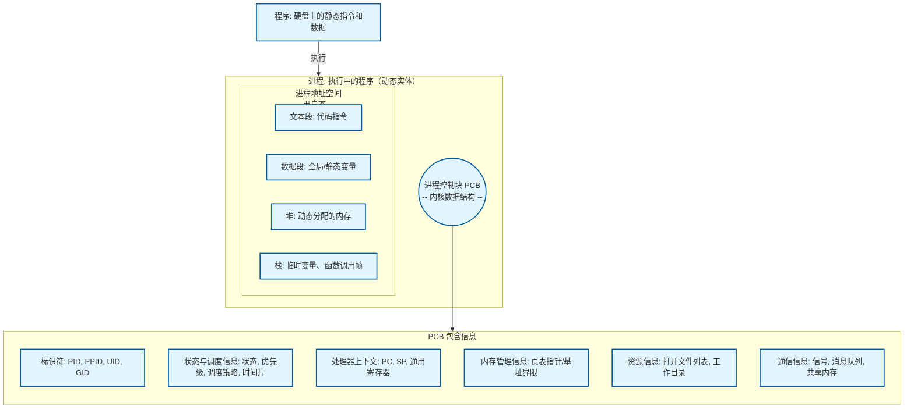

# 进程

    %% 3. 进程状态转换（核心）
    New[新建] -->|已初始化| Ready[就绪]
    Ready -->|被调度器选中| Running[运行]
    Running -->|时间片用完/被抢占| Ready
    Running -->|等待事件如I/O| Blocked[阻塞/等待]
    Blocked -->|事件发生| Ready
    Running -->|执行完成/被终止| Exit[终止]
    Exit -->|父进程调用wait| Terminated[已回收]

    %% 4. 状态转换的触发机制
    Blocked -.->|等待的系统调用| SysCall[系统调用: read, write, sleep]
    Running -.->|时钟硬件周期性触发| ClockInt[时钟中断]
    ClockInt -.->|OS调度器决定切换| Scheduler
    Scheduler -.->|执行上下文切换| ContextSwitch[上下文切换: save/restore registers]

    %% 5. 进程的创建与关系
    Fork[fork系统调用: 复制当前进程] --> Child[子进程: 代码、数据副本]
    Exec[exec系统调用族: 加载新程序] --> New_Code[替换地址空间为新的程序代码和数据]
    Parent[父进程] -- fork --> Child
    Parent -- wait --> Child_Exit[回收子进程资源]

    %% 6. 进程调度（操作系统的大脑）
    Scheduler[操作系统调度器] --> Sched_Queues

    subgraph Sched_Queues[调度队列管理]
        direction LR
        RQ[就绪队列]
        BQ[设备等待队列]
    end

    RQ --> Sched_Algo
    Sched_Algo[调度算法] --> Algo_Detail

    subgraph Algo_Detail[常见算法]
        direction TB
        FCFS[先来先服务FCFS]
        SJF[最短作业优先SJF]
        RR[时间片轮转RR]
        Prio[优先级调度]
        MLQ[多级队列MLQ]
        MLFQ[多级反馈队列MLFQ]
    end

    %% 7. 进程同步与通信（IPC）
    Sync_IPC[进程同步与通信 IPC] --> IPC_Methods

    subgraph IPC_Methods[IPC方法]
        direction TB
        SharedMem[共享内存: 最快]
        Message[消息传递: 管道、FIFO、消息队列]
        Signal[信号: 异步通知]
        Sock[套接字: 跨网络通信]
    end

    Sync_IPC --> Sync_Problems
    subgraph Sync_Problems[同步核心问题]
        direction LR
        RaceCondition[竞态条件]
        CriticalSection[临界区问题]
    end

    Sync_Problems --> Sync_Solutions
    subgraph Sync_Solutions[同步机制/原语]
        direction TB
        Mutex[互斥锁]
        Semaphore[信号量]
        Monitor[管程]
        ConditionVar[条件变量]
    end

    Sync_Solutions --> Sync_Dangers
    subgraph Sync_Dangers[同步的危险]
        direction LR
        Deadlock[死锁: 四个必要条件]
        Starvation[饥饿]
    end

    %% 8. 连接所有部分
    Process --> Ready
    PCB_Detail --> State
    Sched_Queues --> Ready
    Sched_Queues --> Blocked
    Process_Creation --> New
    ContextSwitch --> PCB
```