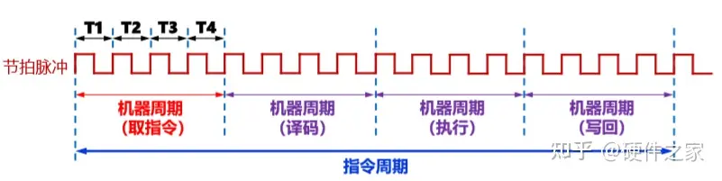

# 00. 计算机行业基础知识-历史、芯片、厂商

## 0. 计算机是什么

计算机的本质就是一台“把**信息**当作原材料，通过预先设定好的规则（程序）对信息做**变换**，从而得到新的、对用户有价值的信息的机器”。
  
1. **信息（数据）**  
   所有东西——数字、文字、图片、声音、视频，乃至一段程序本身——最终都会变成一串 0 和 1 的“比特”。  
2. **变换规则（程序/算法）**  
   这些规则告诉机器：当遇到怎样的比特组合时，下一步应该把它变成怎样的比特组合。  
3. **存储器**  
   用来放“原材料”和“半成品”，保证机器断电后仍能找回关键数据（持久化），或至少在工作期间随时读写（内存）。  
4. **运算与控制单元（CPU/GPU/TPU…）**  
   真正执行“变换”的物理部件：读一条规则、读一段数据、算一下、把结果写回去，再读下一条规则，如此循环。

把这 4 个要素串起来，就得到了计算机的“工作循环”——也就是冯·诺依曼体系结构：  
取指令 → 解码 → 执行 → 回写 → 取下一条指令 … 周而复始，直到程序说“停机”。

计算机并不会“思考”，它只是**极度高速且精确地重复“读规则→按规则改数据”这一机械过程**，快到让人误以为它有智能。  
真正让它显得“智能”的，是背后由人类写出的程序（算法）——而这些算法，本质上仍是一连串对 0/1 比特的变换规则。

- 计算器：把“3+5”这串符号变成比特，规则是“做加法”，结果是“8”对应的比特。  
- 微信发语音：把声波→比特，规则是“压缩→加密→发送→解密→播放”，最终让对方听到原声。  
- 大模型对话：把“你好”→比特，规则是上千亿参数的深度神经网络权重矩阵乘法，输出“你好！有什么可以帮您？”对应的比特。

## 1. 计算机发展简史

### 1.1 机械计算机时代

机械计算机的时代始于17世纪，当时数学家和工程师设计了一系列机械装置，用于执行基本的数学运算。其中较为著名的是布莱兹·帕斯卡和戈特弗里德·莱布尼兹设计的 Pascaline 和莱布尼兹轮。
- 1822 巴贝奇：差分机
- 1848 布尔：布尔代数
- 1890 赫尔曼·荷尔茨：用穿孔卡片存储数据的统计机器。荷尔茨于1896年成立了CTR（Computing Tabulating Recording，计算列表纪录公司）。

### 1.2 电子管计算机时代

1930年代至1950年代： 电子管的发明推动了计算机技术的飞速发展。在这个时代，第一台电子管计算机诞生。此时手工操作已经无法发挥日益强大的计算机性能。唯一的办法是取消人工操作，让计算机自行实现相关作业的自动处理。

- 1906 德·福雷斯特(Lee De Forest)：发明了真空三极电子管。
- 1924 托马斯·沃森(Thomas J. Watson)将赫尔茨成立的CTR改名为IBM（International Business Machines Corporation，国际商业机器公司)
- 1936 英国电脑科学家、数学家、逻辑学家、密码分析学家、理论生物学家、计算机先驱艾伦・麦席森・图灵(Alan.Mathison. Turing)提出一种抽象的计算模型，将人们使用纸笔进行数学运算的过程进行抽象，由一个虚拟的机器（图灵机）替代人类进行数学运算。
- 1940 康奈尔大学的阿特利·图灵和英国的阿兰·图灵分别设计了用于密码破解的电子管计算机。
- 1946 第一台计算机ENIAC埃尼阿克诞生，没有输入控制设备，只能通过人工来扳动庞大面板上的各种开关和插拔电缆来进行数据信息输入。
- 1946 约翰 · 冯 · 诺依曼：理论计算机科学与博弈论的奠基者，提出计算机结构的基本原理。
### 1.3 晶体管计算机时代

1950年代至1970年代： 晶体管的发明取代了电子管，使计算机更小、更可靠、更高效。这个时代诞生了一系列晶体管计算机，如IBM 709和UNIVAC 1103。此时期的计算机逐渐应用于商业、科学和军事领域。冷战时期，计算机的发展也与军事竞赛紧密相连。

### 1.4 现代计算机时代

1970年代至今： 20世纪70年代初，集成电路的发明引领了现代计算机时代。摩尔定律指出集成电路上的晶体管数量每隔18至24个月翻一番，这推动了计算机技术的快速发展。个人计算机的兴起是这一时代的亮点，苹果公司和微软公司成为重要的推动者。1980年代，个人计算机普及，图形用户界面（GUI）的引入使计算机更加用户友好。1990年代，互联网的普及进一步改变了计算机的应用和使用方式。

## 2. 芯片架构
计算机的芯片架构指的是处理器芯片的设计结构和组织方式，决定了计算机如何执行指令和处理数据。主流的芯片架构有多种，由不同的公司研究和开发。

- RISC 精简指令集：通用寄存器数量多，采用硬布线控制逻辑
- CISC 复杂指令集：微程序控制器 

| 架构 | 指令集 | 发明者 | 特点 | 使用厂商 | 发明时间 |
| -- | -- | -- | -- | -- | -- |
| X86 | CISC | Intel英特尔 | 性能高，兼容性好，PC和服务器 | 英特尔、AMD | 1978 |
| ARM | RISC | ARM（软银旗下） | 成本低，低功耗，常见于移动设备和嵌入式系统。 | 苹果、华为 | 1983 |
| RISC-V | RISC | 开源 | 注重灵活性和简化架构。 | 三星、英伟达 | 2014 |
| MIPS | RISC | 波士顿MIPS公司 | 用于嵌入式系统和网络设备。 | 龙芯 | 1981 |

### 2.1 **x86 架构**
- **公司：** Intel 是x86架构的主要开发者。AMD 也是该架构的许可证持有者，推动了x86-64（64位扩展）的发展。
- **应用场景：** PC、服务器。

### 2.2 **ARM 架构**
- **公司：** ARM（Advanced RISC Machine）是ARM架构的设计者，但它并不生产芯片，而是授权其他公司使用ARM架构设计和制造芯片。
- **应用场景：** 智能手机、平板电脑和嵌入式系统。

### 2.3 **MIPS 架构**
- **公司：** MIPS架构最初由MIPS计算机系统公司（现为波士顿MIPS公司）设计。
- **应用场景：** 嵌入式系统、网络设备和一些嵌入式处理器。

### 2.4 **RISC-V 架构**
- **公司：** RISC-V 是一个开源的RISC架构，没有一个特定的公司独立负责。它的设计是由一系列学术和工业合作伙伴共同推动的。
- **应用场景：** 嵌入式系统、自定义处理器

### 与芯片架构相关的重要概念

1. **指令集架构（ISA）：** 描述了处理器支持的指令集合，包括操作、寄存器等。
   
2. **复杂指令集计算机（CISC）：** 指令集较复杂，一个指令可能完成多个操作。

3. **精简指令集计算机（RISC）：** 指令集较简单，旨在提高执行速度。

4. **多核处理器：** 在同一芯片上集成多个处理核心，以提高处理能力。

5. **并行计算：** 使用多个处理单元同时执行任务，提高计算效率。

6. **功耗效率：** 衡量处理器在执行任务时的功耗和性能之间的平衡。

7. **64位架构：** 支持64位地址空间，允许更大的内存寻址范围。

## 基础概念

#### 时钟周期/指令周期/机器周期/总线周期

- **指令周期** : 取出并执行一条指令的时间。

    - 执行一条指令所需要的时间, 一般由若干个机器周期组成. 指令不同,所需要的机器周期也不同.
    - 对于一些简单的单字节指令, 在取指令周期中, 指令取出到指令寄存器后, 立即译码执行, 不再需要其他的机器周期.
    - 对一些比较复杂的指令, 例如:转移指令, 乘法指令, 则需要两个或两个以上的机器周期. 
    - 通常含一个机器周期的指令称为单周期指令, 包含两个机器周期的指令称为双周期指令.

- **机器周期** : 又称CPU周期，CPU访问一次内存所花的时间较长，因此用从内存读取一条指令字的最短时间来定义。
    - 在计算机中, 为了便于管理, 通常把一条指令执行划分为若干个阶段, 每一个阶段完成一项任务. 
    如: 取指令, 存储器读, 存储器写等, 这每一项工作称为一个基本操作. 
    - 完成一个基本操作所需要的时间为机器周期, 一个机器周期由若干个S周期(状态周期)组成.

- **时钟周期** ：又叫节拍脉冲，这是CPU最小的时间单位，CPU的每一次活动至少需要一个时钟周期。
    - 也称为震荡周期， 定义为时钟脉冲的倒数，是计算机中最基本，最小的时间单位.
    - 在一个时钟周期内，CPU只完成最基本的动作。 对同一种机型而言，时钟频率越高，计算机工作速度越快。

- **总线周期**
由于存储器和I/O是挂接在总线上的, CPU对存储器和I/O的访问是通过总线进行的.
通常把CPU通过总线对微处理器外部(存储器或I/O端口)进行一次访问所需要时间称为一个总线周期.

CPU的最小生命单位就是时钟周期，而一个机器周期包括若干个时钟周期，至于指令周期，则包含了若干个机器周期。如果按粒度排序，**指令周期>机器周期>时钟周期**。