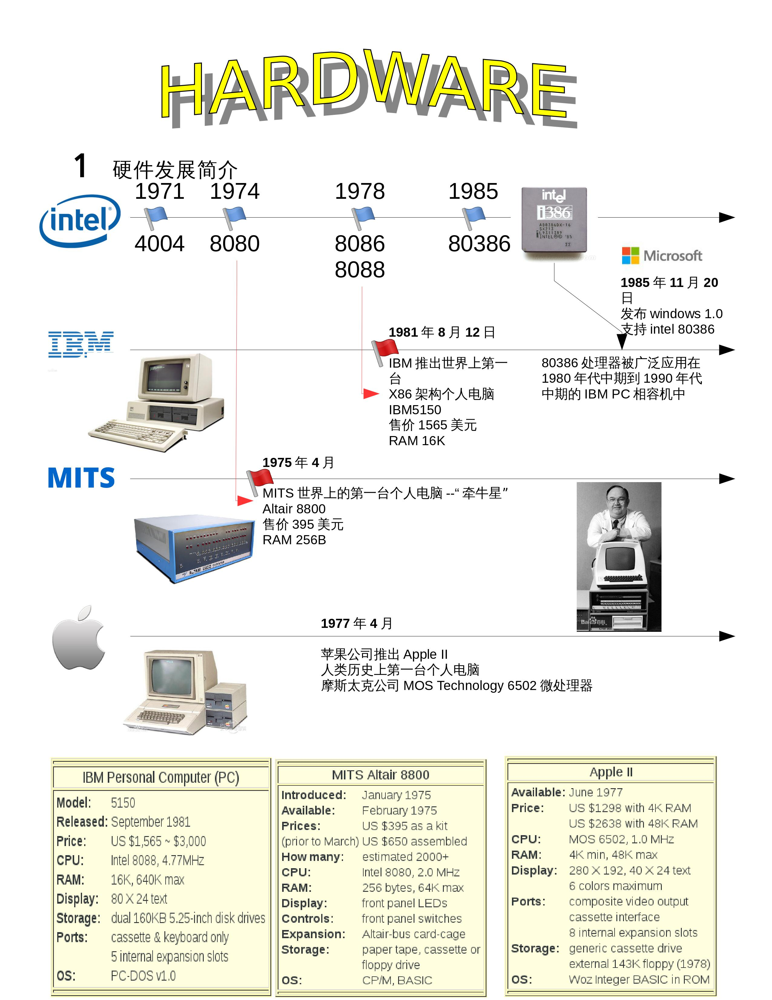
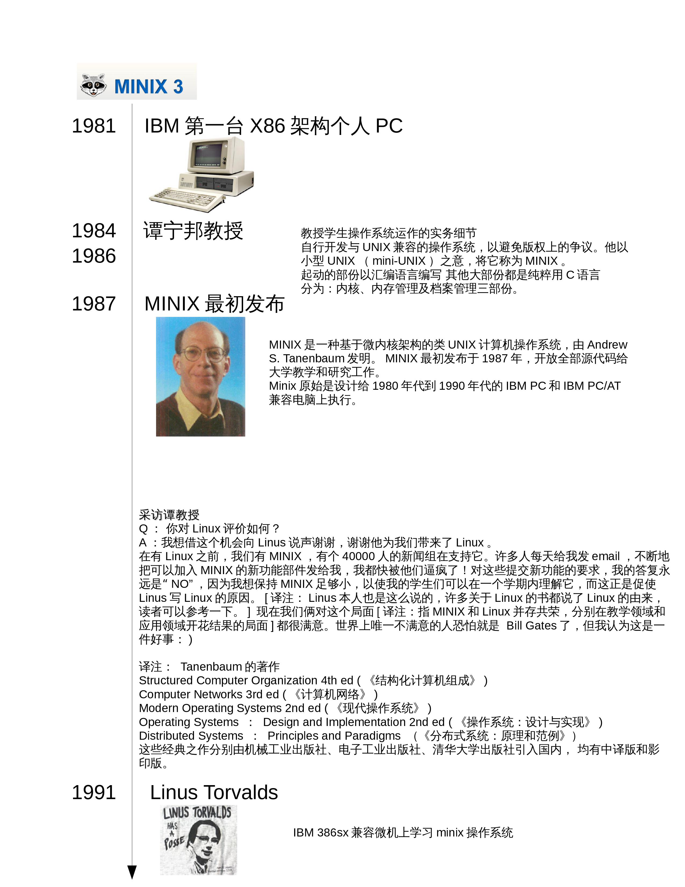
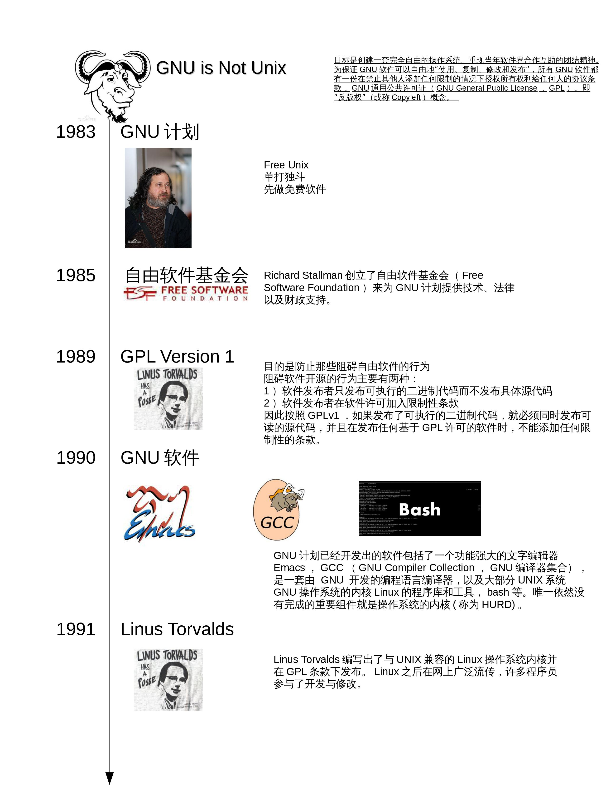
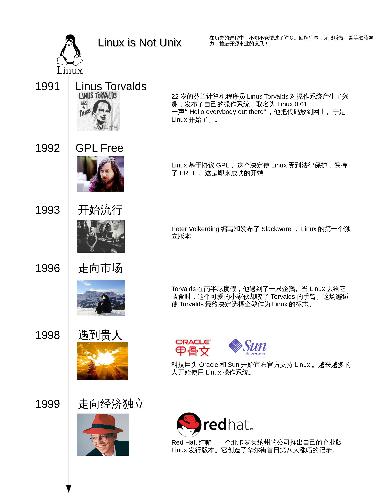
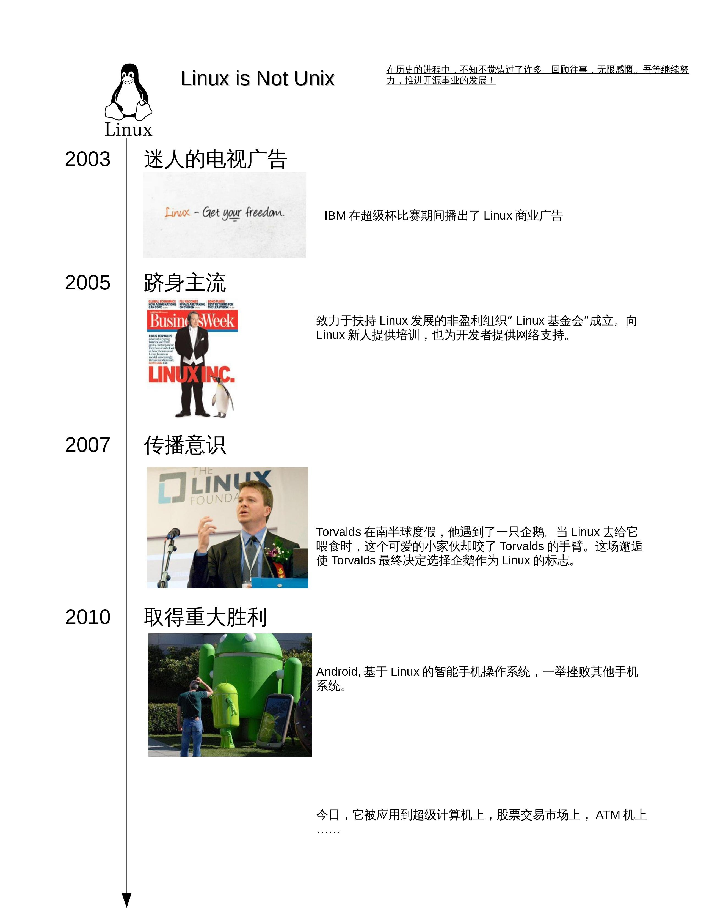

# LINUX HISTORY

[TOC]

## 硬件发展简介

### x86 架构

1978年6月8日，Intel发布了新款16位微处理器“8086”，也同时开创了一个新时代：x86架构诞生了。

X86指令集是美国Intel公司为其第一块16位CPU(i8086)专门开发的，美国IBM公司1981年推出的世界第一台PC机中的CPU—i8088(i8086简化版)使用的也是X86指令，同时电脑中为提高浮点数据处理能力而增加的X87芯片系列数学协处理器则另外使用X87指令，以后就将X86指令集和X87指令集统称为X86指令集。虽然随着CPU技术的不断发展，Intel陆续研制出更新型的i80386、i80486直到今天的Pentium 4(以下简为P4)系列，但为了保证电脑能继续运行以往开发的各类应用程序以保护和继承丰富的软件资源， 所以Intel公司所生产的所有CPU仍然继续使用X86指令集，所以它的CPU仍属于X86系列。

### Altair 8800

世界上的第一台个人电脑--“牵牛星”

爱德·罗伯兹（Ed Roberts）的梦想是做一名儿科医生。但是命运却让他加入了美国空军，做一名工程师。退伍后，他在新墨西哥州的阿伯克基市机场附近的荒漠上创办了一家称为米兹（MITS）的公司，生产各种电子部件和设备。公司有一段时间的经营还算顺利。当市场上的手持计算器卖到395美元时，米兹公司推出了不到100美元的同类产品。但是不久之后，德州仪器等大公司迅速进入手持计算器的市场，产品价格大幅度下降，低到了米兹公司的成本价以下。米兹公司的其他产品销售情况也很糟。到了1974年，米兹公司已濒临破产边缘。　　

罗伯兹绞尽脑汁思考如何扭转公司的困境。他有了一个想法：能不能创造一种很便宜、能让个人使用的电脑呢？全国已经有很多电脑爱好者，他们都急切希望自己能拥有一台电脑，供个人玩弄，就像很多人在鼓捣自制的无线电收音机一样。市面上现在还没有这样的东西。带着这个想法，他去说服本地银行再给他的公司贷一笔款。米兹公司必须至少再贷将近7万美元才能不致于破产。银行对罗伯兹的想法很怀疑。双方一直谈到深夜。不过，银行面临一个两难的选择：要么不再贷款给米兹公司，让它倒闭，银行以前的投资也就全完了。

要么再放一笔贷款，但这笔新贷款很可能又会打水漂。最后，银行再次让罗伯兹确切告诉他们，这种个人电脑什么时候能开发出来，第一年能卖多少套。罗伯兹对什么时候能做出来是有把握的，只要几个月的时间。

能卖多少套他就完全没有谱了。于是他说了一个非常乐观的数字：第一年能卖800套，这样销售收入可以有30万美元。拿到贷款后，米兹公司全力开发个人电脑产品。公司必须在最短时间内把产品开发出来并且卖出去，不然破产就难以避免。为了缩短开发时间和降低成本，罗伯兹决定尽量采用现成的部件，做出来产品不是一台现成的计算机，而是一套零部件，需要用户自己装配。所有并非必需的产品特征都被去掉了。产品根本没有今天的微机不可忽缺的键盘、鼠标、显示器、软盘等等设备。产品也没有软件，所有软件(包括所谓的系统软件)都需要用户用设置开关的方式一条指令一条指令地手工输入计算机。
　　
不管多么简陋，这毕竟是世界上的第一台个人电脑，又称微机。米兹公司的微机产品有两个在当时无可比拟的优点。它很便宜，售价只有不到500美元，而当时一些大公司的实验室也做了类似微机的系统，成本在5万美元左右。另外，米兹的微机设计具有所谓的可扩展能力。用户可以将米兹的微机买回来后，自己再想法配上更多的内存板子和外部设备。有一个用户花了近500美元买了一台微机，再花了3000美元把内存扩展到12KB。《电子科普》（Popular Electronics）杂志听到这个消息后，敏锐地感觉到这是一个历史性的事件，马上决定在1975年1月期作为封面文章报道。但这个个人电脑产品却连名字都还没有。罗伯兹在杂志的责任编辑家里讨论了各种名字。刚好，编辑的家人正在看《星际旅行》的电视节目。那一节刚好讲到了牵牛星座。于是，世界上第一台微机就被命名为“牵牛星”，全称是“牵牛星8800（Altair 8800）”。

罗伯兹做梦也没想到的是，全美有这么多的电脑爱好者，人人都想拥有一台微机。《电子科普》杂志的报道发表后一个月，米兹公司每天都要收到200多台“牵牛星”电脑的订单。生产线根本来不及满足销售需求。有些用户干脆住到公司外面的荒漠上，等着自己的微机生产出来。大多数用户只是购买基本系统。也有用户愿意出495美元，让米兹公司生产一台已经装配好的系统。　　

今天，罗伯兹已经离开了电脑界。他回到乔治亚的老家，获得了医学博士学位，为儿童治病。他为自己创造了计算机领域的一个革命而自豪，但一点也不后悔放弃电脑业，放弃了成为大富翁的机会。他觉得为儿童治病更有意义。爱德·罗伯兹是个很幸福的人，他实现了儿时的梦想。

### IBM5150

IBM推出世界上第一台个人电脑 

1981年8月12日，总部设在美国纽约州阿蒙克的国际商用机器公司（IBM）推出5150的新款电脑，“个人电脑”这个新生市场随之诞生。IBM5150看起来像个米色的“大盒子”，售价1565美元，只有16K字节的内存，可以使用盒式录音磁带来下载和存储数据，此外也可配备5.25英寸的软件盘驱动器。

### MOS Technology 6502

当一个满脸横肉的怪人将这个微芯片装在电脑上，并启动电脑时，整个宇宙都震惊了。这个怪人就是苹果公司创始人之一——斯蒂芬·沃兹尼克，那台电脑就是Apple I，处理器用的是由摩斯太克公司研发的8位微处理器6502。

这一处理器同时也是Apple II、the Commodore PET、BBC Micro等经典电脑以及诸如任天堂和Atari等游戏系统的大脑。该处理器的设计者之一Chuck Peddle回忆称，他们是在1975年的一个贸易展示会上推出这款处理器的。他称：“我们用芯片装满了两个玻璃。我和我的妻子就坐在那里卖这些芯片。”摩斯太克公司6502微处理器终于脱颖而出，其原因是，6502的速度并不比它的竞争对手快多少，但是它的价格便宜，每部售价为25美元，而英特尔的8080和摩托罗拉的6800售价大约在200美元。

---

## 操作系统简介

###  Unix

#### Unix 简史

1965年时，贝尔实验室(Bell Labs)加入一项由奇异电子(General Electric)和麻省理工学院(MIT)合作的计划；该计划要建立一套多使用者、多任务、多层次(multi-user、multiprocessor、multi-level)的MULTICS操作系统。直到1969年，因MULTICS计划的工作进度太慢，该计划就被停了下来。当时，Ken Thompson（后被称为Unix之父）已经有一个称为「星际旅行」的程序在GE-635的机器上跑，但是反应非常的慢，正巧也被他发现了一部被闲置的PDP-7(Digital的主机)，Ken Thompson和Dernis Ritchie就将「星际旅行」的程序移植到PDP-7上。而这部PDP-7就此在整个计算机历史上留下了芳名。

MULTICS 其实是"MULTiplexed Information and Computing System"的缩写，在1970年时，那部PDP-7却只能支持两个使用者，当时，Brian Kernighan 就开玩笑地戏称他们的系统其实是："UNiplexed Information and Computing System"，缩写为"UNICS"，后来，大家取其谐音，就称其为"Unix"了。1970年可称为是Unix元年。

1971年，他们申请了一部PDP-11/20，申请的名义是：要发展文书处理系统。该提案被获采纳，他们也发展出了一套文书处理系统 ─ 就是现在Unix操作系统里面文书处理系统(nroff/troff)的前身。有趣的是，没有多久，贝尔实验室的专利部门真的采用了这套系统作为他们处理文件的工具，而贝尔实验室的专利部门也就顺理成章地成为Unix的第一个正式使用者。当时，那部PDP-11／20只有0.5MB磁盘空间。而描述这整个系统的文件被标示为："First Edition"，版本日期是1970年11月。从此以后，Unix的版本就以系统文件的版别来称呼。

#### UNIX家谱

UNIX的历史开始于1969年ken Thompson，Dennis Ritchie（即著名的K&G，C语言的发明人）与一群人在一部PDP-7上进行的一些工作，后来这个系统变成了UNIX。它主要的几个版本为：

* V1（1971）：第一版的UNIX，以PDP-11/20的汇编语言写成。包括文件系统，fork、roff、ed等软件。
* V4（1973）：以C语言从头写过，这使得UNIX修改容易，可以在几个月内移植到新的硬件平台上。最初C语言是为UNIX设计的，所以C与UNIX间有紧密的关系。
* V6（1975）：第一个在贝尔实验室外（尤其是大学中）广为流传的UNIX版本。这也是UNIX分支的起点与广受欢迎的开始。1.xBSD （PDP-II）就是由这个版本衍生出来的。
* V7（1979）：在许多UNIX玩家的心目中，这是“最后一个真正的UNIX，”这个版本包括一个完整的K&RC编译器，Bourne shell。V7移植到VAX机器后称为32V。

目前开发UNIX（System V）的公司是Unix System Laboratories (USL)。USL本为AT&T所有，1993年初被Novell收购。Novell于1993年末将UNIX这个注册商标转让给X/Open组织。

目前为止，UNIX有两大流派：那就是AT&T发布的UNIX操作系统System V与美国加州大学伯克利分校发布的UNIX版BSD（Berkeley Software Distribution）。SVR4是两大流派融合后的产物。1991年底，与System V针锋相对的开放软件基金会(Open Software Foundation)推出了OSF/1。

现在几种主要的UNIX版本:

* AIX：IBM的UNIX，是根据SVR2（最近已经出到SVR3.2）以及一部分BSD延伸而来，加上各种硬件的支持。具备特有的系统管理（SMIT）。
* 386BSD：Jolitz从Net/2 software移植过来的。支持Posix，32位。
* FreeBSD：1.x从386BSD 0.1而来，FreeBSD 2.x版是用4.4BSD lite改写。
* HP-UX（HP）：旧系统是从S III（SVRx）发展面来，现在是由SVR2（4.2BSD）发展而来，目前是10.x版。
* Linux(x86)：遵从POSIX，SYSV及BSD的扩展，这一点从上页表中即可看出。
* OSF/1（DEC）：DEC对OSF/1的移植。
* SCO UNIX（x86）：SVR3.2，目前影响较大的PC UNIX。
* SunOS（680x0，Sparc，i386）：根据4.3BSD，包含许多来自System V的东西。Sun的主要成果在于：NFS，OpenLook GUI标准，后来演变为Solaris 。这也是目前最著名的UNIX版本之一。
* Ultrix(DEC)：根据4.2BSD再加上许多4.3BSD的东西。
* Xenix(x86)：Intel硬件平台上的UNIX，以SVR2为基础，由微软推出。在中国使用较广泛。

#### 黑暗史

Unix与Linux，SCO与IBM、微软，他们是怎样纠结在一起，形成一团解不开的乱麻？

##### 风起Unix

1969年“阿波罗11号”登月成功。贝尔实验室中一个叫Ken Thompson的年轻人为了一圆翱游太空的梦想，在当时的Multics系统上写了一个叫《星际之旅》的游戏。但当时大型机的机时费很贵，每玩一次公司就要为此支付75美金，于是Thompson打起了小型机PDP-7的主意。但当时的PDP-7只有一个简陋的运行时系统，不支持多用户，为了能双人对战，Thompson找来Dennis Ritchie一起开发新的作系统。他们只花了一个月的时间就用汇编语言写出了作系统的原型。“你写的系统太差劲，干脆就叫Unics算了。”60年代末的一天，贝尔实验室的一位同事对肯·汤普生这样说。同事布莱恩·科尔尼干 Brian W.Kernighan看到后，戏称这个系统为Unics②。Unix这个名字典出于此。

在英文里，Unics发音与Eunuchs一样，而后者的意思是“太监”。汤普生接下同事的嘲弄，稍作修改，把自己研发的系统叫做Unix。

1971年，Unix已经能够支持两名用户在PDP-11上玩《星际之旅》了，但因为当时的Unix是用汇编语言写的，无法移植到其他机器上，所以他们决定用高级语言重写Unix，可当时的高级语言无论从运行效率还是功能上都无法满足他们的需要。Thompson先是在BCPL的基础上萃取出了B语言，Ritchie又在B的基础上进行了重新设计，这才有了今天大名鼎鼎的C语言。

60年代的计算机虽然已不是庞然大物了，但体积仍然不小，而且爱出故障。汤普生回忆：“计算让人着迷，电子也让人着迷，只是不太干净，很脏，因为经常有东西被烧坏。”

操作这些又慢、又笨的大家伙需要专业的计算机程序员，为了提高效率，急需新系统。在这种背景下，汤普生和丹尼斯·利奇研发了Unix操作系统。此时，乔布斯和盖茨还在中学里搞恶作剧，PC和微软操作系统要在10年后才初露端倪。

Unix两位创始人和贝尔实验室也没把这套操作系统太当回事，只是在内部使用，后来大学、研究机构也可以免费使用，而且还提供给他们源代码，因此Unix源代码被广为扩散。在这段时间里，它没有像后来的商业软件那样急功近利，留下一堆窟窿和补丁，因此，Unix在诞生后的10年里“养在深闺人未识”，在实验室进行着充分的使用和论证，这也是它后来在要求稳定性、安全性较高的企业级客户中得到推崇的主要原因。

到了1980年，Unix开始走出实验室，有数以千计的技术高手想把Unix装在家里的机器上。

此时，后知后觉的贝尔实验室开始认识到Unix的价值，但由于源代码早已外散，无法将其拢起来进行精细的商业开发，于是干脆采取对外授权的模式，研究机构使用免费，企业使用要交授权费，这有些金矿当做铜矿卖的味道。一位贝尔高级主管曾感慨：“Unix是继晶体管以后的第二个最重要发明。”但贝尔实验室错失商业发展机遇。

“幸运的时机好比市场上的交易，只要你稍有延误，它就掉价了。”培根在《论时机》中这样写到。当时有多家大学、研究机构和公司获得了Unix授权，并由此开始了各自不同的版本演化之路。1993年，拥有贝尔实验室的美国电话电报公司（AT&T）将自己所拥有的Unix权利卖给Novell，后者成为接受Unix衣钵的合法继承人。当然此时的IBM、DEC、HP和Sun因为早年的授权缘故，有权继续进行各自的Unix版本的研发。

1995年，Novell又将Unix相关资产卖给SCO。和两年前AT&T把Unix卖给Novell一把清的局面有所不同，SCO当时没有足够的现金一次性付清，因此Novell初期只是把Unix源代码交给了SCO，对于Unix著作权的归属协议存在着语焉不详和模棱两可的地方。

花了钱的SCO宣传自己是Unix正宗传人，Novell当时视Unix为鸡肋，没有异议，而且此时SCO没有对别的获得过Unix授权的厂商置喙，于是大家进入了一段相安无事的时期。

##### 微软的进进出出

八十年代末，有人问比尔·盖茨怎么看待Unix与微软构成的竞争，他笑着问道：“哪个Unix？”微软与Unix的关系源远流长，并对SCO的演变起了重要的催化作用。1979年，微软从美国电话电报公司获得授权，为Intel处理器所开发一种Unix操作系统，由于它购买的授权无法直接让该操作系统以“Unix”为名，于是该系统命名为Xenix，可用在个人电脑及微型计算机上使用。微软并不直接把Xenix销售给终端客户，而是以OEM的形式再授权给Intel、Tandy、施乐Altos及SCO公司。

对于微软来说，由于需要从美国电话电报公司获得授权，因而这是一种自己难以把握其未来发展命运的操作系统，而且当时其他厂商不同的版本在搅浑这个市场，所以，盖茨在寻找机会退出这个领域。当微软和IBM达成开发OS/2操作系统的协议后，盖茨便失去了推广Xenix的兴趣。

多年后的历史资料揭秘显示，微软当时脚踩多条船，除和IBM联手开发OS/2操作系统外，微软还在紧锣密鼓地进行着Windows 3.0系统的研发。微软不可能在三条线上同时投入精力，于是决定舍弃Xenix操作系统。

“赛车和做人一样，有时候要停，有时候要冲。”这是电视剧《极速传说》中的一句台词。1987年，微软与SCO达成了一项协议，以持有后者股票25%的条件转让了Xenix的所有权。从微软接盘的SCO，将这种操作系统以最快速度移植到386电脑，成为首款支持Intel386芯片的操作系统，抓住了市场的先机。

当时的市场格局是这样，小型机加五花八门的Unix操作系统把持了高端的企业级用户市场，其中的代表厂商是IBM、DEC、惠普、SUN、SGI等；Intel芯片加微软操作系统，正在全面控制个人电脑市场，其中的代表厂商包括康柏、AST、佰德等。小型机加Unix操作系统的阵营鄙视Intel芯片加微软操作系统形成的Wintel联盟，前者认为后者简陋，而后者则认为前者是老化顽固。

SCO此时扮演的角色有点像“蝙蝠”，非鸟非兽，它的运营模式是Intel芯片加Unix操作系统，在两大阵营间翩翩飞。随着装有Intel芯片电脑的攻城略地，SCO也跟着分到一杯羹。80年代末，有媒体称Xenix为“可能是传播最广的UNIX操作系统”。

SCO进入了其发展史上最辉煌的时期。当然这段时间，Unix的发展也进入了黄金期。1984年9月《财富》杂志称，全球范围内750所大学中80％的计算机领域的教授是Unix用户，因此当时计算机专业毕业的学生都接触过Unix，他们毕业后成为IT领域的骨干。

盖茨抛弃了Unix，但没打算抛弃这块丰饶的市场，而且SCO的成功也刺激了他：自己扔掉的一块鸡肋竟然成了这个小跟班的肥美牛排。换谁不流口水啊？有句谚语是“别让口馋的人看见你的大碗”。

Unix有个致命缺陷：从来就没有通用版存在。多年以来，由于早期混乱的授权，五花八门、不同版本的Unix遍地开花，所以为其中一个版本写的应用程序，常常要修改后才能运用到另一个上，这对于专业的程序员来说也许不是太大问题，但对技术实力较弱的用户来说，则平添了许多麻烦。

从Unix脱身而出的盖茨深知其支离破碎的弱点，他下令微软打造一款“可移植的”的操作系统——“Unix杀手”。这就是微软的Windows NT，包括SCO在内的Unix阵营将感受到它带来的巨大压力。

歌手鲍勃·迪伦在《时代在转变》一诗中写到：“动笔预言世事的作家与评论家们，张大你们的双眼，机会不会再来第二遍，轮盘还在旋转，先别言之过先，看不出来谁会被选，因为目前的输家未来会领先，因为时代正在改变。”

##### 强悍对手逆袭

“我不会用狗屎去污染（NT）”。Windows NT研发负责人大卫·卡特勒这样高声地嚷着，他拒绝允诺新一代的操作系统兼容已有的DOS和Windows。原来，定下“Unix杀手”计划后，盖茨准备组织一个团队来完成这项工作。“我太想要一个可移植的操作系统了，”盖茨说，“问题不在于我们是否应该组成团队，而在于何时能组成团队去开发它。”

随后机会来了，DEC的核心工程师卡特勒因在公司坐冷板凳而萌生去意。“大多数人学会如何把一件事做得很漂亮以后，便一生一直做这个，”卡特勒一个同事评价他：“卡特勒会从自己的成功中学习。下一次，他会做得更好。所以每次，他都上升到一个新的高度。”

卡特勒全身心地投入程序开发，而冷落了两任妻子，后来他发誓再也不会结婚，“结婚是一个错误，你只能犯两次错”。卡特勒在程序开发上精益求精，“对可能干扰他的任何人和事，他不仅置之不理，而且还会对其进行攻击和诋毁”，因此，他与DEC公司高管们相处得很不愉快。

盖茨亲自拜会卡特勒，想让他加盟微软。初次见面，卡特勒就给盖茨一个下马威，直言不讳地称微软的代码写得很“烂”，认为盖茨当时捧在手心里的、深以为傲的DOS，在他的眼里就是一个玩具。卡特勒说只有自己才有能力开发出一个能面向未来进行网络管理、具有高可靠性的操作系统。

此时的盖茨已走过创业期，拥有海量的财富与强势的权力，耳边吹过的都是“软件神童”的悦耳之音。不过，卡特勒的刺耳之音和轻蔑态度反而坚定了盖茨聘请他的决心，盖茨向对方表示将给予充分的发展空间和自由。励志大师戴尔·肯耐基说：“在世界上，要影响别人的惟一办法就是谈论他们的需要，并告诉他们去如何满足这些需要。”

卡特勒到微软之后，盖茨尽可能地满足他的要求，有些甚至是打破微软惯例的。譬如卡特勒不要微软原来的工程师参与他的团队，他把自己在DEC工作时的团队带了过来，其中有些是硬件工程师，是卡特勒的好友。盖茨原来不打算要，但卡特勒威胁不让他们来，自己就不来。

盖茨让步，满足了卡特勒所需要的一切。此前，控制欲极强的盖茨会亲自检查微软的大部分代码，在他刨根揭底地穷问下，程序员有时会露出破绽，这时盖茨会不留情面地痛斥，带有攻击性言语，譬如“这是有史以来最愚蠢的代码”会劈头盖脸地砸过去。但盖茨对卡特勒的项目则放手到几乎“放任自流”的地步。Airbnb联合创始人兼CEO布莱恩·切斯基说过：“你有时候必须靠边站，如果你要插手细节，你会很痛苦。但是你要是站得远一点，你就能看清大局。”

盖茨识才的眼光和用人不疑的态度，最终得到了丰厚的回报，1993年，Windows NT完美亮相，成为微软撬动Unix市场的一把利器。卡特勒也获得了Windows NT之父的赞誉，在微软发展史上占有一席之地。罗杰•福尔克在《漫谈企业管理》中提到：“一个人只有处在最能发挥其才能的岗位上，他才会干得最好。”盖茨自己在这一时期说过：“对我来说，跟一伙聪明的工程师一起工作，研发出产品，然后你走出去看到人们确实在使用它们，这才是更大的乐趣所在。”

在包括SCO在内的Unix阵营开足马力贬低Windows NT之时，Windows NT却在高端市场上大步前进，SCO则开始走下坡路。

“节物风光不相待，桑田碧海须臾改。”在微软与Unix阵营的对手进行车轮战的同时，一股新的力量在生成并变得强大起来，左右了战局的发展方向。这就是Linux。

起初盖茨认为Linux无足轻重，但大量的用户不这样认为，他们对Linux投去青睐的目光，因为Linux公开授权，允许用户销售、拷贝并且改动程序，只不过要求修改后的代码也免费公开，这些举措成了Linux蔓延的强大推力，并给微软带来了强烈的冲击。

Linux的存在给了对微软一直心存敌意的对手们一把雪耻的利刃，包括IBM、Oracle、Sun等业界大鳄，纷纷表示扶持Linux，并以各种方式支持Linux，向陷住微软战靴的泥潭灌进去更多的水。微软一度陷入了被动的局面。但随着Linux的发展，战局发生了微妙的变化。

在一个公开场合，盖茨表示：“受到Linux蚕食的是Unix，而不是Windows。”他说：“我们确实在与Linux竞争，但转换到Linux的Unix市场是相当可观的。Windows和Linux将共同主导市场。”

市场分析机构Gartner也宣称，Linux和开放源代码会继续发展，但它们所掠夺的是Unix而不是微软的领地。与Unix有着千丝万缕联系的Linux，竟然扮演了Unix终结者的角色？

这是因为Unix操作系统价格比微软的产品更高，市场份额也更少，受到Linux的冲击也更大，靠着Unix吃饭的SCO对此感同身受。一位Linux厂商技术总监曾放话：“SCO Unix的生命周期已经结束了，系统移植是必然的。”

与其坐以待毙，不如奋力一击。进入21世纪后，日渐式微的SCO开始策划一出震惊IT业界的大戏。

##### 车轮诉讼大战

“在过去的18个月，我们发现IBM把一些极其高端的企业运算技术的源代码公开了。其中部分看上去与我们拥有知识产权的技术非常相似，违反了我们与IBM之间的协议。他们的行为之间破坏了我们之间不公开这部分技术的协议，单方面公开了源代码。我们有证据表明部分代码是逐字的抄袭。”2003年5月，SCO的CEO达尔·麦克布莱德这样说。

SCO控告IBM的Linux破坏了双方之前签订的软件代码授权协议，声称IBM免费散发有知识产权的代码，把一些Unix的代码改头换面后加入Linux产品中，因此要求蓝色巨人赔偿自己10亿美元。“初寒冻巨海，杀气流大荒。”此举在Linux阵营炸开了锅，他们认为SCO此举为“项庄舞剑，意在沛公”，最终目标是挟制整个Linux阵营。

随后，微软的动作让这个局面变得混乱起来。起诉IBM后不久，SCO宣布向微软发放Unix技术许可，包括专利权和源代码。就是说，微软以花钱买购买SCO的Unix技术许可权的方式，承认了对方Unix合法传人的地位。

布鲁斯·佩伦斯称：“对于微软来说，购买SCO的源代码授权几乎没有任何意义。花钱购买SCO公司的授权，只不过是对一种‘行贿’行为的粉饰，顺便还对未来的Linux用户进行恫吓。可谓一石双鸟！很难想象微软的前对手SCO能为比尔·盖茨冲锋陷阵，但是，微软的钱改变了一切。”

Linux阵营担心的就是这一点，微软此举强化了SCO的Unix“权威地位”，增强了SCO挑战IBM的决心。一旦SCO拿下IBM，就打开了一个收钱口袋，其他推行Linux的厂商只有乖乖纳贡。

而且使用Linux的广大商业用户也面临着被追索的危机，更多的潜在用户将会对Linux望而生畏，这非常符合微软一直针对Linux实施的心理战战术，让用户在恐惧、不确定、怀疑的状态下对Linux敬而远之。考虑到历史上微软与SCO复杂的关系，人们怀疑二者在密谋，认为SCO在扮演为微软火中取栗的角色。2004年初，麦克布莱德警告：全球一些大公司由于使用了Linux将可能很快面临诉讼，其中包括英国石油、西门子和富士通。就是说，SCO的诉讼风暴即将席卷全球。

借着SCO对Linux阵营的压力，2004年11月，微软CEO鲍尔默在新加坡举行的一个高级别政府论坛上表示，Linux侵犯了至少228项专利，不过他并没有明确表示侵犯了哪些专利。他说：“对于那些已经加入世界贸易组织的国家而言，使用Linux就意味着有一天会有人过来向你收取专利费。”

2005年1月，美国法院判决IBM交出20亿行的程序代码给SCO，消息传出后，SCO股价暴涨20%。

SCO似乎可以动手敛钱了，然而风云又变，半路杀出一个程咬金。Novell公司站了出来，称自己才是Unix版权的合法拥有者，说自己当年没有把Unix版权卖给SCO，SCO也只是个授权使用者，并且要对方把从微软和Sun收到的授权许可费给吐出来。

于是，SCO又和Novell公司干上了，开始了法庭上的互有胜负的对峙。

##### 树敌过多后的破产

“SCO公司在诉讼过程中树敌过多。”业内人士温伯格这样表示。连年诉讼耗尽了SCO资源，公司重点也没有放在业务上，话又说回来，其Unix业务已日薄西山，也没啥好继续开展的了。

2007年8月，美国犹他州地方法院一名法官裁定，Unix操作系统的版权归属于Novell，而不是SCO。这意味着SCO需要向Novell支付数百万美元的赔偿。

此举也意味着，SCO在与IBM进行的法律大战中失去胜算。Linux阵营头顶的乌云也随即散去。这年12月27日，SCO正式被纳斯达克摘牌。

芥川龙之介说过：人生好比一盒火柴，严禁使用是愚蠢的，滥用则是危险的。

### Minix

Minix原来是荷兰阿姆斯特丹的Vrije大学计算机科学系的Andrew S. Tanenbaum教授所发展的一个类Unix操作系统。全部的程序码共约12,000行，并置于他的著作Operating Systems: Design andImplementation(ISBN 0-13-637331-3)的附录里作为范例。Minix的系统要求在当时来说非常简单，只要三片磁片就可以启动。Minix原始是设计给1980年代到1990年代的IBM PC和IBM PC/AT兼容电脑上执行。1.5版也有移植到以Motorola 68000系列CPU为基础的电脑上（如Atari ST，Amiga，和早期的Apple Macintosh）和以SPARC为基础的机器（如升阳sun公司的工作站）。2.0版则只有x86架构的版本。

因为AT&T的政策改变，在Version 7 Unix推出之后，发布新的使用条款，将UNIX源代码私有化，在大学中不再能使用UNIX源代码。塔能鲍姆教授为了能在课堂上教授学生操作系统运作的实务细节，决定在不使用任何AT&T的源代码前提下，自行开发与UNIX兼容的操作系统，以避免版权上的争议。他以小型UNIX（mini-UNIX）之意，将它称为MINIX。

全套Minix除了起动的部份以汇编语言编写以外，其他大部份都是纯粹用C语言编写。分为：内核、内存管理及档案管理三部份。

#### 与Linux的关系

如果想了解类Unix系统的内部工作情况，学生可以在他们自己的电脑上运行Minix。据报道，即使是毫无经验的学生也能在几个月的典型培训课程的学习中获得对整个系统的很好的了解。Minix最有名的学生用户是Linus Torvalds，他在芬兰的赫尔辛基大学用Minix操作平台建立了一个新的操作系统的内核，他把它叫做Linux。

Linux是其作者受到Minix的影响而作成的（Linus Torvalds不喜欢他的386电脑上的MS-DOS操作系统，安装了Minix，并以它为样本开发了原始的Linux内核）。但在设计哲学上，Linux则和Minix大相迳庭。Minix在内核设计上采用微内核的原则，但Linux则和原始的Unix相同都采用宏内核的概念。在Linux发展之初，双方还于1992年在新闻组上有过一场精彩的理念争论。Minix的作者和支持者认为Linux的单内核构造是“向七十年代的大倒退”，而Linux的支持者认为Minix本身没有实用性。

#### 授权方式

在授权方式上，Minix的版权宣告在早期被认为是相当自由的，在作者Andrew S. Tanenbaum希望拿Minix作为一个公开的教材与出版社希望保护程序码著作财产权的平衡下，它只要求一个相当低的授权费。但因为它并不是一个开放源码的授权方案，所以志愿工作者在以GPL方式散布的Linux核心出现后就多转向Linux平台。而Unix也在柏克莱系统与AT&T达成协议后，出现了以BSD 授权散布的FreeBSD开放平台。Minix虽然在2000年改用BSD 授权，但这时其它的操作系统在功能上大幅超越了它，而它失去了发展成一个广泛使用的操作系统的机会，只留下，如它的作者Andrew S. Tanenbaum，原来期望的，作为一个开放的教材的用途。

### GUN

GNU计划，又称革奴计划，是由Richard Stallman在1983年9月27日公开发起的。它的目标是创建一套完全自由的操作系统。Richard Stallman最早是在net.unix-wizards新闻组上公布该消息，并附带《GNU宣言》等解释为何发起该计划的文章，其中一个理由就是要“重现当年软件界合作互助的团结精神”。为保证GNU软件可以自由地“使用、复制、修改和发布”，所有GNU软件都有一份在禁止其他人添加任何限制的情况下授权所有权利给任何人的协议条款，GNU通用公共许可证（GNU General PublicLicense，GPL）。即“反版权”（或称Copyleft）概念。

#### 历史

1985年Richard Stallman又创立了自由软件基金会（Free Software Foundation）来为GNU计划提供技术、法律以及财政支持。尽管GNU计划大部分时候是由个人自愿无偿贡献，但FSF有时还是会聘请程序员帮助编写。当GNU计划开始逐渐获得成功时，一些商业公司开始介入开发和技术支持。当中最著名的就是之后被Red Hat兼并的Cygnus Solutions。

到了1990年，GNU计划已经开发出的软件包括了一个功能强大的文字编辑器Emacs[1] 。GCC（GNUCompiler Collection，GNU编译器集合），是一套由 GNU 开发的编程语言编译器。以及大部分UNIX系统GNU操作系统的内核Linux的程序库和工具。唯一依然没有完成的重要组件就是操作系统的内核(称为HURD)。

1991年Linus Torvalds编写出了与UNIX兼容的Linux操作系统内核并在GPL条款下发布。Linux之后在网上广泛流传，许多程序员参与了开发与修改。1992年Linux与其他GNU软件结合，完全自由的操作系统正式诞生。该操作系统往往被称为“GNU/Linux”或简称Linux。（尽管如此GNU计划自己的内核Hurd依然在开发中，已经发布Beta版本。）

许多UNIX系统上也安装了GNU软件，因为GNU软件的质量比之前UNIX的软件还要好。GNU工具还被广泛地移植到Windows和Mac OS上。

#### 协议条款

GNU 包含3个协议条款:
1. GPL：GNU通用公共许可证（GNU General Public License）
2. LGPL：GNU较宽松公共许可证 (GNU Lesser General Public License）, ) ，旧称 GNU Library General Public License (GNU 库通用公共许可证)；
3. GFDL ： GNU自由文档许可证（GNU Free Documentation License ）的缩写形式。

这里指的自由，并不是价格免费，这和价格无关而是使用软件对所有的用户来说是自由的。

通过如下途径实现这一目标：

1. 它要求软件以源代码的形式发布，并规定任何用户能够以源代码的形式将软件复制或发布给别的用户。
2. 如果用户的软件使用了受 GPL 保护的任何软件的一部分，那么该软件就继承了 GPL 软件，并因此而成为 GPL 软件，也就是说必须随应用程序一起发布源代码。
3. GPL 并不排斥对自由软件进行商业性质的包装和发行，也不限制在自由软件的基础上打包发行其他非自由软件。

由于GPL很难被商业软件所应用，它要求调用它的库的代码也得GPL，全部开放，并且一同发布，不能直接连接。所以后来GNU推出了LGPL许可证

在GPL与LGPL许可证保护下发布源代码的结果很相似，对旧代码所做的任何修改对于想知道这些代码的人必须是公开的，唯一真正的不同之处在于私人版权代码是否可以与开放源代码相互连接，LGPL允许实体连接私人代码到开放源代码，并可以在任何形式下发布这些合成的二进制代码。只要这些代码是动态连接的就没有限制。（使用动态链接时，即使是程序在运行中调用函数库中的函数时，应用程序本身和函数库也是不同的实体）

#### 自由软件

“自由软件” 是权利问题，不是价格问题。要理解这个概念，自由应该是“言论自由”中的“自由”，而不是“免费啤酒”中的“免费”。

自由软件关乎使用者运行、复制、发布、研究、修改和改进该软件的自由。 更精确地说，自由软件赋予软件使用者四种自由：

1. 不论目的为何，有运行该软件的自由（自由之零）。
2. 有研究该软件如何运行，以及按需改写该软件的自由（自由之一）。取得该软件源代码为达成此目的之前提。
3. 有重新发布拷贝的自由，这样你可以借此来敦亲睦邻（自由之二）。
4. 有改进该软件，以及向公众发布改进的自由，这样整个社群都可受惠（自由之三）。取得该软件源码为达成此目的之前提。

### Linux

Linux是一套免费使用和自由传播的类Unix操作系统，是一个基于POSIX和UNIX的多用户、多任务、支持多线程和多CPU的操作系统。它能运行主要的UNIX工具软件、应用程序和网络协议。它支持32位和64位硬件。Linux继承了Unix以网络为核心的设计思想，是一个性能稳定的多用户网络操作系统。Linux操作系统诞生于1991 年10 月5 日（这是第一次正式向外公布时间）。Linux存在着许多不同的Linux版本，但它们都使用了Linux内核。Linux可安装在各种计算机硬件设备中，比如手机、平板电脑、路由器、视频游戏控制台、台式计算机、大型机和超级计算机。

严格来讲，Linux这个词本身只表示Linux内核，但实际上人们已经习惯了用Linux来形容整个基于Linux内核，并且使用GNU 工程各种工具和数据库的操作系统。

#### Linux简史

Linux 操作系统的诞生、发展和成长过程始终依赖着五个重要支柱：UNIX 操作系统、MINIX 操作系统、GNU计划、POSIX 标准和Internet 网络。

1981 年IBM公司推出微型计算机IBM PC。

1991年，GNU计划已经开发出了许多工具软件，最受期盼的GNU C编译器已经出现，GNU的操作系统核心HURD一直处于实验阶段，没有任何可用性，实质上也没能开发出完整的GNU操作系统，但是GNU奠定了Linux用户基础和开发环境。

1991年初，林纳斯·托瓦兹开始在一台386sx兼容微机上学习minix操作系统。1991年4月，林纳斯·托瓦兹开始酝酿并着手编制自己的操作系统。

1991 年4 月13 日在comp.os.minix 上发布说自己已经成功地将bash 移植到了minix 上，而且已经爱不释手、不能离开这个shell 软件了。

1991年7月3日，第一个与Linux有关的消息是在comp.os.minix上发布的（当然此时还不存在Linux这个名称，当时林纳斯·托瓦兹的脑子里想的可能是FREAX，FREAX的英文含义是怪诞的、怪物、异想天开等）。

1991年的10月5日，林纳斯·托瓦兹在comp.os.minix新闻组上发布消息，正式向外宣布Linux内核的诞生（Freeminix-like kernel sources for 386-AT）。

1993年，大约有100余名程序员参与了Linux内核代码编写/修改工作，其中核心组由5人组成，此时Linux 0.99的代码大约有十万行，用户大约有10万左右。

1994年3月，Linux1.0发布，代码量17万行，当时是按照完全自由免费的协议发布，随后正式采用GPL协议。

1995年1月，Bob Young创办了RedHat（小红帽），以GNU/Linux为核心，集成了400多个源代码开放的程序模块，搞出了一种冠以品牌的Linux，即RedHat Linux,称为Linux"发行版"，在市场上出售。这在经营模式上是一种创举。

1996年6月，Linux 2.0内核发布，此内核有大约40万行代码，并可以支持多个处理器。此时的Linux已经进入了实用阶段，全球大约有350万人使用。

1998年2月，以Eric Raymond为首的一批年轻的"老牛羚骨干分子"终于认识到GNU/Linux体系的产业化道路的本质，并非是什么自由哲学，而是市场竞争的驱动，创办了"Open Source Intiative"（开放源代码促进会）"复兴"的大旗，在互联网世界里展开了一场历史性的Linux产业化运动。

2001年1月，Linux 2.4发布，它进一步地提升了SMP系统的扩展性，同时它也集成了很多用于支持桌面系统的特性：USB，PC卡（PCMCIA）的支持，内置的即插即用，等等功能。

2003年12月，Linux 2.6版内核发布，相对于2.4版内核2.6在对系统的支持都有很大的变化。

2004年的第1月，SuSE嫁到了Novell，SCO继续顶着骂名四处强行“化缘”， Asianux，MandrakeSoft也在五年中首次宣布季度赢利。3月，SGI宣布成功实现了Linux操作系统支持256个Itanium 2处理器。

