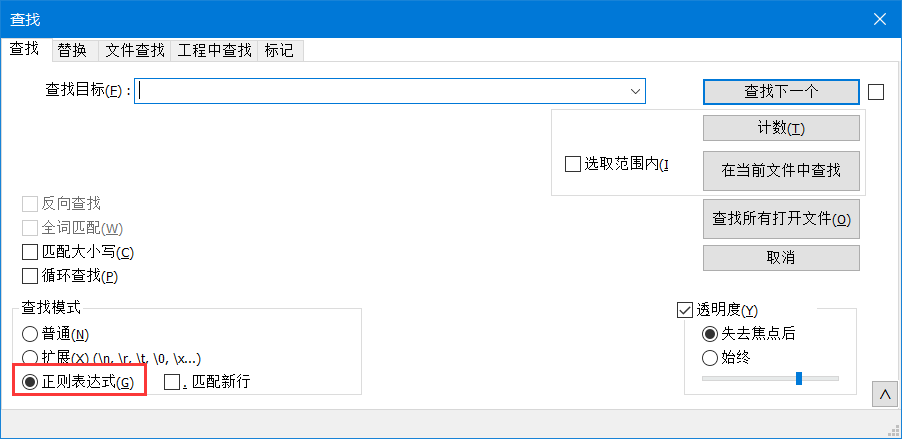
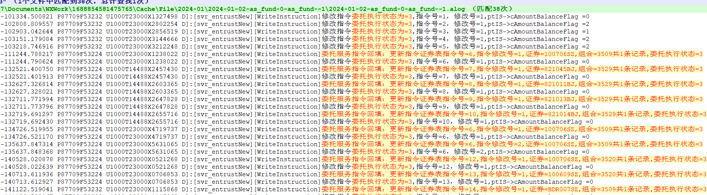

# 16-正则表达式基础

[TOC]

## 什么是正则表达式 ？
:::tip 定义
正则表达式（Regular Expression）：用于从文本中检索符合某些特定规则的文本，常被称为模式"pattern"。

例如：
- abc 这是一个模式，匹配文本中所有abc字符串。
- [ab]c 这也是一个模式，匹配文本中所有的ac、bc字符串。
- a?bc 匹配abc、bc。
- a{1,3}bc 匹配abc、aabc、aaabc。

通常使用它的缩写“regex”或者“regexp”。

正则表达式是从左到右来匹配一个字符串的。
:::

正则表达式可以被用来替换字符串中的文本、验证表单、基于模式匹配从一个字符串中提取字符串等等。

::: tip bash中的regex
在Bash中（主要是grep、sed、gawk命令），正则表达式的语法（或引擎）主要有两种：基于POSIX标准的基本正则表达式（BRE）和扩展正则表达式（ERE）。
:::

### 应用场景举例

在用户选择用户名时设置验证规则：用户名可以包含字母，数字，下划线和连字符；同时限制用户名中的字符数量。以下正则表达式可以满足要求：

<p align="center">

</p>

上面这个正则表达式可以匹配 `john_doe`，`jo-hn_doe` 和 `john12_as`。但是它不能匹配 `Jo`，因为该字符串里面包含大写字符，并且它太短了。

## 常见的支持正则表达式的文本编辑器

vscode、notepad++、emeditor等等。

以notepad++为例，我想要在日志中快速筛选出我想要的记录。ctrl+f，勾选左下“正则表达式”选项。


如果我想查找委托执行状态修改为3的记录，但是又不知道具体的日志是如何记录的，可以使用以下表达式：`委托.*状态.*3`


也可以使用正则表达式将日志中不重要的内容替换掉。例如`角色权限回收开始.*\n.*\n.*\n.*调用后台服务端临时权限生效或回收操作程序`，选出来一键删除掉。
## 1. 基本匹配

正则表达式是用于在文本中检索字符串的**模式**，它代表某一类字符串的匹配标准。本身也是一个字符串文本。

* `jack` 是一个纯文本，仅匹配jack这个单词。
    - ==jack== is a boy


正则表达式通常 **区分大小写** ，因此正则表达式 `JACK` 与字符串`jack`不匹配。

## 2. 元字符

**元字符** 是正则表达式的基本组成元素。它不表达字面意思，而是实现某种特殊功能。

有些元字符在写在方括号内时有特殊含义。

| 元字符 | 描述                                                                                                  |
| :----: | ----------------------------------------------------------------------------------------------------- |
| .    | 匹配除换行符以外的任意单个字符。 |
| [ ]   | 字符类，匹配方括号中包含的任意单个字符。 |
|  [^ ]  | 否定字符类。匹配方括号中不包含的任意字符                                                              |
| - | 定义一个字符区间，例如[a-z]、[0-9]、[A-Z]、[A-z] |
|   \*   | 匹配前面的子表达式 **零次** 或 **多次**                                                                          |
|   +    | 匹配前面的子表达式 **一次** 或 **多次**                                                                          |
| ?    | 匹配前面的子表达式 **零次** 或 **一次** ，或指明一个非贪婪符。 |
| {n,m}  | 花括号，匹配前面字符至少 n 次，但是不超过 m 次。                                                      |
| (xyz)  | 字符组，按照确切的顺序匹配字符 xyz。                                                                  |
| &#124; | 分支结构，在该位置选择两个或多个子模式中的一个进行匹配。                                               |
| &#92;  | 转义符，它可以还原元字符原来的含义，匹配保留字符 <code>[ ] ( ) { } . \* + ? ^ $ \ &#124;</code>，也表示匹配某些特殊字符。 |
|   ^    | 匹配行的开始                                                                                          |
|   $    | 匹配行的结束                                                                                          |


特殊字符元字符

与普通元字符不同，特殊元字符要转义后才起到作用。

| 元字符 | 说明 |   
| -- | -- |
| \f | 换页符 |
| \n | 换行符 |
| \r | 回车符 |
| \t | 制表符tab键 |
| \v | 垂直制表符 |
| [\b] | 回退并删除一个字符backspace键 |


### 2.1 英文句号

英文句号 `.` 是元字符的最简单的例子。`.` 可以匹配任意单个字符。它不会匹配换行符和新行的字符。

* `.ar` 表示：任意字符后面跟着一个字母 `a`，再后面跟着一个字母 `r`。
    - The ==car== ==par==ked in the ==gar==age.

### 2.2 字符集

字符集也称为字符类，方括号 `[]` 用于指定字符集，匹配括号内任意一个字符。

**不考虑** 方括号内字符的顺序。

* `[Tt]he` ，表示：大写 `T` 或小写 `t` ，后跟字母 `h`，再后跟字母 `e`。
    - ==The== car parked in ==the== garage.
#### 2.2.1 字符区间

使用字符集内的连字符 `-` 来指定字符范围。

在一个字符集里可以给出多个字符区间。

::: tip 常用字符区间
* [A-Z]：匹配A-Z所有大写字母
* [a-z]：匹配a-z所有小写字母
* [0-9]：匹配0-9数字
* [A-Z][a-z][0-9]：匹配任意一个字母（无论大小写）或数字
:::

* `[0-9A-Fa-f][0-9A-Fa-f][0-9A-Fa-f][0-9A-Fa-f][0-9A-Fa-f][0-9A-Fa-f]`，匹配RGB值。
    - ==66ccff==、==FFFFFF==、==333455==
    
字符集中的英文句号表示它字面的含义。

* `ar[.]`，表示小写字母 `a`，后面跟着一个字母 `r`，再后面跟着一个英文句号 `.` 字符。
    - A garage is a good place to park a c==ar.==

#### 2.2.2 取非匹配

插入字符 `^` 表示一个模式的开始，但是当它在方括号内出现时，表示字符集取非匹配。

* `[^c]ar`，表示：除了字母 `c` 以外的任意字符，后面跟着字符 `a`，再后面跟着一个字母 `r`。
    * The car ==par==ked in the ==gar==age.

* `[^0-9]`，表示匹配任何不是数字的字符。

### 2.3 重复

以下元字符 `+`，`*` 或 `?` 用于指定子模式可以出现多少次。这些元字符也被称为**量词**。

#### 2.3.1 星号

星号 `*` 表示匹配某个模式 **零次或多次**。

* `a*` 表示：小写字母 `a` 可以重复零次或者多次。但若星号出现在字符集或者字符类之后，它表示整个字符集的重复。

* `[a-z]*`，表示：一行中可以包含任意数量的小写字母。
    * T==he== ==car== ==parked== ==in== ==the== ==garage==
    * 在上面这个例子中，是匹配了六次而不是一次。

星号 `*` 可以与元符号 `.` 用在一起，用来匹配任意字符串 `.*`。

星号 `*` 可以与空格符 `\s` 一起使用，用来匹配一串空格字符。

* `\s*cat\s*`，表示：零个或多个空格，后面跟小写字母 `c`，再后面跟小写字母 `a`，再在后面跟小写字母 `t`，后面再跟零个或多个空格。
    - The fat【 cat 】sat on the【 cat】.

#### 2.3.2 加号

加号 `+` 表示匹配上一个字符 **一次** 或 **多次**。

* `c.+t`，表示：一个小写字母 `c`，后跟任意数量的字符，后跟小写字母 `t`。
    * 贪婪匹配"c.+t" => The fat ==cat sat on the mat==.
    * 非贪婪匹配"c.+?t" => The fat ==cat== sat on the mat.

#### 2.3.3 问号

`?` 用来表示前一个字符是可选的，匹配前一个字符 **零次** 或 **一次**。

* `[T]?he`，表示：可选的大写字母 `T`，后面跟小写字母 `h`，后跟小写字母 `e`。
    - "[T]he" => ==The== car is parked in the garage.
    - "[T]?he" => ==The== car is parked in t==he== garage.

#### 2.3.4 贪婪与懒惰

在进行重复匹配时，可能会发生==过度匹配==的问题，导致得不到我们想要的结果。

```bash
grep "<a>.*</a>" -
<a>AK</a> and <a>HI</a>
```

在上面这个例子中，grep将匹配整行字符，而不是分成两段。

这是因为 `*` 和 `+` 都是 **贪婪** 型匹配，他会尝试匹配满足条件的最长的字符。例如 `a.*b` 搜索ababab，会返回整个字符串。

在贪婪型字符后加上一个 `?` ，即可得到 **懒惰** 版本，碰到第一个匹配的字符串就结束。

| 贪婪型元字符 | 懒惰型元字符 |
| -- | -- |
| * | *? |
| + | +? |
| {n, } | {n, }? |

### 2.4 花括号

花括号 `{}`（也称量词）用于指定字符或一组字符可以重复的次数。

* `[0-9]{2,3}`，表示：匹配至少 2 位数字但不超过 3 位（0 到 9 范围内的字符）。
    - The number was 9.==999==7 but we rounded it off to ==10==.0.

可以省略第二个数字，表示至少匹配多少次。

* `[0-9]{2,}`，表示：匹配 2 个或更多个数字。
    * The number was 9.==9997== but we rounded it off to ==10==.0.

如果逗号也删除，则匹配指定次数。

* `[0-9]{2}`，表示：匹配正好为 2 位数的数字。
    * The number was 9.==99== ==97== but we rounded it off to ==10==.0.

### 2.5 字符组（子表达式）

字符组是一组写在圆括号内的子模式 `(...)`。

如果把一个量词（星号、问号、加号、花括号）放在一个字符之后，它会重复前一个字符。

如果把量词放在一个字符组之后，它会重复整个字符组。

* `(ab)*` 匹配零个或多个的字符串“ab”。

我们还可以在字符组中使用元字符 `|`。

*  `(c|g|p)ar` 匹配小写字母 `c`、`g` 或 `p` 后面跟字母 `a`，后跟字母 `r`。
    - The ==car== is ==par==ked in the ==gar==age.

### 2.6 分支结构

竖线 `|` 用来定义分支结构，类似或运算。分支结构就像多个表达式之间的条件。

字符集和分支结构的功能有些类似，区别在于字符集作用于字符级别，分支结构作用于模式级别。

* `pattern1|pattern2`，表示：要么匹配 pattern1，要么匹配 pattern2。

* `(T|t)he|car`，表示：匹配大写字母 `T` 或小写字母 `t`，后面跟小写字母 `h`，后跟小写字母 `e`，或匹配小写字母 `c`，后跟小写字母 `a`，后跟小写字母 `r`。
    - "(T|t)he|car" => ==The== ==car== is parked in ==the== garage.

### 2.7 转义特殊字符

反斜杠 `\` 用来转义下一个字符，匹配特殊字符本身 `{ } [ ] / \ + * . $ ^ | ?`。

在特殊字符前面加 `\`，就可以使用它来做匹配字符。

例如正则表达式 `.` 是用来匹配除了换行符以外的任意字符。现在要在输入字符串中匹配 `.` 字符，就要使用`\.`

- `(f|c|m)at\.?`：小写字母 `f`、`c` 或者 `m` 后跟小写字母 `a`，后跟小写字母 `t`，后跟可选的 `.` 字符。
    - The ==fat== ==cat== sat on the ==mat.==

### 2.8 定位符

定位符用于检查模式的起始符号或结尾符号，通常用于**行首**和**行尾**的匹配。

两种类型：
* `^` 检查匹配字符是否是起始字符。
* `$` 检查匹配字符是否是输入字符串的最后一个字符。

#### 2.8.1 插入符号

插入符号 `^` 符号用于检查匹配字符是否是输入字符串的第一个字符。

- `^a` 匹配字符串 `abc`，匹配到 `a`。

- `^b` 匹配`abc`，匹配不到任何字符串，因为在字符串 `abc` 中“b”不是起始字符。

- `^(T|t)he`：大写字母 `T` 或小写字母 `t` 是输入字符串的起始符号，后面跟着小写字母 `h`，后跟小写字母 `e`。
    - "^(T|t)he" => ==The== car is parked in the garage.
    - "(T|t)he" => ==The== car is parked in ==the== garage.

#### 2.8.2 美元符号

美元 `$` 符号用于检查匹配字符是否是输入字符串的最后一个字符。

- `(at\.)$`：小写字母 `a`，后跟小写字母 `t`，后跟一个 `.` 字符，且该模式必须是字符串的结尾。
    - (at) => The fat c==at.== s==at.== on the m==at.==
    - (at)$ => The fat cat sat on the m==at.==

## 3. 简写字符集

正则表达式为常用的字符集和常用的正则表达式提供了简写。

| 简写 | 描述                                     |
| :--: | ---------------------------------------- |
|  .   | 匹配除换行符以外的任意字符               |
| \b | boundary，匹配一个单词的边界，即开始和结尾 |
|  \w  | 匹配所有字母和数字的字符：`[a-zA-Z0-9_]` |
|  \W  | 匹配非字母和数字的字符：`[^\w]`          |
|  \d  | 匹配数字：`[0-9]`                        |
|  \D  | 匹配非数字：`[^\d]`                      |
|  \s  | 匹配空格符：`[\t\n\f\r\p{Z}]`            |
|  \S  | 匹配非空格符：`[^\s]`                    |

- (\d){5}=：匹配所有五位数字后带一个等号的字符串

## 4. 断言

断言在正则表达式中是一种**匹配位置**而不匹配字符的机制。通过设置条件，以确保匹配到的模式出现或不出现在特定位置。换言之，断言关心的是模式的上下文是否符合要求。

后行断言和先行断言有时候被称为断言，它们是特殊类型的 **_非捕获组_**（用于匹配模式，但不包括在匹配列表中）。当我们在一种特定模式之前或者之后有这种模式时，会优先使用断言。

例如我们想获取输入字符串 `$4.44 and $10.88` 中带有前缀 `$` 的所有数字。我们可以使用这个正则表达式 `(?<=\$)[0-9\.]*`，表示：获取包含 `.` 字符且前缀为 `$` 的所有数字。

以下是正则表达式中使用的断言：

| 符号 | 描述         |
| :--: | ------------ |
|  ?=  | 正向先行断言 |
|  ?!  | 负向先行断言 |
| ?<=  | 正向后行断言 |
| ?<!  | 负向后行断言 |

### 4.1 正向先行断言

正向先行断言认为第一部分的表达式的后面必须是先行断言表达式。返回的匹配结果仅包含与第一部分表达式匹配的文本。
要在一个括号内定义一个正向先行断言，在括号中问号和等号是这样使用的 `(?=...)`。先行断言表达式写在括号中的等号后面。
例如正则表达式 `(T|t)he(?=\sfat)`，表示：匹配大写字母 `T` 或小写字母 `t`，后面跟字母 `h`，后跟字母 `e`。
在括号中，我们定义了正向先行断言，它会引导正则表达式引擎匹配后面跟着 `fat` 的 `The` 或 `the`。

<pre>
"(T|t)he(?=\sfat)" => <a href="#learn-regex"><strong>The</strong></a> fat cat sat on the mat.
</pre>

### 4.2 负向先行断言

当我们需要指定第一部分表达式的后面不跟随某一内容时，使用负向先行断言。负向先行断言的定义跟我们定义的正向先行断言一样，
唯一的区别在于我们使用否定符号 `!` 而不是等号 `=`，例如 `(?!...)`。
我们来看看下面的正则表达式 `(T|t)he(?!\sfat)`，表示：从输入字符串中获取全部 `The` 或者 `the` 且不匹配 `fat` 前面加上一个空格字符。

<pre>
"(T|t)he(?!\sfat)" => The fat cat sat on <a href="#learn-regex"><strong>the</strong></a> mat.
</pre>

### 4.3 正向后行断言

正向后行断言用于获取跟随在特定模式之后的所有匹配内容。正向后行断言表示为 `(?<=...)`。例如正则表达式 `(?<=(T|t)he\s)(fat|mat)`，表示：从输入字符串中获取在单词 `The` 或 `the` 之后的所有 `fat` 和 `mat` 单词。

<pre>
"(?<=(T|t)he\s)(fat|mat)" => The <a href="#learn-regex"><strong>fat</strong></a> cat sat on the <a href="#learn-regex"><strong>mat</strong></a>.
</pre>

### 4.4 负向后行断言

负向后行断言是用于获取不跟随在特定模式之后的所有匹配的内容。负向后行断言表示为 `(?<!...)`。例如正则表达式 `(?<!(T|t)he\s)(cat)`，表示：在输入字符中获取所有不在 `The` 或 `the` 之后的所有单词 `cat`。

<pre>
"(?&lt;!(T|t)he\s)(cat)" => The cat sat on <a href="#learn-regex"><strong>cat</strong></a>.
</pre>

## 5. 标记

标记也称为修饰符，因为它会修改正则表达式的输出。这些标志可以以任意顺序或组合使用，并且是正则表达式的一部分。

| 标记 | 描述                                       |
| :--: | ------------------------------------------ |
|  i   | 不区分大小写：将匹配设置为不区分大小写。   |
|  g   | 全局搜索：搜索整个输入字符串中的所有匹配。 |
|  m   | 多行匹配：会匹配输入字符串每一行。         |

### 5.1 不区分大小写

`i` 修饰符用于执行不区分大小写匹配。例如正则表达式 `/The/gi`，表示：大写字母 `T`，后跟小写字母 `h`，后跟字母 `e`。
但是在正则匹配结束时 `i` 标记会告诉正则表达式引擎忽略这种情况。正如你所看到的，我们还使用了 `g` 标记，因为我们要在整个输入字符串中搜索匹配。

<pre>
"The" => <a href="#learn-regex"><strong>The</strong></a> fat cat sat on the mat.
</pre>

<pre>
"/The/gi" => <a href="#learn-regex"><strong>The</strong></a> fat cat sat on <a href="#learn-regex"><strong>the</strong></a> mat.
</pre>

### 5.2 全局搜索

`g` 修饰符用于执行全局匹配（会查找所有匹配，不会在查找到第一个匹配时就停止）。
例如正则表达式 `/.(at)/g`，表示：除换行符之外的任意字符，后跟小写字母 `a`，后跟小写字母 `t`。
因为我们在正则表达式的末尾使用了 `g` 标记，它会从整个输入字符串中找到每个匹配项。

<pre>
".(at)" => The <a href="#learn-regex"><strong>fat</strong></a> cat sat on the mat.
</pre>

<pre>
"/.(at)/g" => The <a href="#learn-regex"><strong>fat</strong></a> <a href="#learn-regex"><strong>cat</strong></a> <a href="#learn-regex"><strong>sat</strong></a> on the <a href="#learn-regex"><strong>mat</strong></a>.
</pre>

### 5.3 多行匹配

`m` 修饰符被用来执行多行的匹配。正如我们前面讨论过的 `(^, $)`，使用定位符来检查匹配字符是输入字符串开始或者结束。但是我们希望每一行都使用定位符，所以我们就使用 `m` 修饰符。
例如正则表达式 `/at(.)?$/gm`，表示：小写字母 `a`，后跟小写字母 `t`，匹配除了换行符以外任意字符零次或一次。而且因为 `m` 标记，现在正则表达式引擎匹配字符串中每一行的末尾。

<pre>
"/.at(.)?$/" => The fat
                cat sat
                on the <a href="#learn-regex"><strong>mat.</strong></a>
</pre>

<pre>
"/.at(.)?$/gm" => The <a href="#learn-regex"><strong>fat</strong></a>
                  cat <a href="#learn-regex"><strong>sat</strong></a>
                  on the <a href="#learn-regex"><strong>mat.</strong></a>
</pre>

## 常用正则表达式

-   **正整数**：`^\d+$`
-   **负整数**：`^-\d+$`
-   **电话号码**：`^+?[\d\s]{3,}$`
-   **电话代码**：`^+?[\d\s]+(?[\d\s]{10,}$`
-   **整数**：`^-?\d+$`
-   **用户名**：`^[\w\d_.]{4,16}$`
-   **字母数字字符**：`^[a-zA-Z0-9]*$`
-   **带空格的字母数字字符**：`^[a-zA-Z0-9 ]*$`
-   **密码**：`^(?=^.{6,}$)((?=.*[A-Za-z0-9])(?=.*[A-Z])(?=.*[a-z]))^.*$`
-   **电子邮件**：`^([a-zA-Z0-9._%-]+@[a-zA-Z0-9.-]+\.[a-zA-Z]{2,4})*$`
-   **IPv4 地址**：`^((?:(?:25[0-5]|2[0-4][0-9]|[01]?[0-9][0-9]?)\.){3}(?:25[0-5]|2[0-4][0-9]|[01]?[0-9][0-9]?))*$`
-   **小写字母**：`^([a-z])*$`
-   **大写字母**：`^([A-Z])*$`
-   **网址**：`^(((http|https|ftp):\/\/)?([[a-zA-Z0-9]\-\.])+(\.)([[a-zA-Z0-9]]){2,4}([[a-zA-Z0-9]\/+=%&_\.~?\-]*))*$`
-   **VISA 信用卡号码**：`^(4[0-9]{12}(?:[0-9]{3})?)*$`
-   **日期（MM/DD/YYYY）**：`^(0?[1-9]|1[012])[- /.](0?[1-9]|[12][0-9]|3[01])[- /.](19|20)?[0-9]{2}$`
-   **日期（YYYY/MM/DD）**：`^(19|20)?[0-9]{2}[- /.](0?[1-9]|1[012])[- /.](0?[1-9]|[12][0-9]|3[01])$`
-   **万事达信用卡号码**：`^(5[1-5][0-9]{14})*$`