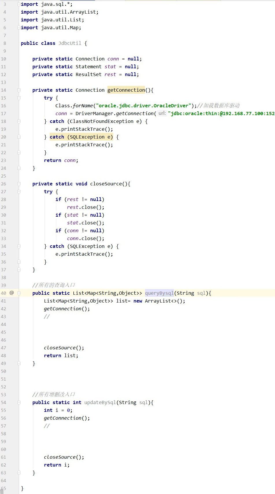

# JDBC

## JDBC连接测试

```java
import java.sql.Connection;
import java.sql.DriverManager;
import java.sql.ResultSet;
import java.sql.SQLException;
import java.sql.Statement;

public class MySQLConnectionTest {
    public static void main(String[] args) {
        String url = "jdbc:mysql://localhost:3306/test_db?useSSL=false&serverTimezone=UTC";
        String user = "your_username";
        String password = "your_password";

        try {
            // 1. 加载 MySQL JDBC 驱动
            Class.forName("com.mysql.cj.jdbc.Driver");

            // 2. 建立数据库连接
            Connection connection = DriverManager.getConnection(url, user, password);

            // 3. 创建 Statement 对象
            Statement statement = connection.createStatement();

            // 4. 执行 SQL 查询
            ResultSet resultSet = statement.executeQuery("SELECT * FROM your_table");

            // 5. 处理查询结果
            while (resultSet.next()) {
                System.out.println("id: " + resultSet.getInt("id") + ", name: " + resultSet.getString("name"));
            }

            // 6. 关闭资源
            resultSet.close();
            statement.close();
            connection.close();
        } catch (ClassNotFoundException e) {
            e.printStackTrace();
        } catch (SQLException e) {
            e.printStackTrace();
        }
    }
}
```
请将 url、user 和 password 变量替换为适当的值。确保已创建数据库 test_db 和表 your_table，并在表中插入一些数据。

在运行此代码之前，不要忘记将 MySQL 的 JDBC 驱动程序添加到项目的依赖中。如果你使用的是 Maven 项目，可以在 pom.xml 文件中添加以下依赖：
```java
<dependency>
    <groupId>mysql</groupId>
    <artifactId>mysql-connector-java</artifactId>
    <version>8.0.27</version>
</dependency>

```


