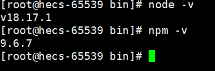

# Nginx
## centos 安装nginx

### 包管理器
```bash
# yum install nginx
```
### 编译安装

### docker安装

## 服务启停

### systemctl命令
- 启动Nginx服务：sudo systemctl start nginx
- 停止Nginx服务：sudo systemctl stop nginx
- 重新加载Nginx配置：sudo systemctl reload nginx

### nginx命令
```bash
# nginx
# ps -ef|grep nginx

root       41580       1  0 11:20 ?        00:00:00 nginx: master process nginx
nginx      41581   41580  0 11:20 ?        00:00:00 nginx: worker process
root       69235   68876  0 11:32 pts/2    00:00:00 grep --color=auto nginx

# lsof -i:80

COMMAND   PID  USER   FD   TYPE DEVICE SIZE/OFF NODE NAME
nginx   41580  root    9u  IPv4 161121      0t0  TCP *:http (LISTEN)
nginx   41580  root   10u  IPv6 161122      0t0  TCP *:http (LISTEN)
nginx   41581 nginx    9u  IPv4 161121      0t0  TCP *:http (LISTEN)
nginx   41581 nginx   10u  IPv6 161122      0t0  TCP *:http (LISTEN)

```
#### 1. **启动 Nginx**：

```shell
nginx
```

这个命令用于启动 Nginx 服务器，它会读取 Nginx 配置文件并开始监听来自客户端的请求。

#### 2. **nginx -s singal**
- **停止 Nginx**：

```shell
nginx -s stop
```

这个命令用于停止正在运行的 Nginx 服务器。

- **快速停止 Nginx**：

```shell
nginx -s quit
```

这个命令也用于停止 Nginx 服务器，但它会等待当前请求处理完毕后再停止。

- **重新加载配置文件**：

```shell
nginx -s reload
```

使用这个命令可以重新加载 Nginx 的配置文件，使配置更改生效，而不需要停止和重新启动整个服务。

- **重新打开日志文件**

```shell
nginx -s reopen
```
    
#### 3. **测试配置文件语法**：
```shell
nginx -t
```

这个命令用于测试 Nginx 配置文件的语法是否正确，如果配置文件存在错误，它会指示错误的位置和原因。

#### 4. **查看 Nginx 版本**：

```shell
nginx -v
```

这个命令会显示当前安装的 Nginx 版本信息。

#### 5. **查看 Nginx 编译参数**：

```shell
nginx -V
```

使用这个命令可以查看 Nginx 的编译参数和配置信息。  

1. **显示编译参数**：`nginx -V` 命令会显示 Nginx 在编译时所使用的参数。这包括了一系列选项和标志，它们决定了 Nginx 编译后的功能和特性。

2. **模块信息**：`nginx -V` 会列出所有编译进 Nginx 的模块。这些模块可以是核心模块，也可以是第三方模块，它们扩展了 Nginx 的功能，如 SSL 支持、缓存控制、反向代理等。

3. **路径信息**：该命令还会显示 Nginx 的安装路径、配置文件路径以及其他重要文件的路径。这对于了解 Nginx 安装的位置和配置文件的位置非常有用。

4. **编译信息**：`nginx -V` 还会显示编译器的信息，包括编译器的类型和版本。这对于排查编译相关的问题非常有帮助。

通过查看 `nginx -V` 的输出，您可以了解 Nginx 的编译配置，包括启用的模块和功能，以及相关的路径信息。这对于管理和维护 Nginx 服务器以及调试潜在问题都非常有用。请注意，`nginx -V` 命令通常需要在 Nginx 安装目录中执行。

```bash
[root@hecs-65539 ~]# nginx -V
nginx version: nginx/1.14.1
built by gcc 8.2.1 20180905 (Red Hat 8.2.1-3) (GCC) 
built with OpenSSL 1.1.1 FIPS  11 Sep 2018 (running with OpenSSL 1.1.1k  FIPS 25 Mar 2021)
TLS SNI support enabled
configure arguments: --prefix=/usr/share/nginx --sbin-path=/usr/sbin/nginx --modules-path=/usr/lib64/nginx/modules --conf-path=/etc/nginx/nginx.conf --error-log-path=/var/log/nginx/error.log --http-log-path=/var/log/nginx/access.log --http-client-body-temp-path=/var/lib/nginx/tmp/client_body --http-proxy-temp-path=/var/lib/nginx/tmp/proxy --http-fastcgi-temp-path=/var/lib/nginx/tmp/fastcgi --http-uwsgi-temp-path=/var/lib/nginx/tmp/uwsgi --http-scgi-temp-path=/var/lib/nginx/tmp/scgi --pid-path=/run/nginx.pid --lock-path=/run/lock/subsys/nginx --user=nginx --group=nginx --with-file-aio --with-ipv6 --with-http_ssl_module --with-http_v2_module --with-http_realip_module --with-http_addition_module --with-http_xslt_module=dynamic --with-http_image_filter_module=dynamic --with-http_sub_module --with-http_dav_module --with-http_flv_module --with-http_mp4_module --with-http_gunzip_module --with-http_gzip_static_module --with-http_random_index_module --with-http_secure_link_module --with-http_degradation_module --with-http_slice_module --with-http_stub_status_module --with-http_perl_module=dynamic --with-http_auth_request_module --with-mail=dynamic --with-mail_ssl_module --with-pcre --with-pcre-jit --with-stream=dynamic --with-stream_ssl_module --with-debug --with-cc-opt='-O2 -g -pipe -Wall -Werror=format-security -Wp,-D_FORTIFY_SOURCE=2 -Wp,-D_GLIBCXX_ASSERTIONS -fexceptions -fstack-protector-strong -grecord-gcc-switches -specs=/usr/lib/rpm/redhat/redhat-hardened-cc1 -specs=/usr/lib/rpm/redhat/redhat-annobin-cc1 -m64 -mtune=generic -fasynchronous-unwind-tables -fstack-clash-protection -fcf-protection' --with-ld-opt='-Wl,-z,relro -Wl,-z,now -specs=/usr/lib/rpm/redhat/redhat-hardened-ld -Wl,-E'
```

这是运行 `nginx -V` 命令后的输出，它提供了有关 Nginx 编译和配置的详细信息：

1. **nginx version**: 显示了 Nginx 的版本信息，这里是 `nginx/1.14.1`，表示 Nginx 的版本是 1.14.1。

2. **built by gcc**: 显示了编译 Nginx 使用的 C 编译器信息，这里使用的是 GCC 版本 `8.2.1 20180905`，这是 Red Hat 特定版本的 GCC。

3. **built with OpenSSL**: 显示了 Nginx 使用的 OpenSSL 库的版本信息。Nginx需要 OpenSSL 来提供 HTTPS 支持。这里使用的 OpenSSL 版本是 `1.1.1 FIPS 11 Sep 2018` 和 `1.1.1k FIPS 25 Mar 2021`。

4. **TLS SNI support enabled**: 表示启用了 TLS Server Name Indication（TLS SNI）支持，这是一种用于支持多域名证书的扩展。

5. **configure arguments**: 这一行列出了编译 Nginx 时使用的配置选项，这些选项告诉 Nginx 如何构建和运行。以下是其中一些重要选项的解释：
   - `--prefix=/usr/share/nginx`: Nginx 的安装目录。
   - `--sbin-path=/usr/sbin/nginx`: Nginx 主执行文件的路径。
   - `--conf-path=/etc/nginx/nginx.conf`: 主配置文件的路径。
   - `--error-log-path=/var/log/nginx/error.log`: 错误日志文件的路径。
   - `--http-log-path=/var/log/nginx/access.log`: HTTP 访问日志文件的路径。
   - `--pid-path=/run/nginx.pid`: 存储主进程的 PID（进程标识符）的文件路径。
   - `--lock-path=/run/lock/subsys/nginx`: 存储锁文件的路径。
   - `--user=nginx` 和 `--group=nginx`: 指定 Nginx 运行时使用的用户和组。
   - `--with-http_ssl_module` 和 `--with-http_v2_module`: 启用 HTTP SSL 和 HTTP/2 支持。
   - `--with-stream=dynamic` 和 `--with-stream_ssl_module`: 启用动态模块和 Stream SSL 支持。
   - `--with-debug`: 启用调试模式。
   - `--with-cc-opt` 和 `--with-ld-opt`: 分别指定编译器和链接器的选项，用于设置优化和安全性参数。


## 配置hexo

### 安装nodejs

到官网下载安装包https://nodejs.org/en/download/

上传到服务器/usr/local/目录下并解压
```bash
tar -xvf node-v12.13.1-linux-x64.tar.xz
```


把npm和node命令添加到全局。

在 `/usr/local/bin` 目录下创建软连接，因为存放在 /usr/local/bin 目录下的可执行文件可以被系统中的任何用户调用，因为该目录通常被添加到系统的环境变量 PATH 中，允许用户在命令行中直接运行这些程序。
```bash
[root@hecs-65539 bin]# ln -s /usr/local/node-v18.17.1-linux-x64/npm /usr/local/bin/npm
[root@hecs-65539 bin]# ln -s /usr/local/node-v18.17.1-linux-x64/node /usr/local/bin/node
```

查看版本


然后安装cnpm，使用淘宝镜像。
```bash
npm install -g cnpm --registry="https://registry.npm.taobao.org"
```
添加全局变量

```bash
ln -s /usr/local/node-v18.17.1-linux-x64
/bin/cnpm /usr/local/bin/cnpm
```

查看版本

```bash
cpnm -v
```

### 安装hexo
- 执行命令：
```bash
npm install hexo-cli -g
```

- 然后把hexo命令添加到全局。

```bash
ln -s /usr/local/node-v18.17.1-linux-x64/lib/node_modules/hexo-cli/bin/hexo /usr/local/bin/hexo 
```

- 在usr/local/目录下新建目录hexo作为博客网站的根目录。然后执行命令
```bash
hexo init
```
- 启动hexo
```
hexo s
```


### 配置nginx到hexo的代理

修改nginx的配置文件。

```bash
    server {
        listen       80 default_server;
        listen       [::]:80 default_server;
        server_name  _;
    #    root         /usr/share/nginx/html;

        # Load configuration files for the default server block.
        include /etc/nginx/default.d/*.conf;

        location / {
            proxy_pass http://localhost:4000;
            proxy_set_header Host $host;
            proxy_set_header X-Real-IP $remote_addr;
            proxy_set_header X-Forwarded-For $proxy_add_x_forwarded_for;
        }

        error_page 404 /404.html;
            location = /40x.html {
        }

        error_page 500 502 503 504 /50x.html;
            location = /50x.html {
        }
    }
```
然后检查配置文件语法问题，重启nginx服务即可。

```bash
nginx -t
systemctl reload nginx
```
