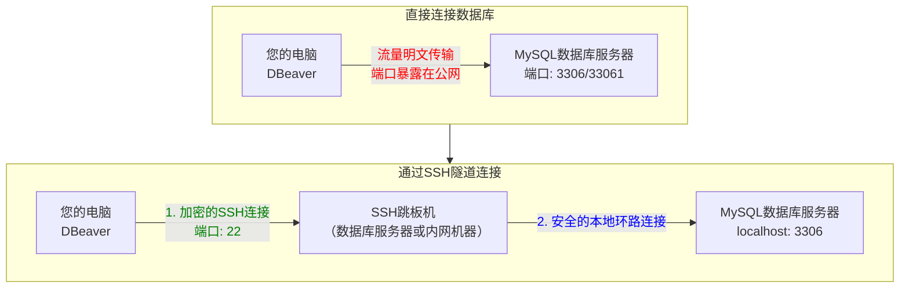

# MySQL登录验证

## 1. 验证系统概述

MySQL 的登录验证是一个**两层验证系统**：
1. **连接验证**：验证用户是否有权连接到 MySQL 服务器
2. **请求验证**：验证用户是否有权执行特定操作

## 2. 核心组件

### 1. 权限表
MySQL 将权限信息存储在 `mysql` 数据库的多个表中：
- `user`：用户账户和全局权限
- `db`：数据库级权限
- `tables_priv`：表级权限
- `columns_priv`：列级权限
- `procs_priv`：存储过程和函数权限

### 2. 验证插件
MySQL 支持多种验证方式：
- `mysql_native_password`：传统密码验证
- `caching_sha2_password`：MySQL 8.0+ 默认验证
- `sha256_password`：SHA-256 密码验证
- 外部验证：PAM、LDAP 等

## 3. 详细验证过程
```mermaid
flowchart TD
    A[客户端连接请求<br>
    mysql -u <username> -p -h <hostname> -P <port>] --> B{解析连接参数<br>用户名@主机:端口}
    
    B --> C[在mysql.user表中查找匹配记录]
    
    C --> D{找到匹配用户记录?}
    D -->|否| E[Access denied<br>错误代码: 1045]
    D -->|是| F{验证身份插件}
    
    subgraph F [身份验证方式]
        F1[mysql_native_password]
        F2[caching_sha2_password]
        F3[sha256_password]
        F4[LDAP/PAM/外部插件]
    end
    
    F --> G{密码验证}
    G -->|密码错误| H[Access denied<br>错误代码: 1045]
    G -->|密码正确| I{检查账户状态}
    
    I -->|密码过期| J[必须更改密码<br>错误代码: 1820]
    I -->|账户锁定| K[Account is locked<br>错误代码: 3118]
    I -->|权限被回收| L[权限重新加载等待]
    I -->|一切正常| M[连接成功!<br>建立安全通道]
    
    M --> N[客户端进入命令行，发送SQL查询]
    
    style A fill:#e1f5fe
    style M fill:#e8f5e9
    style E fill:#ffebee
    style H fill:#ffebee
    style K fill:#ffebee
```

上述流程可以分解为以下 **6 个核心阶段**，每个阶段都至关重要：

---

### 3.1: 连接初始化 (网络层)

**目标**: 建立基础的网络通信通道。
*   **要素**: 客户端提供服务器 IP 地址 (或主机名) 和端口号 (如 `-h 10.20.140.61 -P 33061`)。
*   **过程**: 客户端与服务器完成 TCP 三次握手。如果服务器防火墙丢弃了该端口的包，或没有进程监听该端口，连接会在此阶段失败，通常返回 **"Connection refused"** 错误。

```sql
# 连接命令示例
mysql -u username -p -h hostname -P port

# 参数说明：
# -u: 用户名 (e.g., 'root', 'appuser')
# -p: 密码 (交互式输入)
# -h: 主机地址 (e.g., 'localhost', '192.168.1.100', 'db.example.com')
# -P: 端口号 (默认3306，您使用的是33061)
```

“从本地到远程、从明文到安全”的常用连接命令速查

------------------------------------------------
1. 本地 socket（最安全，免密）
```bash
mysql -u root -p
```

2. 本地一次给密码（脚本用）
```bash
mysql -u root -p'YourPass@123'
```

3. 远程 TCP（端口 3306）
```bash
mysql -u remote_user -p'YourPass@123' -h 10.20.140.61 -P 3306
```

4. 远程 TCP + 指定数据库
```bash
mysql -u remote_user -p'YourPass@123' -h 10.20.140.61 -P 3306 -D yourdb
```

5. 只跑一条 SQL 就退出（适合脚本）
```bash
mysql -u root -p'YourPass@123' -e "SELECT NOW();"
```

6. 导入 SQL 文件
```bash
mysql -u root -p'YourPass@123' yourdb < /tmp/data.sql
```

7. 导出（mysqldump 示例）
```bash
mysqldump -u root -p'YourPass@123' yourdb > /tmp/yourdb_backup.sql
```

8. 使用 SSL（远程加密）
```bash
mysql -u remote_user -p'YourPass@123' -h 10.20.140.61 --ssl-mode=REQUIRED
```

------------------------------------------------
快速记忆  
本地：`-u 用户 -p`  
远程：`-u 用户 -p'密码' -h 主机 -P 端口`  
脚本：后面加 `-e "SQL"` 或重定向 `< file.sql`

### 3.2: 身份识别 (用户@主机匹配)

**目标**: 确认服务器是否“认识”这个来自特定地方的用户。
*   **要素**: **用户名 (Username)** 和 **主机 (Host)**。
*   **过程**: MySQL 在 `mysql.user` 表中查找匹配 ==User== 和 ==Host== 字段的记录。
    *   **`Host`** 列定义了允许连接的来源地址，可以是：
        *   **`localhost`**, **`127.0.0.1`**, **`::1`**： 仅允许本地套接字或回环接口连接。
        *   **具体 IP** (如 `192.168.1.100`)： 只允许来自该 IP 的连接。
        *   **网段通配** (如 `192.168.1.%` 或 `192.168.1.0/255.255.255.0`)： 允许来自该子网的连接。
        *   **`%`**： 允许来自任何主机的连接 (**生产环境慎用**)。
    *   **匹配规则**: 如果找到多条记录，MySQL 会使用**最具体**的一条。`'root'@'192.168.1.100'` 的优先级高于 `'root'@'192.168.1.%'`，后者又高于 `'root'@'%'`。
*   **失败结果**: 如果找不到任何匹配的 `user@host` 组合，连接立即终止，返回错误 **`ERROR 1045 (28000): Access denied for user 'user'@'host' (using password: YES/NO)`**。

MySQL 使用 =='username'@'host'== 格式进行精确匹配：

```sql
-- 示例用户记录
SELECT user, host FROM mysql.user;

-- 可能的结果：
-- +----------+---------------+
-- | user     | host          |
-- +----------+---------------+
-- | root     | localhost     |  -- 优先级最高
-- | appuser  | 192.168.1.%   |  -- 优先级中等
-- | admin    | %             |  -- 优先级最低
-- +----------+---------------+
```

---

### 3.3: 身份验证 (密码验证)

**目标**: 证明用户确实拥有其所声称的身份。
*   **要素**: **密码 (Password)** 和**身份验证插件 (Authentication Plugin)**。
*   **过程**:
    1.  服务器根据 `mysql.user` 表中该用户的 `plugin` 列决定使用哪种验证方式 (如 `mysql_native_password`, `caching_sha2_password`)。
    2.  客户端根据验证插件的要求提供密码凭证。
    3.  服务器使用相同的插件算法对提供的密码进行计算，并将结果与 `mysql.user` 表中 `authentication_string` 列存储的哈希值进行比对。
*   **失败结果**: 密码不匹配，连接终止，返回同样的 **`ERROR 1045 (28000)`** (不会告知是用户名错误还是密码错误，以防信息泄露)。

---

### 3.4: 账户状态检查

**目标**: 检查账户本身是否健康可用。
*   **要素**: 账户的状态标志位。
*   **过程**: 即使密码正确，MySQL 还会检查 `mysql.user` 表中的其他状态字段：
    *   **`account_locked`**： 是否为 `Y`。如果是，则表示管理员已锁定该账户，拒绝连接。错误: **`ERROR 3118 (HY000): Account is locked.`**
    *   **`password_expired`**： 是否为 `Y`。如果是，则要求用户立即更改密码。错误: **`ERROR 1820 (HY000): You must reset your password using ALTER USER statement before executing this statement.`**
    *   **`password_last_changed`** 和 **`password_lifetime`**： 密码是否已超过设置的有效期。
*   **失败结果**: 根据具体状态返回相应的错误。

---

### 3.5: 权限加载

**目标**: 为后续的 SQL 操作准备好权限规则。
*   **过程**: 一旦连接成功，MySQL 会将该用户的所有权限从各级权限表 (`user`, `db`, `tables_priv`, `columns_priv`, `procs_priv`) 中加载到内存缓存中。
*   **要点**: 这意味着如果管理员直接使用 `UPDATE`, `INSERT`, `DELETE` 语句修改了权限表，必须执行 **`FLUSH PRIVILEGES;`** 命令通知服务器重新加载权限缓存。使用 `GRANT`/`REVOKE` 语句则会自动刷新。

---

### 3.6: 进入命令3.(请求验证)

**目标**: 对连接后发出的每一个 SQL 语句进行授权检查。
*   **过程**: 对于客户端在此连接上执行的每一条命令 (`SELECT`, `INSERT`, `DROP` 等)，服务器都会检查内存中的权限缓存。
*   **验证逻辑**: 这是一个自上而下的过程：
    1.  检查 `user` 表中的**全局权限** (如 `SELECT_priv`)。如果这里是 `N`，请求直接被拒。
    2.  如果全局权限为 `Y`，则允许。否则，继续检查更细粒度的权限：
        *   检查 `db` 表中的**数据库权限**。
        *   检查 `tables_priv` 表中的**表权限**。
        *   检查 `columns_priv` 表中的**列权限**。
    3.  权限是**累加**的，除非在更高层级被明确拒绝。
*   **失败结果**: 如果用户尝试执行其没有权限的操作，服务器返回错误 **`ERROR 1142 (42000): command denied to user 'user'@'host' for table 'table_name'`**。


## SSH隧道连接

DBeaver 的 SSH 隧道功能本质上就是：先让 DBeaver 通过 SSH 协议登录到一台能访问数据库服务器的跳板机（Bastion Host），然后在这台跳板机上建立一个到数据库的“安全隧道”，最后通过这个隧道来连接数据库。

### 直接连接 与 SSH隧道连接



---

### 两种连接方式的对比


| 特性对比         | **直接连接 (Direct Connection)**                                  | **SSH隧道连接 (SSH Tunnel)**                                                                 |
| :--------------- | :---------------------------------------------------------------- | :------------------------------------------------------------------------------------------- |
| **网络路径**     | 您的电脑 → **互联网** → 数据库服务器(`33061`端口)                      | 您的电脑 → **互联网(SSH)** → 跳板机 → **内部网络** → 数据库服务器                               |
| **数据库端口**   | 必须对公网开放（如`33061`）                                           | **无需对公网开放**，只需跳板机可访问即可（通常只在内部网络监听）                                      |
| **加密方式**     | 依赖 MySQL 自身的加密（如开启SSL）                                   | **所有流量均被SSH协议加密**，即使MySQL未启用SSL也是安全的                                      |
| **安全风险**     | **高**。端口暴露在公网，易被扫描和暴力破解                                 | **极低**。数据库隐藏在内部网络，公网无法直接探测                                                     |
| **防火墙配置**   | 需要在数据库服务器的防火墙开放公共端口                                 | 只需在跳板机上开放**SSH端口(默认22)**                                                            |
| **认证方式**     | 仅需数据库用户名和密码                                                   | 需要两套认证：**1. SSH密钥（或密码）** <br> **2. 数据库用户名和密码**                                |
| **适用场景**     | 开发环境、测试环境，或受信任的内网环境                                   | **生产环境、云数据库、任何不安全的网络环境**的首选方案                                           |
| **连接速度**     | 直接，通常延迟更低                                                     | 有轻微 overhead（开销），因为多了一次加密/解密和转发，但对于大多数操作感知不明显                          |
| **配置复杂度**   | 简单                                                                 | 相对复杂，需要配置SSH密钥、跳板机信息等                                                              |

---

### SSH 隧道的工作原理（深入解释）

在 DBeaver 中配置 SSH 隧道时，会发生以下几步：

1.  **建立 SSH 连接**：DBeaver 使用提供的 SSH 用户名、密码或密钥文件，连接到您定的跳板机（如 `10.20.140.61` 的 `22` 端口）。
2.  **创建隧道**：DBeaver 请求 SSH 服务器在它自己（跳板机）上打开一个**本地端口监听**（例如 `127.0.0.1:33063`）。
3.  **端口转发**：任何发送到跳板机这个本地端口（`127.0.0.1:33063`）的数据，SSH 服务器都会自动通过已建立的 SSH 连接 **“转发”** 回本地电脑上的 DBeaver。
4.  **连接数据库**：DBeaver 然后不再直接连接远程的 `10.20.140.61:33061`，而是去连接这个 **“本地”** 的隧道端口（`127.0.0.1:33063`）。对 DBeaver 来说，它以为数据库就在本地。
5.  **完成请求**：SSH 服务器收到来自隧道的数据包后，将其解密，然后再以明文形式在它的内部网络上发送给真正的数据库 `localhost:3306`（或 `10.20.140.61:33061`）。

**简单比喻：**
> SSH隧道就像是一条从您家（电脑）到公司办公室（数据库）的**加密专用隧道（SSH连接）**。您先把文件给隧道口的保安（跳板机），保安通过隧道把文件安全送到办公室。办公室大门（数据库端口）只对内部的保安开放，外人从大街上根本看不到办公室的门在哪。