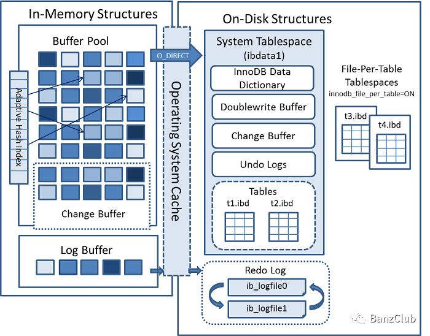

# MySQL结构
## 逻辑层次

1. **Server 层（Server Layer）**：Server 层是 MySQL 的核心，它管理了所有数据库的基本功能，包括客户端连接、安全认证、查询解析、查询优化和执行。这一层包含了连接层和 SQL 层。

    - **连接层（Connection Layer）**：连接层负责处理客户端与服务器之间的通信，包括通信协议、线程处理和用户身份验证。它确保客户端可以安全地连接到数据库，并处理请求的传输。

    - **SQL 层（SQL Layer）**：SQL 层包括了查询解析器、预处理、查询优化器、查询缓存、权限判断、执行计划和执行器等组件。这些组件协同工作，将用户发送的 SQL 查询翻译成可以执行的操作。其中，查询优化器负责决定如何执行查询以获得最佳性能。

2. **存储引擎层（Storage Engine Layer）**：存储引擎层负责管理数据的存储和检索。MySQL 支持多种存储引擎，例如 InnoDB、MyISAM、Memory 等。每个存储引擎都有其独特的特性和适用场景。用户可以根据需求选择不同的存储引擎来存储数据。存储引擎层使得 MySQL 具有了很高的灵活性。

## 逻辑结构

数据库 -> 表 + 与之相关的索引和视图、存储过程等。

1. **数据库（Database）：** MySQL的最顶层结构是数据库。每个数据库内可以包含多个表以及与之相关的其他数据库对象。

2. **表（Table）：** 表是数据库中存储数据的主要单位。每个表具有自己的列和行，定义了数据的结构和组织方式。表中的数据以行的形式存储。

3. **索引（Index）：** 索引是用于提高数据检索性能的结构。它存储了表中某一列的值和对应的行位置，加速数据查询操作。

4. **视图（View）：** 视图是虚拟表，它是一个基于一个或多个表的查询结果的集合。视图可以简化复杂的查询，提供一种更抽象的数据访问方式。

5. **存储过程（Stored Procedure）：** 存储过程是一组SQL语句的集合，可以在数据库中存储和重复使用。它们允许执行特定的数据库操作，如数据操作或复杂的业务逻辑。

这种简化的理解涵盖了MySQL的逻辑结构的主要组成部分。当然，还有其他一些数据库对象和特性，如触发器、事件、用户和权限管理等，但上述元素是构建MySQL数据库的核心组件。这种简单的逻辑结构有助于理解和操作MySQL数据库。

## 物理结构

