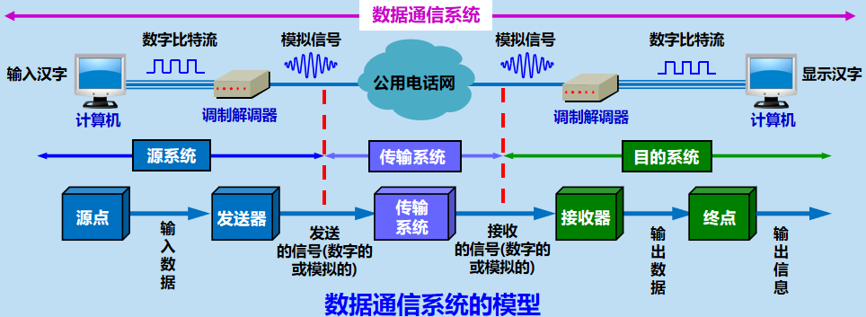
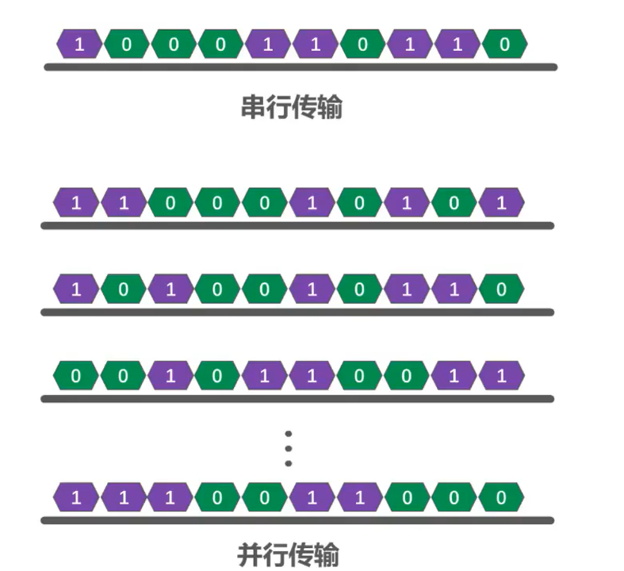
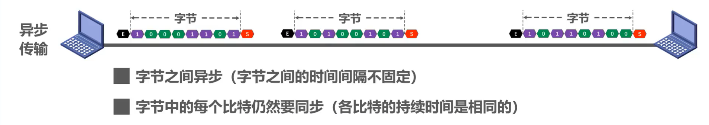
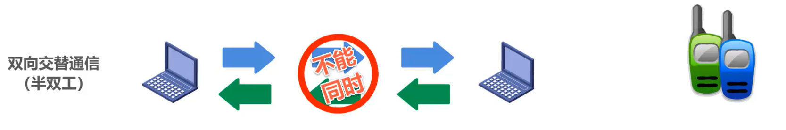
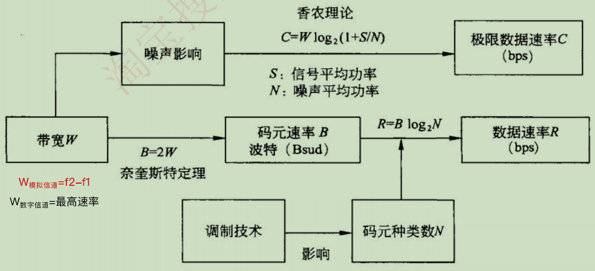
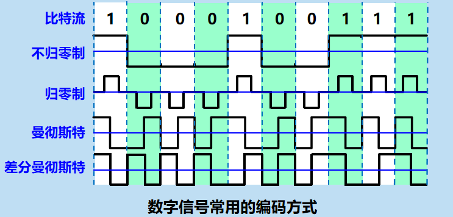
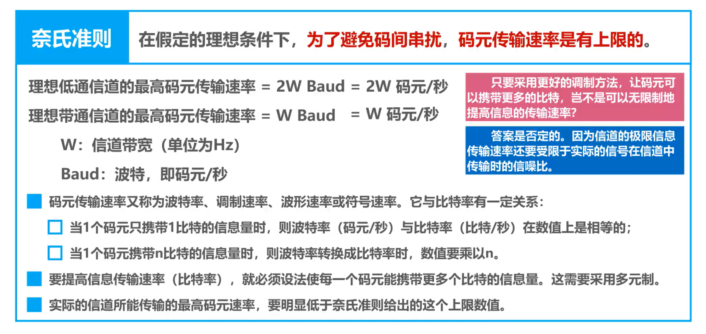
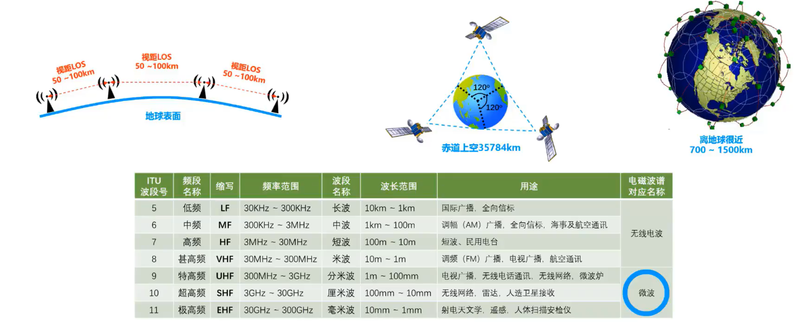
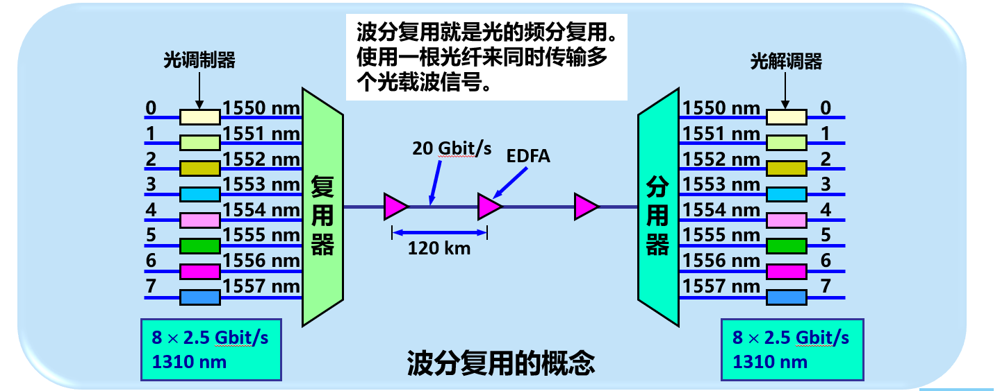

# 2.1 物理层的基本概念

* 物理层考虑的是怎样才能在连接各种计算机的传输媒体上 **传输数据比特流** ，而不是指具体的传输媒体。
* 物理层的作用是要尽可能地 **屏蔽掉** 不同传输媒体和通信手段的差异。
* 物理层主要任务：确定与传输媒体的接口的一些特性。
    * 机械特性 ：指明接口所用接线器的形状和尺寸、引线数目和排列、固定和锁定装置等。
    * 电气特性：指明在接口电缆的各条线上出现的电压的范围。
    * 功能特性：指明某条线上出现的某一电平的电压的意义。
    * 过程特性 ：指明对于不同功能的各种可能事件的出现顺序。

# 2.2 数据通信基础知识
## 1. 数据通信系统的模型
一个数据通信系统包括三大部分： **源系统**（或发送端、发送方）、 **传输系统**（或传输网络）和 **目的系统**（或接收端、接收方）。

* 消息 (message) —— 通信的目的是传送消息。如语音、文字、图像、视频等都是消息。
    * 数据 (data) —— 运送消息的实体。通常是有意义的符号序列。
* 信号 (signal) —— 数据的电气的或电磁的表现。

### 模拟信号与数字信号

* ==模拟信号== (analogous signal) —— 代表消息的参数的取值是==连续==的。模拟信号的电平随时间连续变化，具有周期性的正弦波信。
    * 如：**连续** 变化的 **电磁波** （无线电、广播），电压信号（电话传输中的音频电压信号）

* ==数字信号== (digital signal) —— 代表消息的参数的取值是==离散==的。 它是不连续的二进制脉冲信号（对称的方波波形）。
    * 如：**断续** 变化的电压脉冲、光脉冲。
    * **码元** (code) —— 在使用时间域（或简称为时域）的波形表示数字信号时，代表 **不同离散数值** 的 **基本波形**。
        * 一个码元所携带的信息量是 **不固定** 的，这与调制方式和编码方式有关。
        * 一个码元携带的信息量n（位）与码元的种类 N 之间的关系 $n = log_2N$
        * 码元速率（又称 **波特率** ）：**单位时间** 内通过信道传送的 **码元个数**，如果信道带宽为T秒，则码元速率为 $B=1/T$。
        * 波特率和比特率的关系：波特率 ＝ 比特率/每符号含的比特数。
## 2. 关于信道的概念
* （物理）**信道** —— 一般用来表示向某一个方向传送信息的媒体。根据其允许通过的 **信号类型** 可划分为：
    * **数字信道**：能传输 **数字信号** 的信道称之为数字信道。数字信号的变化是不连续的，在它的整个信号中只有两种状态，高电平与低电平，高电平用逻辑1表示低电平用逻辑0表示。
        * 双绞线、电缆、光纤
    * **模拟信道**：能传输 **模拟信号** 的信道。模拟信号一般通过PCM脉码调制方法量化为数字信号，即让模拟信号的不同幅度分别对应不同的二进制值。
        * 电话网、有线电视网
* 通信的三种基本方式（根据双方信息交互的方式）
    * 单向通信（**单工通信**）——只能有一个方向的通信而没有反方向的交互。
    * 双向交替通信（**半双工通信**）——通信的双方都可以发送信息，但不能双方同时发送(当然也就不能同时接收)。
    * 双向同时通信（**全双工通信**）——通信的双方可以同时发送和接收信息。 

* 基带信号（即基本频带信号）—— **来自信源的信号**。像计算机输出的代表各种文字或图像文件的数据信号都属于基带信号。
    * 从原始信号（比如声音、图像等）经过采样、量化等处理后得到的未经过调制的信号，通常被称为基本信号或基础信号。
    * 在数字通信系统中，基带信号可以被数字信号直接表示。但在模拟通信系统中，由于信号的调制过程，基带信号需要被转换为调制信号，再经过发射到达接收端。

## 3. 传输方式

### 串行传输和并行传输

> **串行传输**：
>
> * 数据是一个比特一个比特依次发送的，因此在发送端与接收端之间，只需要一条数据传输线路即可
>
> **并行传输**：
>
> * 一次发送n个比特，因此，在发送端和接收端之间需要有n条传输线路
>
> * 并行传输的优点是比串行传输的速度n倍，但成本高
>
> 数据在传输线路上的传输采用是**串行传输**，计算机内部的数据传输常用**并行传输**

### 同步传输和异步传输

> **同步传输**：
>
> * 数据块以稳定的比特流的形式传输。字节之间没有间隔
> * 接收端在每个比特信号的中间时刻进行检测，以判别接收到的是比特0还是比特1
> * 由于不同设备的时钟频率存在一定差异，不可能做到完全相同，在传输大量数据的过程中，所产生的判别时刻的累计误差，会导致接收端对比特信号的判别错位
>
> 所以要使收发双发时钟保持同步

> **异步传输**：
>
> * 以字节为独立的传输单位，字节之间的时间间隔不是固定
> * 接收端仅在每个字节的起始处对字节内的比特实现同步
> * 通常在每个字节前后分别加上起始位和结束位

### 单向通信（单工）、双向交替通信（半双工）和双向同时通信（全双工）

在许多情况下，我们要使用 **信道（channel）** 这一名词。信道和电路并不等同。信道一般都是用来表示向某一个方向传送信息的媒体。因此，一条通信电路往往包含一条发送信道和一条接收信道。

从通信的双方 **信息交互的方式** 来看，可以有以下三种基本方式：

**单向通信**：

又称为**单工通信**，即只能有一个方向的通信而没有反方向的交互。无线电广播或有线电以及电视广播就属于这种类型

**双向交替通信**：

又称为**半双工通信**，即通信的双方可以发送信息，但不能双方同时发送（当然也就不能同时接收）。这种通信方式使一方发送另一方接收，过一段时间后可以再反过来

**双向同时通信**：

又称为**全双工通信**，即通信的双发可以同时发送和接收信息。

> **单向通信**只需要一条信道，而**双向交替通信**或**双向同时通信**则需要两条信道（每个方向各一条）
>
> **双向同时通信**的传输效率最高

### **传输媒体与信道的关系**

严格来说，传输媒体不能和信道划等号

对于单工传输，传输媒体只包含一个信道，要么是发送信道，要么是接收信道

对于半双工和全双工，传输媒体中要包含两个信道，一个发送信道，另一个是接收信道

> 如果使用信道复用技术，一条传输媒体还可以包含多个信道

## 4. 编码与调制

### 4.1 编码
用 **数字信号** 承载数字或模拟数据。
* 仅对基带信号的波形进行变换，使它能够与信道特性相适应。数字信号和模拟信号都可以进行编码。

* ==数字信号编码后使用数字信道传送==：如以太网**曼切斯特编码**
    * 要是数字信号在数字信道上传送，需要对数字信号先进行编码。例如，当数据从计算机传输到打印机时，一般是采用这种方式。在这种方式下，首先须进行对数字信号编码，即由计算机产生的二进制0和1数字信号被转换成一串可以在导线上传输的电压脉冲。
    * 对信源进行编码可以降低数据率，提高信息量效率，对信道进行 编码可以提高系统的抗干扰能力。
* ==模拟信号编码后使用数字信道传送==：
    * **脉冲编码调制PCM**：使模拟信号在数字信道上传送，首先要将模拟信号转换为数字信号，数字化的过程主要包括 **采样、量化、编码** 。
        * 采样：以相等的间隔时间来抽取模拟信号的样值，使连续的信号变成离散的信号。
        * 量化：把抽取的样值变换为最接近的数字值，表示抽取样值的大小。
        * 编码：把量化的数值用一组二进制的数码来表示。这种方法叫**脉冲编码**。
    * 常见的将模拟信号编码到数字信道传送的方法主要有：脉冲幅度调制(Pulse Amplitude Modulation，PAM)、**脉冲编码调制**(Pulse Code Modulation，**PCM**)、差分脉冲编码调制(Differential PCM，DPCM)和增量脉码调制方式(Delta Modulation，DM)。
::: tip 猫 modem 
普通电话线是针对语音通话而设计的**模拟信道**，适用于传输模拟信号。但是计算机产生的是离散脉冲表示的数字信号，因此要利用电话交换网实现计算机的数字脉冲信号的传输，就必须首先将数字脉冲信号转换成模拟信号。
* 将发送端数字脉冲信号转换成模拟信号的过程称为调制(Modulation)；将接收端模拟信号还原成数字脉冲信号的过程称为解调(Demodulation)。

将调制和解调两种功能结合在一起的设备称为调制解调器(Modem) ，俗称猫。

在通信网的发展初期，所有的通信信道都是模拟信道。但由于数字技术的高速发展，数字信道可提供更高的通信服务质量，因此，过去建造的模拟信道正在被数字信道所代替。现在计算机通信所使用的通信信道在主干线路上已基本是数字信道。​
:::

在计算机网络中，常见的是将数字基带信号通过编码或调制的方法在相应信道进行传输

#### 码元

在使用时间域的波形表示数字信号时，代表不同离散数值的基本波形。

码元在调制和编码中是通用的概念。
* 在数字通信中，码元通常是表示数字信号中的最小单位，通常由两个离散的电平或符号来表示。
* 在调制中，码元指的是基带信号的一个样本点或一组样本点，这些样本点表示信号的特定时刻的振幅、频率或相位值。
* 在编码中，码元指的是将信息编码成数字信号的基本单元，通常由一系列的二进制数字组成。

::: tip 数字信号与码元
数字信号是一种离散的信号，由一系列离散的取值构成，通常用二进制数字表示。而码元是数字信号的基本单位，它是一个固定时长的信号波形，用来表示数字信号的每一个离散取值。在数字通信中，将数字信号转换为一组具有特定码元波形的信号，称为数字调制。例如，在二进制数字通信中，数字信号由“0”和“1”两个二进制数构成，对应的码元是两个固定时长的信号波形。
:::

#### 数字信号常用编码方法
::: tip 编码方式
* 极性码：使用正电平、负电平或零电平表示二进制信息“1”和“0”的编码方式。
    * 单极性码：正电平表示 1， 零电平表示 0。
        * 单极性不归零
        * 单极性归零：正电平只持续一段时间
    * 双极性码：信号在正、负、零之间变化。
      **交替反转编码AMI**：0即0电平，1在1电平和-1电平之间交替反转。

* 不归零制：正电平代表 1，负电平代表 0。
* 归零制：正电平代表 1，负电平代表 0。同时每个码元中间信号电平归零作为**时钟信号**。
* 曼彻斯特编码：位周期中心的向上跳变代表 0，位周期中心的向下跳变代表 1。但也可反过来定义。
* 差分曼彻斯特编码：在每一位的中心处始终都有跳变。位开始边界有跳变代表 0，而位开始边界没有跳变代表 1。
:::

#####  1. **不归零编码**

> * 正电平表示比特1/0
>
> * 负电平表示比特0/1
>
> 中间的虚线是零电平，所谓不归零编码，就是指在整个码元时间内，电平不会出现零电平
>
> **实际比特1和比特0的表示要看现实怎么规定**

> 这需要发送方的发送与接收方的接收做到严格的同步
>
> * 需要**额外一根传输线来传输时钟信号**，使发送方和接收方同步，接收方按时钟信号的节拍来逐个接收码元
> * **但是**对于计算机网络，**宁愿利用这根传输线传输数据信号**，而不是传输时钟信号
>
> 由于**不归零编码**存在**同步问题**，因此计算机网络中的数据传输不采用这类编码！

#####  2. **归零编码**

> **归零编码**虽然**自同步**，但**编码效率低**

##### 3. **曼彻斯特编码**

> 在每个码元时间的中间时刻，信号都会发生跳变
>
> * 负跳变表示比特1/0
> * 正跳变表示比特0/1
> * 码元中间时刻的跳变即表示时钟，又表示数据
>
> **实际比特1和比特0的表示要看现实怎么规定**
>
* 传统**以太网**使用的就是曼切斯特编码
* 两个码元表示一个比特，所以波特率是数据速率的2倍。

##### 4. **差分曼彻斯特编码**

>
> * **码元中间跳变仅表示时钟**
> * **码元开始处电平是否变换表示数据**
>   * 变化表示比特0
>   * 不变化表示比特1
>
> **实际比特1和比特0的表示要看现实怎么规定**
>
> 比曼彻斯特编码变化少，更适合较高的传输速率

**总结**

#### 模拟信号常用编码方法

* 脉冲编码调制（PCM）是一种常见的模拟信号编码方式，它将模拟信号的振幅按照一定的采样周期采样后，将采样值量化成数字，然后再将数字编码成脉冲序列输出。

* 差分编码调制（DM）是在PCM的基础上，将相邻的采样值之间的差分编码成数字，以减少编码后的数据量。

### 4.2 调制
将数字信号转换为适合传输媒介的信号的过程。

* **调制**：使用载波 (*carrier*) 进行调制，把基带信号的频率范围搬移到较高的频段，并转换为 **模拟信号** ，这样就能够更好地在模拟信道中传输（即仅在一段频率范围内能够通过信道） 。

* ==模拟信号调制后使用模拟信道传送==：为了充分利用带宽资源或远距离传输
    * 有时候模拟数据可以在模拟信道上直接传送，但在网络数据传送中这并不常用，人们仍然会将模拟数据调制出来，然后再通过模拟信道发送。调制的目的是将模拟信号调制到高频载波信号上以便于远距离传输。
    * 目前，存在的调制方式主要有**调幅**(Amplitude Modulation，AM)、**调频**(Frequency Modulation，FM)及**调相**(Phase Modulation，PM)。

* ==数字信号调制后使用模拟信道传送==：如拨号上网、WiFi
    * 将数字信号使用模拟信道传送的过程是一个调制的过程，它是一个将数字信号(二进制0或1)表示的数字数据来改变模拟信号特征的过程，即将二进制数据调制到模拟信号上来的过程。

#### 调制模拟信号的方法

* 调幅（AM）：通过改变基带信号的振幅来调制高频信号的振幅。
* 调频（FM）：通过改变基带信号的频率来调制高频信号的频率。
* 调相（PM）：通过改变基带信号的相位来调制高频信号的相位。
* 调幅调频（AM-FM）：将调幅信号再通过调频的方式进行调制。
* 调频调幅（FM-AM）：将调频信号再通过调幅的方式进行调制。

#### 调制数字信号的方法

* **幅度键控ASK**（Amplitude-shift keying）：所调制的信号由两种不同振幅的基本波形构成。每个基本波形只能表示1比特信息量。

* **频移键控FSK**（Frequency-shift keying）：所调制的信号由两种不同频率的基本波形构成。每个基本波形只能表示1比特信息量。

* **相移键控PSK**（Phase-shift keying）：所调制的信号由两种不同初相位的基本波形构成。每个基本波形只能表示1比特信息量。
    * **QPSK** 正交相移键控（Quadrature Phase Shift Keying）：==四相==调制
        * 4种码元
    * **DPSK** 差分相移键控（Differential Phase Shift Keying）：==二相==调制，通过前后有无相位改变来表示数据 0 和 1。
        * 2种码元
但是使用基本调制方法，1个码元只能包含1个比特信息

#### 正交幅度调制QAM
* 把两个幅度相同但相位相差90°的模拟信号合成为一个模拟信号。

> 上图码元所对应的4个比特是错误的，码元不能随便对应4个比特

## 5. 信道的极限容量

### 尼奎斯特定理
若无噪声的信道带宽为 W ，码元携带的位数 n 与码元种类 N 关系为 $n=log_2N$，则极限数据速率为
$R= B*log_2N=2W*log_2N$ 
* 尼奎斯特采样定理：**采样速率**大于模拟信号**最高频率**的2倍。

### 香农定理

* 限制码元在信道上的传输速率的因素有以下两个：
    * 信道能够通过的频率范围
    * 信噪比

* 失真的原因：
    * 码元传输的速率越高
    * 信号传输的距离越远
    * 噪声干扰越大
    * 传输媒体质量越差

奈氏准则和香农公式对比：

------

# 2.3 物理层下面的传输媒体

**传输媒体**也称为传输介质或传输媒介，他就是数据传输系统中在发送器和接收器之间的物理通路。**传输媒体**课分为两大类，即**导引型传输媒体**和**非导引型传输媒体**

传输媒体不属于计算机网络体系结构的任何一层。如果非要将它添加到体系结构中，那只能将其放置到物理层之下。

## 1. 导引型传输媒体

在导引型传输媒体中，电磁波被导引沿着固体媒体传播。

### **同轴电缆**

### **双绞线**

### **光纤**

> **多模光纤**
>
> * 可以存在多条不同角度入射的光线在一条光纤中传输。这种光纤就称为**多模光纤**。
>
> **单模光纤**
> * 贵
> * 若光纤的直径减小到只有一个光的波长，则光纤就像一根波导那样，它可使光线一直向前传播，而不会产生多次反射。这样的光纤称为**单模光纤**。

### **电力线**

## 2. 非导引型传输媒体

非导引型传输媒体是指自由空间。

**无线电波**

**微波**

**红外线**

**可见光**

[LIFI](https://baike.baidu.com/item/%E5%8F%AF%E8%A7%81%E5%85%89%E6%97%A0%E7%BA%BF%E9%80%9A%E4%BF%A1/16268518?fromtitle=LiFi&fromid=5675729&fr=aladdin)

------

# 补充：信道复用技术

本节内容视频未讲到，是《计算机网络（第7版）谢希仁》物理层的内容

## FDM、TDM、STDM

复用 (multiplexing) 是通信技术中的基本概念。

它允许用户使用一个共享信道进行通信，降低成本，提高利用率。

### **频分复用 FDM (Frequency Division Multiplexing)**

* 将整个带宽分为多份，用户在分配到一定的频带后，在通信过程中自始至终都占用这个频带。
* **频分复用**的所有用户在同样的时间**占用不同的带宽资源**（请注意，这里的“带宽”是频率带宽而不是数据的发送速率）。 

### **时分复用TDM (Time Division Multiplexing)** 

* **时分复用** 则是将时间划分为一段段等长的 **时分复用帧（TDM帧）** 。每一个时分复用的用户在每一个 TDM 帧中占用固定序号的时隙。
* 每一个用户所占用的时隙是 **周期性地出现** （其周期就是TDM帧的长度）的。
* TDM 信号也称为 **等时** (isochronous) 信号。
* **时分复用的所有用户在不同的时间占用同样的频带宽度。**

* **时分复用可能会造成线路资源的浪费**
  * 使用时分复用系统传送计算机数据时，由于计算机数据的突发性质，用户对分配到的子信道的利用率一般是不高的。

### **统计时分复用 STDM  (Statistic TDM)** 

## 波分复用

波分复用 WDM(Wavelength Division Multiplexing)

## 码分复用

码分复用 CDM  (Code Division Multiplexing)

* 常用的名词是**码分多址** CDMA (Code Division Multiple Access)。
* 各用户使用经过特殊挑选的不同码型，因此彼此不会造成干扰。
* 这种系统发送的信号有很强的抗干扰能力，其频谱类似于白噪声，不易被敌人发现。 

## 数字传输系统

### E1载波（欧洲标准）
E1载波（E1 Carrier）是一种==2.048Mbps==速率的 **PCM** 载波。采用同步时分复用技术将30个话音信道（64K）和2个控制信道（16K）复合在一条2.048Mb/s的高速信道上。
* **时分复用**帧长度 $125us$（一秒传送8000个帧），将其划分为32个相等的时隙，每个时隙8 bit。时隙编号为CH0-CH31。CH0和CH16作为控制信道。控制开销 $2/32=6.25\%$。
* 1个时隙（语音信道）的数据速率为 $8000*8bit=64$ kbps。总数据率为 $64*32= 2.048$ mbps。
* E2载波由4个E1载波组成；E3载波由4个E2载波组成；E4载波由4个E3载波组成.

### T1载波（美日标准）
T1载波是专用电话连接、时分多路数字传输设施，其支持的数据传输速度为 ==1.544Mbps== 。T1 线路实际上是由24个单独的通道组成的，每个通道支持 64K 比特/秒的传输速度。
* **时分复用**帧长度 $125us$（一秒传送8000个帧），把24路话音信道复合到一条高速信道上。
* 每个信道数据(8bit)中有7bit是数据，1bit是控制信息。24条信道可容纳8*24=192 bit，再加上一个帧同步位共193 bit。
* 对每一路话音信道来说，数据传输的比特率为 $7b/125μs=56kb/s$ ,控制信息传输的比特率为 $1b/125μs=8kb/s$,总的比特率为 $193b/125μs=1.544Mb/s$（其中125us为一个取样周期）