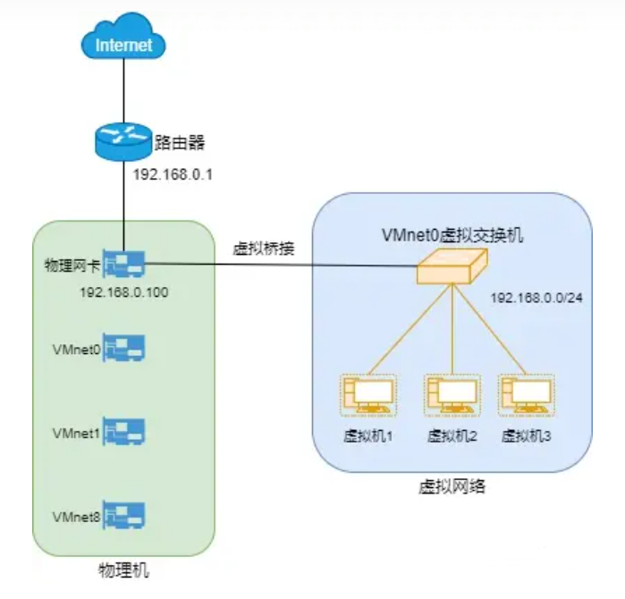
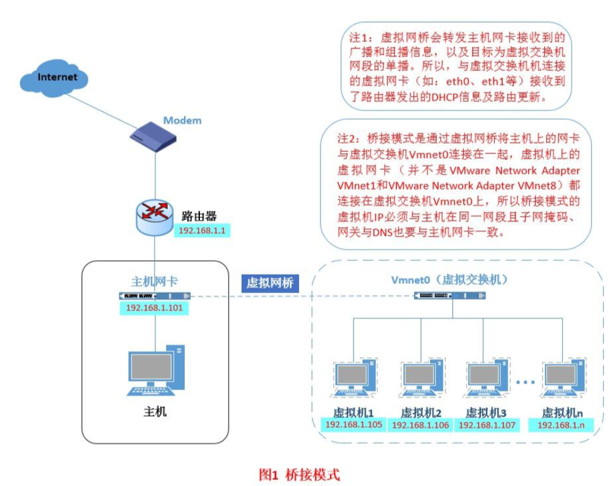
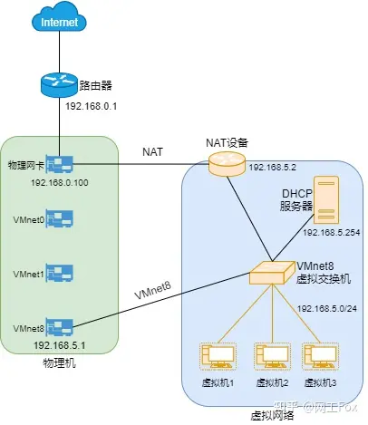
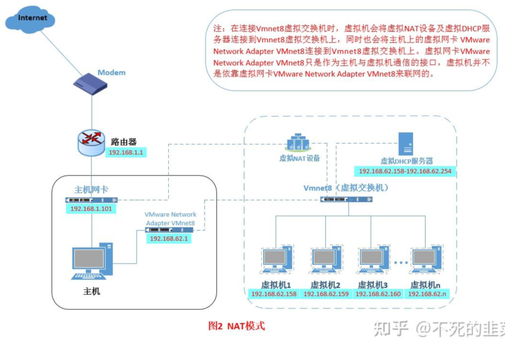
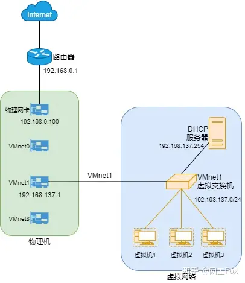
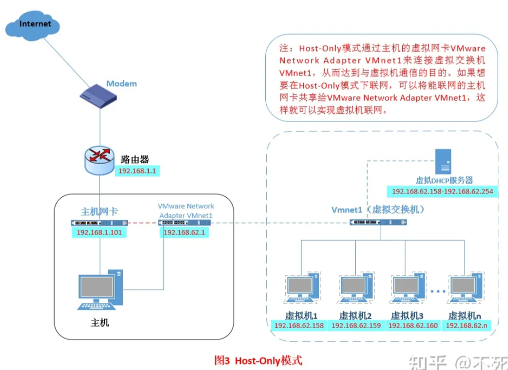
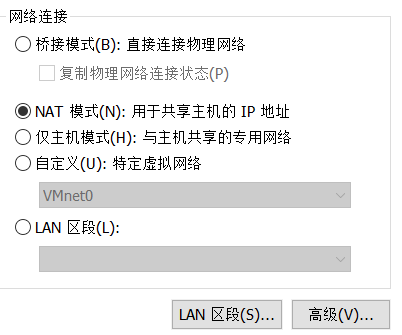
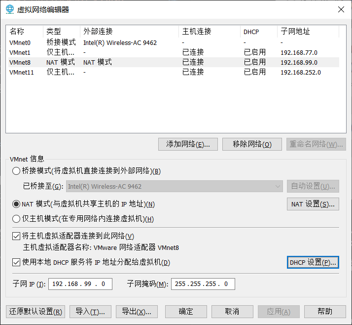
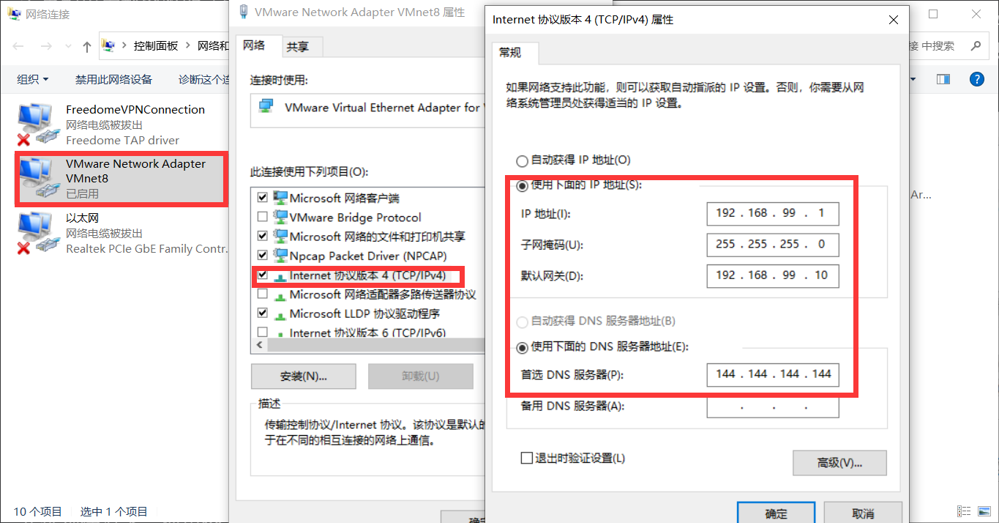
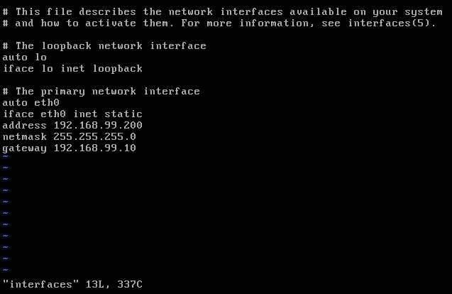

# 虚拟机联网
> 网络上东西都是虚拟的，你把握不住

## 1. 虚拟网络组件
* **虚拟机**（Virtual Machine）
在物理计算机上通过虚拟化技术创建的一台虚拟计算机。它具有自己的操作系统、应用程序和网络配置，可以独立运行和管理。

* **虚拟化软件**（Virtualization Software）
物理机上用于创建、配置和管理虚拟机的软件，如 VMware、VirtualBox。它可以将物理机资源（如处理器、内存、存储）虚拟化为多个独立的虚拟机。

* **宿主机**（Host）
运行虚拟化软件的物理计算机。

* **虚拟网络**（Virtual Network）
在虚拟化环境中创建的逻辑网络，提供连接虚拟机、宿主机和外部网络的信道。

### 1. 虚拟网络适配器（Virtual Network Adapter）
也称虚拟机网卡。虚拟网络适配器是==虚拟机==中的软件（eth0），模拟物理网卡的功能。它用于==连接虚拟机和虚拟交换机==，实现虚拟机与虚拟网络之间的通信。

注意区别虚拟网络适配器（虚拟机）和虚拟网卡（主机）。

### 2. 虚拟交换机（Virtual Switch）
虚拟交换机是==虚拟网络==中的虚拟网络设备。它一端连接各个虚拟机，另一端连接虚拟网卡、虚拟NAT设备、DHCP服务器等，负责将来自不同虚拟机的数据包进行交换和转发。

VMware默认设置了三个虚拟交换机：vmnet0（桥接）、vmnet1（仅主机）、vmnet8（NAT）。在win主机上，最多能创建20个虚拟网络。

在官方的说明文档中，将虚拟交换机与虚拟网络等同。
* 虚拟交换机直连物理网卡，就是桥接模式。
* 虚拟交换机连接宿主机的虚拟网卡，但不连接NAT设备，就是仅主机模式。
* 虚拟交换机连接宿主机的虚拟网卡，另一端连接NAT设备和DHCP服务器，就是NAT模式。

### 3. 虚拟网卡（Virtual NIC）
虚拟网卡是==宿主机==上的软件实体（vmnet1、vmnet8等），==仅负责虚拟交换机和宿主机之间的数据传输==。每一个虚拟网络，都会有一个对应的虚拟网卡。

### 4. 虚拟DHCP服务器
虚拟动态主机配置协议 (DHCP) 服务器可在未桥接到外部网络的配置中向虚拟机提供 IP 地址。例如，虚拟 DHCP 服务器可在仅主机模式和 NAT 配置中向虚拟机分配 IP 地址。

### 5. 虚拟NAT设备
NAT 配置中的 NAT 设备可在一个或多个虚拟机以及外部网络之间传送网络数据，识别用于每个虚拟机的传入数据包，并将它们发送到正确的目的地。NAT设备实际上起到了 **网关** 的作用。

网关又是什么？连接不同网络的节点，负责在网络之间传递数据。可以是硬件设备（如路由器的接口）或者是软件实现（虚拟接口的IP）。

虚拟网络配置（Virtual Network Configuration）
对虚拟交换机进行网络参数的设置。主要包括虚拟交换机的子网IP、子网掩码，DNS服务器，NAT设置，DHCP设置等。

## 2. 三个问题

### 1. 虚拟机连接宿主机
虚拟网卡用于实现虚拟机与主机之间的通信，而不是使虚拟机连接外网。它允许主机与虚拟机之间进行数据交换、文件共享等操作。禁用虚拟网卡后，虚拟机仍能访问外网，但宿主机无法远程连接虚拟机。

### 2. 虚拟机连接外网
只有连接上宿主机的物理网卡，虚拟机才能访问外网。仅主机模式仅仅连接了虚拟网卡，因此无法访问外网。

要设置NAT或桥接模式下的虚拟网络，根据子网IP、子网掩码、NAT设置的网关、DHCP的IP地址范围去配置虚拟机网卡信息，才能访问外网。

### 3. 虚拟机连接其他虚拟机
虚拟网络适配器连接到虚拟交换机，使得多个虚拟机之间可以相互通信，形成虚拟局域网（VLAN）。

## 3. 三种网络连接方式
VMware虚拟机提供了三种网络连接方式，分别为：
* 桥接模式（Bridged mode）：将虚拟机直接连接到外部网络。
* 网络地址转换（NAT）模式：虚拟机共享主机的IP地址。
* 仅主机（Host-only）模式：在专用（私有）网络内连接虚拟机。

###  1. 桥接模式（Bridged mode）

虚拟交换机与物理网卡连接，使虚拟机成为该网络中的一个==独立节点==。在这种模式下，虚拟机可以直接与宿主机、其他虚拟机以及物理网络中的其他设备进行通信。

但实际上，尽管虚拟机拥有独立的IP地址，它与外网通信的数据仍要经过主机物理网卡转发（废话）。

* 允许虚拟机直接连接到宿主机所在的物理网络。
* 在桥接模式下，虚拟机表现得就像是连接到该网络的另一台独立的物理计算机。
* 虚拟机将获得与宿主机相同网络段的IP地址。这个地址通常由DHCP动态获取，也可以手动设置。
* 桥接模式适用于需要与物理网络中的其他设备进行广泛交互的虚拟机。






#### 桥接模式的工作原理

1. 虚拟网络交换机与宿主机上的==物理网络适配器==（如以太网卡或Wi-Fi适配器）建立桥接连接。

2. 当虚拟机发送数据包时，数据包首先到达虚拟网络适配器。然后，虚拟网络适配器将数据包发送到与之桥接的物理网络适配器。这样，数据包就能直接进入宿主机所在的物理网络。

3. 在物理网络上，虚拟机的数据包与宿主机或其他物理设备的数据包没有区别。因此，虚拟机可以与其他设备通信，就像它是直接连接到物理网络的一台独立计算机一样。

4. 当物理网络上的设备向虚拟机发送数据包时，数据包会通过物理网络适配器和虚拟网络适配器到达虚拟机。

### 2. 网络地址转换（NAT）模式

在NAT模式下，虚拟机的虚拟网络适配器通过虚拟交换机与宿主机的虚拟网卡（例如vmnet8）连接在一个虚拟网络上。同时，虚拟NAT设备与宿主机物理网卡相连，这才是虚拟机访问外网的凭借。

虚拟机的网络请求将被发送到虚拟NAT设备，然后再由宿主机代转到外部网络。同样，外部网络的响应将通过宿主机的NAT设备返回到虚拟机。

虚拟机无法直接与物理网络中的其他设备通信，而只能通过宿主机进行通信。NAT模式适用于需要与外部网络通信，但不需要成为物理网络中独立节点的虚拟机。






#### NAT模式的工作原理

NAT模式（Network Address Translation）的技术原理就是网络地址转换。在虚拟机的上下文中，NAT模式允许虚拟机与宿主机共享同一个网络连接，以便访问外部网络（如互联网）。这是通过在宿主机上创建一个虚拟网络适配器和一个虚拟路由器来实现的。

1. 虚拟机发送数据包时，数据包的源IP地址是虚拟机的内部IP地址。
2. 数据包到达虚拟NAT设别时，数据包的源IP地址更改为宿主机的外部IP地址。这就是所谓的“网络地址转换”过程。然后已转换地址的数据包被发送到外部网络。
3. 当外部网络上的服务器响应数据包时，数据包的目标IP地址是宿主机的外部IP地址。外网无法访问虚拟机，也根本意识不到有这样一台虚拟机。
4. 虚拟NAT收到响应数据包后，会根据之前建立的地址转换记录将目标IP地址更改为虚拟机的内部IP地址，然后将响应数据包发送回虚拟机。

通过这种方式，虚拟机可以与宿主机共享相同的外部网络连接，同时保持独立的内部IP地址。这使得虚拟机可以访问互联网，同时与宿主机的网络环境保持隔离。NAT模式适用于大多数常见的网络场景，如连接到家庭或企业网络，或连接到公共Wi-Fi热点。

### 3. 仅主机（Host-only）模式
主机仅模式允许虚拟机仅与宿主机进行通信，而不能与外部网络或其他设备进行通信，其实就是NAT模式去除了虚拟NAT设备。

这种模式为虚拟机创建了一个与外部网络完全隔离的私有网络。主机仅模式适用于需要与宿主机进行通信，但不需要访问外部网络的虚拟机，如用于测试和开发的虚拟环境。






## 4. 配置网络连接的步骤

### 1. 打开VMware Workstation
选择要配置网络的虚拟机。确保虚拟机处于关闭状态，因为无法在运行状态下更改网络设置。
    
### 2. 选择虚拟网络适配器的模式

在虚拟机菜单中选择"设置"（Settings）。
    
选择左侧的"网络适配器"（Network Adapter）。在"网络适配器"设置区域，可以看到三种网络连接方式的选项：
    
* 桥接模式（Bridged）：选择"桥接模式"，然后选择"复制物理网络连接状态"。
    
* NAT模式：选择"NAT：与宿主机网络共享IP地址"。
    
* 主机仅模式（Host-only）：选择"仅主机：与宿主机之间的专用网络"。

* 自定义模式：自己创建并配置虚拟交换机。对于每一个虚拟交换机，VMware都为主机创建了一个对应的虚拟网卡，网卡与交换机的标识符是一样的（vmnet1、vmnet2等）。
    

如果需要配置虚拟网络的高级设置，可以点击"网络适配器"设置区域下方的"高级..."按钮。在这里，可以配置MAC地址、带宽限制等高级设置。

### 3. ==配置虚拟交换机==
桥接模式的配置很简单，仅主机模式就是去除NAT设备的NAT模式，不赘述。下面详细介绍NAT模式的配置。注意：NAT网络只能创建一个。

虚拟交换机的配置，与宿主机的物理网卡的IP地址并没有关系。

点击“编辑->虚拟网络编辑器”，在这里设置与宿主机虚拟网卡相连的虚拟交换机（虚拟网络）的信息，比如子网IP、NAT网关等。

首先配置虚拟网络的子网IP和子网掩码，然后点击NAT设置，设置虚拟NAT设备的网关，配置完成。



查看DHCP设置，在这里可以设置DHCP动态IP地址分配的相关信息。

### 4. 配置宿主机虚拟网卡

在“控制面板->网络和共享中心->更改适配器设置”，查看主机所有网卡。

也可以使用批处理文件快速打开。

```bat
start ncpa.cpl
```

找到对应的虚拟网卡，右键“属性”，点击“Internet协议版本4”，配置虚拟网卡的IP、子网掩码、默认网关等。这个默认网关只需要是虚拟网络内的就行，也可以填写NAT的网关。



### 5. 虚拟机网络配置

运行虚拟机，输入`ifconfig`查看本机网卡和IP地址等信息。配置使之位于虚拟网络中。

==注意==：不同发行版的Linux系统具体命令、文件名称和所在目录可能不同，但流程相同。比如centos需要更改/etc/sysconfig/network-scripts下的ifcfg-ens33文件。详情自行百度。

首先关闭网卡。
```shell
sudo ifconfig eth0 down
```

打开/etc/networking/interfaces，配置静态IP地址。注意默认网关要配置NAT的网关。



设置DNS，修改/etc/resolv.conf，设置DNS服务器IP地址。这里填写NAT网关即可。

```txt
nameserver 192.168.99.10
```

重启网卡。
```shell
/etc/init.d/networking restart
或者
sudo systemctl restart NetworkManager.service
选其一即可
```

### 6. 验证
至此大功告成。尝试主机和虚拟机互ping，以及虚拟机ping百度。如果主机ping虚拟机能ping通，但虚拟机ping主机ping不通，通常是防火墙未关闭的原因。

## 连接手机热点，哪种虚拟机网络连接方式比较合适？

使用NAT模式和桥接模式都可以。

当主机连接到手机热点时，手机热点充当路由器并为主机分配一个内网IP地址。使用NAT模式时，虚拟NAT设备为虚拟机分配一个与主机不同子网的内网IP地址。NAT设备会负责在主机和虚拟机之间进行地址转换，使它们可以通过手机热点上的互联网连接进行通信。

桥接模式需要虚拟机直接连接到物理网络。在连接到手机热点的情况下，上级路由会为虚拟机分配一个与主机相同子网的IP地址。（有时也会拒绝分配，比如需要账号验证时。）

主机仅（Host-only）模式不适用于此情况，因为它仅允许虚拟机与宿主机进行通信，而不能访问外部网络（如互联网）。

最后祝你，身体健康。