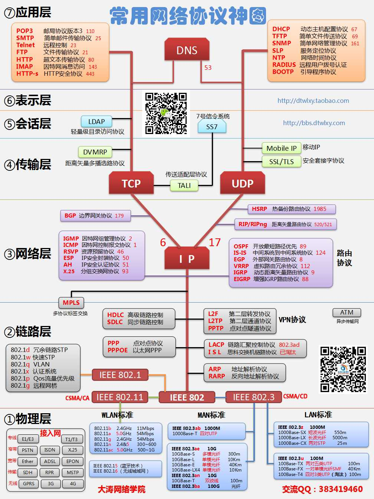
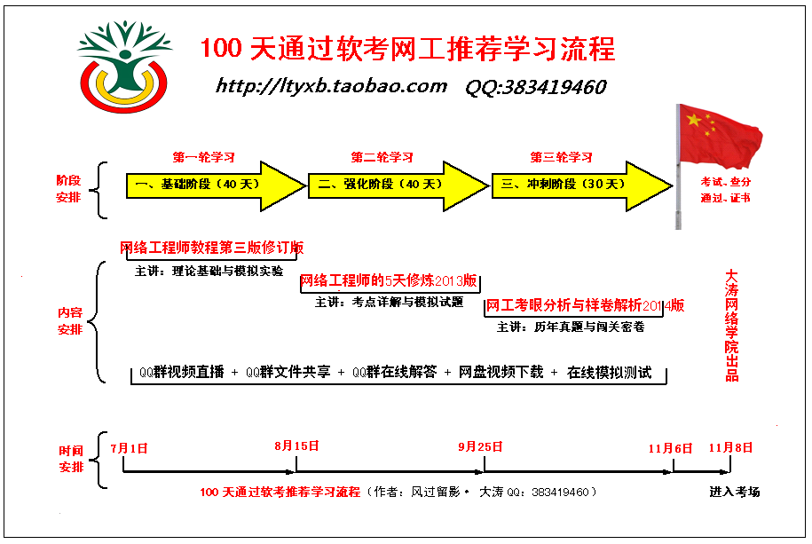

# 1. 物理层

## 1.1 该层主要设备
### 1. 中继器 (*Repeater*)
* 功能： 连接两个局域网段。对接收信号进行再生和发送。再生的信号与接收的信号完全相同。它只是起到拓展传输距离的作用。

### 2. 集线器 (*Hub*)
* 功能： 与中继器类似，对接收到的信号进行再生整形放大，从其他**所有接口**进行泛洪，以扩大网络的传输距离，同时把所有节点集中在以它为中心的节点上。实际上仅起到了一个整理线材、转发信号的作用。
* 说明： 采用CSMA/CD（即带冲突检测的载波监听多路访问技术)介质访问控制机制。集线器每个接口简单地接收、广播比特，收到1就转发1，收到0就转发0，**不进行碰撞检测**。这就导致使用集线器的设备必须竞争带宽资源。碰撞的增加导致丢包的增加，设备要承受重传数据包的性能损失，这又加剧了网络拥塞和碰撞。
* 这俩已经是上古神器，实际环境已经不会用了。

### 3. 调制解调器 (*Modem*)
俗称**猫**。
* 功能：将计算机数字信号调制加载在音频（模拟）信号上，通过电话线进行传输。在接收端将数据解调出来。

### 双绞线

### 光纤

## 1.2 该层主要协议

# 2. 数据链路层
网络层通过源和目的地之间的一系列路由器路由数据报，为了将分组从一个结点移动到路径的下一个结点，网络层必须依靠链路层的服务。
## 2.1 该层主要设备
### 网桥 (*Bridge*)
* 功能： 类似于中继器
### 网络适配器 (网卡）

* 功能：负责信息的调制与收发。

### 交换机 (*Switch*)

* 功能：类似集线器，用来转发数据包。但它并不是对所有数据包都进行广播，而是根据mac地址将数据包发送至连接着目的计算机的端口上。
* 说明：交换机将连接设备的mac地址记录在内容寻址寄存器CAM上。

## 2.1 该层主要协议
* **ARQ** ( `Automatic Repeat-reQuest` ）自动重传请求协议，错误纠正协议之一，包括停止等待ARQ 协议和连续ARQ 协议，错误侦测、正面确认、逾时重传与负面确认继以重传等机制。

* **停止等待协议： CSMA/CD** (Carrrier Sense Multiple Access with Collision Detection)载波监听多点接入/碰撞检测协议。总线型网络，协议的实质是载波监听和碰撞检测。载波监听即发数据前先检测总线上是否有其他计算机在发送数据，如暂时不发数据，避免碰撞。碰撞检测为计算机边发送数据边检测信道上的信号电压大小。

* **PPP** (Point-to-Ponit Protocol)点对点协议面向字节，由三部分组成：一个将IP 数据报封装到串行链路的方法；一个用于建立、配置和测试数据链路连接的链路控制协议

* **LCP** (Link Control Protocol) ：一套网络控制协议NCP 。

* **HDLC** (High-Level Data Link Control ）高级数据链路控制同步网上传输数据、面向比特的数据链路层协议。

* **ATM** (Asynchronous Transfer Mode ）异步传递方式，建立在电路交换和分组交换的基础上的一种面向连接的快速分组交换技术。 “异步”是指将ATM 信元“异步插入”到同步的 SDH 比特流中。如同步插入则用户在每帧中所占的时隙相对位置固定不变。“同步”是指网络中各链路上的比特流都是受同一非常精确的主时钟的控制。Wi-Fi 、WiMAX 、DTM 、令牌环、以太网、FDDI 、帧中继、 GPRS 、 EVDO 、HSPA 、L2TP 、ISDN

# 3. 网络层
## 3.1 网络层主要设备
### 路由器 (*Router*)

### 三层交换机
三层交换机是一种网络交换机，可以在第三层网络层上工作，具有路由器和二层交换机的功能。它可以根据网络层地址（如IP地址）对数据包进行转发，支持对不同子网之间的通信进行控制和管理。三层交换机可以处理较为复杂的网络环境，具有更好的网络带宽利用率和更快的数据包转发速度，同时还能够提高网络的可靠性和安全性。

与二层交换机不同，三层交换机除了可以根据目的MAC地址进行数据包转发之外，还可以根据目的IP地址进行转发。在处理大量数据流时，三层交换机可以实现更快的转发速度和更高的吞吐量，因为它们可以直接在网络层处理数据，而不需要先解析MAC地址。

除了基本的路由功能，三层交换机还可以支持多种高级功能，如VLAN间的路由、QoS（Quality of Service）服务、负载均衡和流量过滤等。由于它的功能比较强大，所以**三层交换机在较大的企业网络中得到了广泛应用**。

## 3.2 网络层主要协议

因特网的网络层负责将称为数据报的网络层分组从一台主机移动到另一台主机。

* **IP** (IPv4 · IPv6) (Internet Protocol) 
网络之间互连的协议

* **ARP** (Address Resolution Protocol) 
地址解析协议，实现通过IP地址得知其物理地址。

* **RARP** (Reverse Address Resolution Protocol)
反向地址转换协议。允许局域网的物理机器从网关服务器的 ARP 表或者缓存上请求其 IP地址。

* **ICMP** (Internet Control Message Protocol ）
Internet 控制报文协议。它是TCP/IP 协议族的一个子协议，用于在IP主机、路由器之间传递控制消息。

* **IGMP** (Internet Group Management Protocol) 
Internet 组管理协议。是因特网协议家族中的一个组播协议，用于 IP 主机向任一个直接相邻的路由器报告他们的组成员情况。

* **RIP** (Router information protocol) 路由信息协议。是一种在网关与主机之间交换路由选择信息的标准。

* **OSPF** (Open Shortest Path First)开放式最短路径优先，分布式链路状态协议。

* **BGP** (Border Gateway Protocol ）
边界网关协议。用来连接 Internet 上独立系统的路由选择协议.采用路径向量路由选择协议。

* **IS-IS** (Intermediate System to Intermediate System Routing Protocol ）
中间系统到中间系统的路由选择协议。

* **IPsec** (IP Secure) 
Internet 协议安全性。是一种开放标准的框架结构，通过使用加密的安全服务以确保在 Internet 协议(IP) 网络上进行保密而安全的通讯。

# 4. 传输层
## 4.1 传输层主要设备
## 4.2 传输层主要协议
因特网的传输层在应用程序端点之间传送应用层报文。

* **TCP** (Transmission Control Protocol ）
传输控制协议。提供可靠的面向连接的服务，传输数据前须先建立连接，结束后释放。可靠的全双工信道。可靠、有序、无丢失、不重复。

* **UDP** (User Datagram Protocol ）
用户数据报协议。发送数据前无需建立连接，不使用拥塞控制，不保证可靠交付，最大努力交付。

* **DCCP** (Datagram Congestion Control Protocol ）数据报拥塞控制协议

* **SCTP** (STREAM CONTROL TRANSMISSION PROTOCOL ）流控制传 输协议

* **RTP** (Real-time Transport Protocol ）实时传送协议

* **RSVP** (Resource ReSer Vation Protocol ）资源预留协议

* **PPTP** ( Point to Point Tunneling Protocol ）点对点隧道协议

# 5. 应用层
## 5.1 应用层主要设备

## 5.2 应用层主要协议
应用层是网络应用程序以及它们的应用层协议存留的地方。应用层协议和应用程序直接挂钩

* **DHCP** (`Dynamic Host Configuration Protocol`)动态主机分配协议，使用 UDP 协议工作，主要有两个用途：给内部网络或网络服务供应商自动分配 IP 地址，给用户或者内部网络管理员作为对所有计算机作中央管理的手段。实 现即插即用连网。

* **BOOTP**  (`BOOTstrapProtocol`) 引导程序协议/ 自举协议，使用UDP 来使 一个无盘工作站自动获取配置信息。静态的配置协议 DNS  (Domain Name System ）域名解析<端口号53>

* **FTP**  (`File Transfer Protocol` ）文件传输协议<端口号21>减少或消除不同操作系统下处理文件的不兼容性。

* **Gopher** (`The Internet Gopher Protocol` ）网际Gopher 协议

* **HTTP** (`Hypertext Transfer Protocol` ）超文本传输协议 <端口号 80>， 面向事务的应用层协议。

* **IMAP4** (`Internet Message Access Protocol 4`) Internet 信息访问协议的第 4 版本

* **IRC** (`Internet Relay Chat` ）网络聊天协议

* **NNTP** (`Network News Transport Protocol` ）网络新闻传输协议

* **XMPP** 可扩展消息处理现场协议

* **POP** (Post Office Protocol 3) 即邮局协议的第3 个版本，用于接受邮件。

* **SIP** ()信令控制协议

* **SMTP** (`Simple Mail Transfer Protocol` ）简单邮件传输协议 <端口号25> 用于发送邮件。

* **SNMP** (`Simple Network Management Protocol`),简单网络管理协议

* **SSH** (Secure Shell ）安全外壳协议

* TELNET 远程登录协议 <端口号23>

* **RPC** (Remote Procedure Call Protocol ）** (RFC- 1831）远程过程调用协 议

* **RTCP** (RTP Control Protocol ）RTP 控制协议

* **RTSP** (Real Time Streaming Protocol ）实时流传输协议

* **TLS** (Transport Layer Security Protocol ）安全传输层协议

* **SDP** ( Session Description Protocol ）会话描述协议

* **SOAP** (Simple Object Access Protocol ）简单对象访问协议

* **GTP** 通用数据传输平台

* **STUN** (Simple Traversal of UDP over NATs ，NAT 的UDP 简单穿越） 是一种网络协议

* **NTP** (Network Time Protocol ）网络校时协议。
