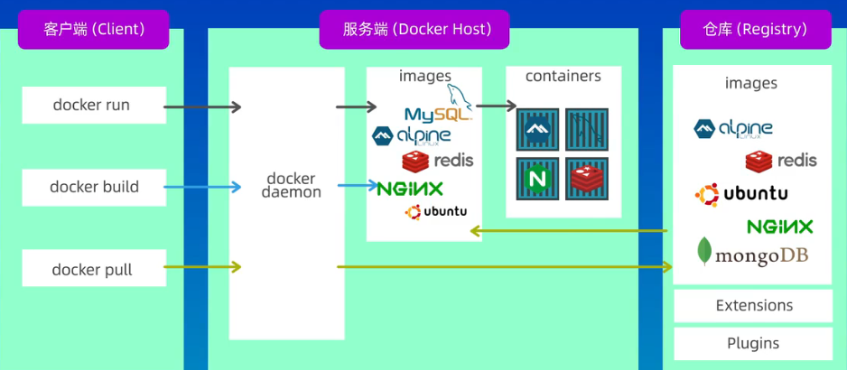

# docker

将应用程序、运行时环境、第三方软件库、配置文件等打包在一起，一键运行。

docker是容器化技术的一种实现。

## 基础概念


- 镜像 **image**：只读模板，相当于root文件系统。
- 容器 **container**：运行实例，容器可以被创建、启动、停止、删除、暂停等。
- 仓库 **registry**：存放镜像的仓库。
镜像和容器的关系，类似于类和实例。
- docker客户端：与docker守护进程通信的命令行界面。

## 安装步骤

### Windows环境

https://www.docker.com/
直接下载即可

#### 修改安装目录

- cmd
在安装包所在目录下，输入cmd，执行以下命令
```bat
"Docker Desktop Installer.exe" install --installation-dir=<path>
```

- powershell
```powershewll
Start-Process -FilePath 'Docker Desktop Installer.exe' -Wait -ArgumentList "install --installation-dir=<path>"
```

### Linux环境
https://docs.docker.com/engine/install/centos

centos8
```bash
# 卸载现有环境
sudo yum remove docker \
                  docker-client \
                  docker-client-latest \
                  docker-common \
                  docker-latest \
                  docker-latest-logrotate \
                  docker-logrotate \
                  docker-engine
# 建立仓库
sudo yum install -y yum-utils
sudo yum-config-manager --add-repo https://download.docker.com/linux/centos/docker-ce.repo

# 安装docker引擎
yum install docker-ce docker-ce-cli containerd.io docker-buildx-plugin docker-compose-plugin

# 启动docker
sudo systemctl start docker

# 验证安装是否成功
sudo docker run hello-world
```
## 常用命令

docker使用CS架构，使用远程API才管理和创建容器。

### 基础信息（版本、日志）
```bash
# 查看docker版本
docker version
# 显示docker系统的信息
docker info
# 日志信息
docker logs
# 故障检查
service docker status
# 启动关闭docker
sudo service docker start|stop
```

### 镜像管理

```bash
# 查看所有镜像
docker image ls
```


## 容器和虚拟机的区别

容器和虚拟机是两种不同的虚拟化技术，它们有一些重要的区别。

1. 架构层次：虚拟机是在硬件层面上创建虚拟化的环境，每个虚拟机包含操作系统、应用程序和其它依赖的组件。容器则是在操作系统层面上实现虚拟化，共享宿主机的操作系统内核，每个容器包含应用程序及其依赖的库和文件。

2. 资源隔离：虚拟机提供了完全的隔离性，每个虚拟机都有自己独立的操作系统和资源，如独立的内存、磁盘空间和网络接口。容器则共享宿主机的操作系统和内核，通过命名空间和控制组实现资源隔离和限制，容器之间相互隔离但使用的是共享资源。

3. 启动时间和性能：由于虚拟机包含完整的操作系统，其启动时间较长，需要启动操作系统、加载驱动程序和应用程序。容器由于共享操作系统内核，启动时间较短，通常在几秒钟内启动。容器也更加轻量级，消耗的系统资源较少，能够实现更高的性能和密度。

4. 可移植性：虚拟机可以在不同的物理机器上运行，因为它们是独立的操作系统实例。容器也具有可移植性，但需要依赖于宿主机的操作系统内核和运行环境。

5. 管理和部署：虚拟机需要一个虚拟化管理器（如VMware、KVM）来管理和部署，需要安装和维护操作系统。容器可以使用容器管理工具（如Docker、Kubernetes）进行管理和部署，更加方便和灵活。

总的来说，虚拟机提供了更高的隔离性和完整的虚拟化环境，适用于需要多个独立操作系统的场景。容器提供了更轻量级的虚拟化解决方案，适用于快速部署和扩展应用程序的场景，并且在启动时间和性能方面具有优势。