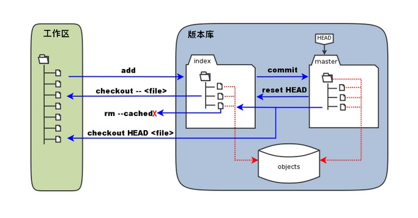

# Git

## 1. 基础知识

git 是一个 **分布式** 版本控制系统，在开源项目中得到了广泛的应用。

### 1.1 使用方式

-   命令行

-   图形化界面 GUI

-   IDE 插件

### 1.2 仓库 Repo

Git 中的仓库（repository）可以理解为一个通过 Git 命令进行管理的目录或文件夹，其中包含项目的所有文件和版本历史记录。

仓库分为两种类型：本地仓库（local repository）和远程仓库（remote repository）。

#### 1. 本地仓库

本地仓库指存储在本地计算机上的 Git 仓库。它是项目的主要仓库，包含项目的所有文件、版本历史和分支信息。您可以通过 Git 命令在本地仓库中进行提交、分支管理、历史查看等操作。

#### 2. 远程仓库

远程仓库指存储在远程服务器上的 Git 仓库，例如在代码托管平台（如 GitHub、GitLab、Gitee）上创建的仓库。

远程仓库用于实现团队协作和代码共享。比如将本地仓库中的更改推送到远程仓库，或者从远程仓库拉取更新到本地仓库。

Git 通过跟踪和记录文件的变化来管理仓库。每次对文件进行更改和提交，Git 都会记录这些变化，并创建一个新的提交（commit），形成一个版本历史记录。

管理者可以查看、回滚、比较和合并这些提交，从而管理项目的不同版本和变化。

### 1.3 工作区、暂存区、本地仓库


#### 工作区 （Working Directory）

工作区指在电脑中能看到的目录，也就是 `.git` 所在的目录。其中包含了项目的实际文件。可以在工作区进行文件的修改、创建、删除等操作。

#### 暂存区 （Staging Area/index）

暂存区是位于 `.git` 目录中的一个文件，用于临时存放要提交的文件。在修改文件后，将需要提交的文件先添加到暂存区，然后再通过提交操作将暂存区的文件提交到版本库。

#### 版本库 （Local Repository）

版本库，也称本地仓库，是 Git 的核心部分，它包含了项目的完整历史记录。位于项目根目录下的一个隐藏文件夹 `.git` 中。版本库中保存着每次提交的文件快照，以及与每个提交相关的元数据信息，如作者、时间戳等。

### 1.4 文件状态
在 Git 中，文件可以存在以下几种状态：

1. **未跟踪**（Untracked）：表示该文件在 Git 仓库中不存在，Git 不会对其进行版本控制。当你在工作区创建新文件或添加新文件夹时，这些文件将处于未跟踪状态。

2. **已修改**（Modified）：表示该文件在工作区中发生了修改，但还没有被暂存（Staged）。

3. **已暂存**（Staged）：表示该文件的修改已经被暂存到暂存区（也称为索引），即将被包含在下一次提交中。

4. **已提交**（Committed）：表示该文件的修改已经被提交到 Git 仓库中，成为了一个新的版本。

需要注意的是，这些状态是针对单个文件的，而不是整个项目或仓库。

`git status` 命令查看文件的状态，列出所有已修改、已暂存和未跟踪的文件，并给出相应信息。

### 1.5 分支 branch

在 Git 中，分支（Branch）是指项目的一个独立线条，它代表了项目的一个**特定状态**。可以将分支看作是项目的一个独立副本，在分支上进行开发不影响主线（通常是主分支）的开发进度。

所有的代码更改和文件操作都是在某个分支上进行的。

默认情况下，每个 Git 项目都有一个主分支，通常被称为 "master" 分支或 "main" 分支。该分支代表了项目的主要开发线，通常用于发布稳定版本。

在项目中添加新功能、修复 bug 或进行其他开发工作时，可以创建一个新的分支。工作完成后将新分支合并回主分支，以将新功能或修复的 bug 添加到主线中。

### 1.4 工作流程

1. 初始化仓库：

    - 使用 `git init` 命令在本地目录中创建一个新的 Git 仓库。
    - 使用 `git clone` 命令克隆远程仓库到本地。

2. 添加和提交文件：

    - 使用 `git add` 命令将文件添加到 Git 的暂存区。可以使用 `git add <文件名>` 添加指定文件，或使用 `git add .` 添加所有文件。
    - 使用 `git commit` 命令将暂存区中的文件变更提交到本地仓库。每次提交需要附带一条有意义的提交信息，描述本次提交的目的和内容。

3. 分支管理：

    - 使用 `git branch` 命令可以查看本地分支列表，使用 `git branch <分支名>` 命令可以创建一个新的分支。
    - 使用 `git checkout` 命令可以切换到不同的分支。例如，`git checkout <分支名>` 可以切换到指定分支。
    - 使用 `git merge` 命令可以将一个分支的更改合并到当前分支。例如，`git merge <分支名>` 可以将指定分支的更改合并到当前分支。

4. 远程仓库协作：

    - 使用 `git remote` 命令可以查看远程仓库列表，使用 `git remote add <名称> <远程仓库地址>` 命令可以添加一个新的远程仓库。
    - 使用 `git push` 命令将本地仓库中的提交推送到远程仓库。例如，`git push origin master` 可以将本地 `master` 分支的更改推送到名为 `origin` 的远程仓库。
    - 使用 `git pull` 命令从远程仓库获取最新的代码，并将其合并到当前分支。

5. 分支管理和合并冲突：
    - 如果多个分支对同一文件的同一部分进行了修改，合并分支时可能会发生冲突。此时需要手动解决冲突，然后使用 `git add` 和 `git commit` 命令完成合并过

## 2. 基本操作

### 2.1 配置全局用户名和邮箱

-   配置全局用户名

```shell
git config --global user.name "Your Name"
```

-   配置全局用户邮箱

```shell
git config --global user.email "youremail@example.com"
```

-   存储用户名和密码

```shell
# 在全局范围内使用凭据助手（credential helper）来存储用户名和密码
git config --global credential.helper --list
```

当执行该命令后，Git 会将凭据保存在本地计算机上的一个明文文件中，以后在与远程仓库通信时，Git 将自动使用这些保存的凭据进行身份验证，而无需再次输入用户名和密码。

### 2.2 查看配置信息

* 查看全局信息
```shell
git config --global --list
```

* 查看所有详细配置

```shell
git config --list

'''
$ git config --list
diff.astextplain.textconv=astextplain
filter.lfs.clean=git-lfs clean -- %f
filter.lfs.smudge=git-lfs smudge -- %f
diff.astextplain.textconv=astextplain
filter.lfs.clean=git-lfs clean -- %f
filter.lfs.smudge=git-lfs smudge -- %f
filter.lfs.process=git-lfs filter-process
filter.lfs.required=true
http.sslbackend=openssl
http.sslcainfo=C:/Program Files/Git/mingw64/etc/ssl/certs/ca-bundle.crt
core.autocrlf=true
core.fscache=true
core.symlinks=false
pull.rebase=false
credential.helper=manager
credential.https://dev.azure.com.usehttppath=true
init.defaultbranch=master
user.name=ZZY610
user.email=2766617826@qq.com
core.repositoryformatversion=0
core.filemode=false
core.bare=false
core.logallrefupdates=true
core.symlinks=false
core.ignorecase=true
remote.origin.url=git@github.com:ZZY610/python-learningnotes.git
remote.origin.fetch=+refs/heads/*:refs/remotes/origin/*
branch.master.remote=origin
branch.master.merge=refs/heads/master
'''
```

### 2.3 新建仓库 repository (Repo)

#### 两种方式：创建与克隆

-   `git init`：初始化一个新的 Git 仓库。

-   `git clone [url]`：克隆（下载）远程仓库到本地。

注意：如果想在A目录下获取一个远程仓库的副本，直接在A目录下执行clone命令即可，这将创建远程仓库的文件夹并克隆。

### 2.4 文件操作

-   `git add [file]`：将文件添加到暂存区。
-   `git commit -m "message"`：提交暂存区中的文件到本地仓库，并附带提交信息。
-   `git rm [file]`：从版本控制中删除文件。

```bash

git rm <file>：从工作区、暂存区中移除指定的文件。
git rm --cached <file>：将文件从暂存区中移除，但保留在工作目录中。
git rm -f <file>：强制移除文件，即使文件被修改或暂存区存在文件。
git rm --ignore-unmatch <file>：忽略不存在的文件，并不报错。
git rm -r <directory>：递归地移除指定的目录及其内容。
git rm --dry-run <file>：模拟移除操作，显示将要移除的文件列表，但不实际执行移除操作。
git rm --quiet <file>：静默模式，不显示移除操作的输出信息。
```

-   `git mv [file-original] [file-renamed]`：重命名或移动文件。

### 2.5 日志查看

* `git log`：查看历史提交记录

```shell
git log                       # 显示完整的提交日志
git log --oneline             # 以简洁的单行格式显示提交日志
git log --graph               # 以图形化的方式显示提交历史，并展示分支与合并关系。
git log --author=John         # 仅显示作者为 John 的提交日志
git log --since=2022-01-01    # 仅显示指定日期之后的提交日志
git log --until=2020-09-09    # 仅显示指定日期之前的提交日志
git log --grep="bug fix"      # 仅显示包含 "bug fix" 的提交日志
```
* `git blame <file>` ：查看指定文件的修改记录

-   `git status`：查看当前工作区和暂存区的状态。
-   `git log`：查看提交日志历史。
-   `git diff`：查看文件的修改内容。

### 2.6 版本回退

* `git reset`： 用于回退版本，回到之前某次提交的状态。

```shell
git reset [--soft | --mixed | --hard] [HEAD]
```

* soft：保留工作区和暂存区所有内容
* hard：清空工作区和暂存区内容
* mixed：保留工作区，清空暂存区

版本回退后，提交历史也会被修改到目标版本为止。

### 2.7 比较差异
* `git diff`：比较工作区、暂存区、本地仓库之间的差异；比较不同版本之间的差异；不同提交之间的差异；不同分支之间的差异。
    * 只输入git diff命令并执行，将比较**工作区**（当前工作目录）和**暂存区**（index）的差异

- `git diff [branch_name] [remote/banch_name]`：比较本地分支和远程仓库某分支之间的差异。

- `git diff --cached` 或 `git diff --staged`：比较暂存区中的文件与最后一次提交（本地仓库）之间的差异。
- `git diff commit1 commit2`：比较两个提交之间的差异，可以使用提交的哈希值、分支名或标签名表示提交。
- `git diff --color-words`：以单词为单位显示差异，并使用颜色突出显示。
- `git diff --stat`：显示简略的统计信息，包括被修改的文件和文件中的插入/删除行数。
- `git diff --name-only`：仅显示被修改的文件的名称，而不显示具体的差异内容。
- `git diff --ignore-space-change`：忽略空格的更改，只比较实际的代码更改。
- `git diff --ignore-case`：忽略大小写的更改，不区分大小写地比较差异。
- `git diff --dir-diff`：在目录级别进行差异比较，显示目录之间的差异。

```bash
$ git diff
# 发生变更的文件
diff --git a/file1.txt b/file1.txt

# 哈希值和文件权限
index ce01362..331b562 100644

# 
--- a/file1.txt
+++ b/file1.txt
@@ -1 +1 @@
-hello
+thankyou
```


### 2.8 分支与合并

`HEAD` 指向分支的最新提交节点。

-   `git branch`：列出所有分支，当前分支前面会有一个星号 (\*)。
-   `git checkout [branch]`：切换到指定分支。
-   `git checkout -b [branch]`：创建并切换到新的分支。
-   `git merge [branch]`：将指定分支合并到当前分支。
-   `git branch -d [branch]`：删除指定分支。

#### **Git 本地分支操作详解**

Git 的分支是对代码版本的指针。通过分支可以同时处理多个开发任务而互不干扰。以下是 Git 本地分支的核心概念和常用操作的详细解释。

---

#### **1. 查看分支**
- **查看当前分支和所有分支**：
  ```bash
  git branch
  ```
  - 输出中，当前分支会用 `*` 标记。
  
- **查看远程分支和本地分支**：
  ```bash
  git branch -a
  ```
  - `remotes/origin/...` 表示远程分支。

- **查看已合并和未合并的分支**：
  ```bash
  git branch --merged   # 查看已合并到当前分支的分支
  git branch --no-merged  # 查看未合并到当前分支的分支
  ```

---

#### **2. 创建分支**
- **创建新分支**：
  ```bash
  git branch new-branch
  ```
  - 创建名为 `new-branch` 的分支，但不会自动切换到该分支。

- **创建并切换到新分支**：
  ```bash
  git checkout -b new-branch
  ```
  或：
  ```bash
  git switch -c new-branch
  ```

---

#### **3. 切换分支**
- **切换到已有分支**：
  ```bash
  git checkout branch-name
  ```
  或（推荐方式）：
  ```bash
  git switch branch-name
  ```

- **切换到上一个分支**：
  ```bash
  git checkout -
  ```
  或：
  ```bash
  git switch -
  ```

---

#### **4. 合并分支**
- **合并其他分支到当前分支**：
  ```bash
  git merge other-branch
  ```
  - 会尝试将 `other-branch` 的内容合并到当前分支。
  - 如果有冲突，Git 会提示解决冲突。

- **快速合并（无历史分支记录）**：
  ```bash
  git merge --squash other-branch
  ```
  - 会将其他分支的内容压缩成一次提交。

---

#### **5. 删除分支**
- **删除本地分支**：
  ```bash
  git branch -d branch-name
  ```
  - 只能删除已合并到其他分支或远程的分支。

- **强制删除未合并的分支**：
  ```bash
  git branch -D branch-name
  ```

---

#### **6. 重命名分支**
- **重命名当前分支**：
  ```bash
  git branch -m new-branch-name
  ```

- **重命名其他分支**：
  ```bash
  git branch -m old-branch-name new-branch-name
  ```

---

#### **7. 比较分支**
- **比较两个分支的差异**：
  ```bash
  git diff branch1 branch2
  ```
  - 显示 `branch1` 和 `branch2` 的文件差异。

- **比较当前分支和其他分支的差异**：
  ```bash
  git diff other-branch
  ```

---

#### **8. 跟踪远程分支**
- **创建分支并设置跟踪远程分支**：
  ```bash
  git checkout -b new-branch origin/new-branch
  ```
  - 本地 `new-branch` 会追踪远程的 `origin/new-branch`。

- **将本地分支设置为跟踪远程分支**：
  ```bash
  git branch --set-upstream-to=origin/branch-name
  ```

- **查看分支的上游信息**：
  ```bash
  git branch -vv
  ```

---

#### **9. 保存工作区更改（避免冲突）**
在切换分支之前，如果当前分支有未提交的更改，可以将其暂存：

- **暂存工作目录的更改**：
  ```bash
  git stash
  ```

- **恢复暂存的更改**：
  ```bash
  git stash apply
  ```
  或：
  ```bash
  git stash pop
  ```
  - `pop` 会恢复更改并删除暂存记录。

---

#### **10. 强制覆盖分支**
- **用其他分支强制覆盖当前分支**：
  ```bash
  git reset --hard other-branch
  ```
  - 将当前分支完全替换为 `other-branch` 的状态。

- **用远程分支覆盖当前分支**：
  ```bash
  git reset --hard origin/branch-name
  ```

---

#### **11. 分支合并冲突的解决**
- 当合并冲突发生时：
  - Git 会显示冲突的文件。
  - 打开冲突文件，手动选择保留的内容。
  - 标记冲突已解决：
    ```bash
    git add conflict-file
    ```
  - 完成合并：
    ```bash
    git commit
    ```

---

#### **12. 实践中的分支策略**
1. **主分支（`main` 或 `master`）**：
   - 存放稳定的生产代码，不直接在主分支开发。
   
2. **开发分支（`dev`）**：
   - 用于日常开发工作，合并新功能后测试。

3. **功能分支（`feature/*`）**：
   - 为单个功能或任务创建，完成后合并回 `dev` 分支。

4. **修复分支（`hotfix/*`）**：
   - 紧急修复线上问题时使用，完成后合并到 `main` 和 `dev`。

---

通过以上命令和分支策略，你可以灵活管理本地代码和远程分支的关系，提升团队协作和个人开发效率！

### 2.9 远程操作

-   `git remote add [name] [url]`：添加一个新的远程仓库。

注意：每个本地仓库所配置的远程仓库是相互独立的，不共享给其他仓库。通过 `git remote -v` 查看。

- `git remote rm [name]`：删除一个远程仓库url记录。

- `git remote set-url <remote> <new-url>`：更新远程仓库URL

在GitHub，这个url通常有两种：https和SSH

```bash
# https
https://github.com/ZZY610/python-learningnotes.git

# SSH
git@github.com:ZZY610/python-learningnotes.git
```

-   `git remote -v`：查看远程仓库的详细信息。包括远程仓库的名称（默认是origin）和URL。

```shell
$ git remote -v
'''
origin  git@github.com:ZZY610/python-learningnotes.git (fetch)
origin  git@github.com:ZZY610/python-learningnotes.git (push)
'''
```

-   `git pull [remote] [branch]`：拉取远程仓库的最新代码并合并到当前分支。

-   `git push [remote] [branch]`：将本地仓库的代码推送到远程仓库。

通过运行 `git [command] --help` 查看详细的命令帮助信息。

## 本地项目关联 GitHub
### 下载并安装Git

1. 访问git官网并下载合适的版本：https://git-scm.com/ 按照指导安装即可。安装结束后，输入命令并查看输出： 

```bash
git --version
```

2. 配置全局用户名和邮箱。

```bash
git config --global user.name "Your GitHub Username"
git config --global user.email "your.email@example.com"
```

### 生成SSH密钥对

GitHub与SSH密钥相关的内容主要涉及在使用Git与GitHub进行远程代码管理时，如何配置和使用SSH密钥进行身份验证。

1. 生成SSH密钥对：首先需要在本地生成SSH密钥对。在`git bash`使用以下命令：
   ```
   ssh-keygen -t rsa -b 4096 -C "your_email@example.com"
   ```
   将生成一对密钥，包括私钥（默认存储在`~/.ssh/id_rsa`）和公钥（默认存储在`~/.ssh/id_rsa.pub`）。
   以下是详细步骤：
   * 首先输入保存密钥对的完整路径。默认是：/c/Users/hspcadmin/.ssh/my_ssh_key。如果不希望更改，直接按下 Enter 键。
   * 然后输入密码短语（passphrase）。密码短语是对私钥的保护，确保只有知道密码的人才能使用私钥进行认证。输入密码短语（也可以不设置）并按下 Enter 键。

    ```bash
    $ ssh-keygen -t rsa -b 4096 -C "your_email@example.com"
    Generating public/private rsa key pair.
    Enter file in which to save the key (/c/Users/myself/.ssh/id_rsa):
    Created directory '/c/Users/myself/.ssh'.
    Enter passphrase (empty for no passphrase):
    Enter same passphrase again:
    Your identification has been saved in /c/Users/myself/.ssh/id_rsa
    Your public key has been saved in /c/Users/myself/.ssh/id_rsa.pub
    The key fingerprint is:
    SHA256:xxxxxxxxxxxxxxxxxxxxxxxxxx your_email@example.com
    The key's randomart image is:
    +---[RSA 4096]----+
    |      ..E..o.    |
    |  . .+ .o+o      |
    | o oo +o*o+o     |
    |  + .=+*.X+.     |
    |   o oB.S.+      |
    |    .  X =       |
    |      = =        |
    |     + o .       |
    |    . o..        |
    +----[SHA256]-----+
    ```

2. 添加SSH公钥到GitHub账户：打开公钥文件`~/.ssh/id_rsa.pub`，将其中的内容复制到GitHub账户的SSH密钥设置中。这样就能通过SSH进行身份验证并与GitHub进行安全通信。

    * 点击 GitHub 账户的 `settings` ，侧边栏点击 `SSH and GPG keys`， 添加公钥。

3. 配置本地Git仓库：在本地Git仓库中，将远程仓库的URL更改为SSH URL。

4. 测试SSH连接：可以通过以下命令测试与GitHub的SSH连接是否正常：
    ```
    ssh -T git@github.com
    ```
    如果一切配置正确，将收到一条欢迎消息。

    ```bash
    $ ssh -T git@github.com
    Enter passphrase for key '/c/Users/yourname/.ssh/id_rsa':
    Hi user! You've successfully authenticated, but GitHub does not provide shell access.
    ```
### 关联GitHub仓库

1. 注册并登录 GitHub 帐号。

2. 创建一个新的仓库。在 GitHub 网站上，点击右上角的加号图标，然后选择 "New repository"。给仓库起一个名称，可以选择添加描述、设置为公开或私有，然后点击 "Create repository"。

3. 初始化本地仓库

```bash
git init
```

4. 添加所有文件到 Git 暂存区。

```bash
git add .
```

5. 提交文件。运行以下命令，提交你的更改，并添加提交信息：

```bash
git commit -m "Initial commit"
```

6. 将本地仓库关联到远程 GitHub 仓库。运行以下命令，将远程仓库的 URL 替换为在第 2 步创建的 GitHub 仓库的 URL：

```bash
git remote add origin https://github.com/yourusername/your-repo.git

# 或者ssh类型
git remote add myaccount git@github.com:ZZY610/Myaccount.git
```

* origin是自己起的对远程仓库的别名。

7. 将本地仓库推送到远程仓库。运行以下命令，将本地仓库的内容推送到远程 GitHub 仓库：

```bash
git push -u origin master
# 注意：origin是远程仓库的别名，master是本地分支名称
```

在完成这些步骤后，本地项目将与远程 GitHub 仓库保持同步。

### 强制推送和强制覆盖

```bash
# 强制拉取远程仓库的最新内容
git fetch --all
git reset --hard origin/main  # 替换 'main' 为你的默认分支名
git clean -fd # 删除本地多余的文件和目录

# 添加所有修改并提交
git add .
git commit -m "Auto-sync notes"

# 强制推送到远程仓库
git push origin main --force  # 替换 'main' 为你的默认分支名
```


#### 强制推送

git add . 和 git commit：提交本地新增或修改的文件。
git push --force：强制推送到远程仓库，覆盖远程的内容。

#### 强制覆盖

git fetch --all：获取远程仓库的所有更新。
git reset --hard origin/main：重置本地分支为远程分支的状态，丢弃本地未提交的更改。
git clean -fd # 删除本地多余的文件和目录
## 命令速查


## 举例
```shell
# 查看当前所有分支
zzy@LAPTOP-SRPKCA95 MINGW64 ~/Desktop/notebook/python学习笔记 (master)
$ git branch
* master

# 创建新分支main
zzy@LAPTOP-SRPKCA95 MINGW64 ~/Desktop/notebook/python学习笔记 (master)
$ git checkout -b main
Switched to a new branch 'main'

# 查看当前所有分支
zzy@LAPTOP-SRPKCA95 MINGW64 ~/Desktop/notebook/python学习笔记 (main)
$ git branch
* main
  master

# 将master分支合并到main分支
zzy@LAPTOP-SRPKCA95 MINGW64 ~/Desktop/notebook/python学习笔记 (main)
$ git merge master
Already up to date.

# 强制推送本地main分支到远程仓库
zzy@LAPTOP-SRPKCA95 MINGW64 ~/Desktop/notebook/python学习笔记 (main)
$ git push -f origin main:main
Total 0 (delta 0), reused 0 (delta 0), pack-reused 0
To github.com:ZZY610/python-learningnotes.git
 + e722727...cf3e80d main -> main (forced update)


```
